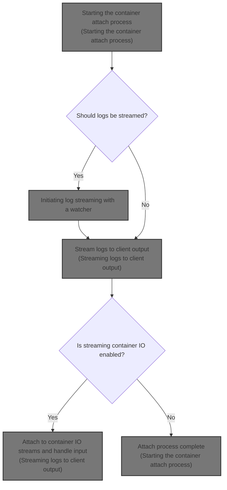
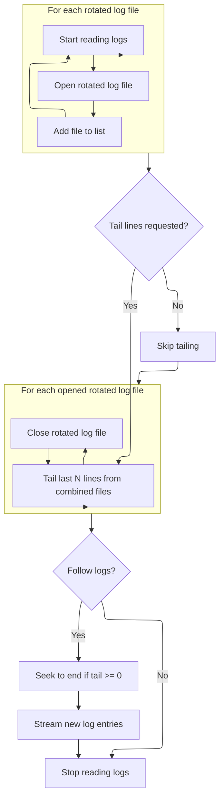

This document describes the flow of attaching to a container's input and output streams and optionally streaming its logs. It manages starting the attach process, reading past and live logs, streaming logs to the client, forwarding input to the container, and waiting for the container process to finish if configured. This enables real-time interaction with the container's running processes.



# Starting the container attach process

```mermaid
%%{init: {"flowchart": {"defaultRenderer": "elk"}} }%%
flowchart TD
    node1{"Stream logs?"}
    node1 -->|"Yes"| subgraph loop1["Stream container logs"]
        node2["Initiating log streaming with a watcher"]
    end
    node1 -->|"No"| node3{"Stream container IO?"}
    node3 -->|"Yes"| node4["Streaming logs to client output"]
    node3 -->|"No"| node5["Return success"]
    node2 --> node5
    node4 --> node5
classDef HeadingStyle fill:#777777,stroke:#333,stroke-width:2px;
click node2 goToHeading "Initiating log streaming with a watcher"
node2:::HeadingStyle
click node4 goToHeading "Streaming logs to client output"
node4:::HeadingStyle
```

<SwmSnippet path="/daemon/attach.go" line="76">

---

Here we start the containerAttach flow by checking if logs should be streamed. If yes, we get the container's log driver and verify it supports reading logs. Then we call ReadLogs to get a log stream, which lets us access past logs while attaching.

```go
func (daemon *Daemon) containerAttach(c *container.Container, stdin io.ReadCloser, stdout, stderr io.Writer, logs, stream bool, keys []byte) error {
	if logs {
		logDriver, err := daemon.getLogger(c)
		if err != nil {
			return err
		}
		cLog, ok := logDriver.(logger.LogReader)
		if !ok {
			return logger.ErrReadLogsNotSupported
		}
		logs := cLog.ReadLogs(logger.ReadConfig{Tail: -1})

```

---

</SwmSnippet>

## Initiating log streaming with a watcher

<SwmSnippet path="/daemon/logger/jsonfilelog/read.go" line="37">

---

`ReadLogs` creates a LogWatcher to stream logs asynchronously. It starts a goroutine that reads logs and returns the watcher immediately so the caller can consume logs as they come in.

```go
func (l *JSONFileLogger) ReadLogs(config logger.ReadConfig) *logger.LogWatcher {
	logWatcher := logger.NewLogWatcher()

	go l.readLogs(logWatcher, config)
	return logWatcher
}
```

---

</SwmSnippet>

## Reading and tailing rotated log files



<SwmSnippet path="/daemon/logger/jsonfilelog/read.go" line="44">

---

In `readLogs` we open all rotated log files plus the latest one to read logs in order. If tailing is requested, we combine them to tail logs across files. We handle follow mode by streaming new logs and reacting to rotations, locking readers to manage concurrency.

```go
func (l *JSONFileLogger) readLogs(logWatcher *logger.LogWatcher, config logger.ReadConfig) {
	defer close(logWatcher.Msg)

	pth := l.writer.LogPath()
	var files []io.ReadSeeker
	for i := l.writer.MaxFiles(); i > 1; i-- {
		f, err := os.Open(fmt.Sprintf("%s.%d", pth, i-1))
		if err != nil {
			if !os.IsNotExist(err) {
				logWatcher.Err <- err
				break
			}
			continue
		}
		files = append(files, f)
	}
```

---

</SwmSnippet>

<SwmSnippet path="/daemon/logger/jsonfilelog/read.go" line="67">

---

After tailing logs, we close rotated files and either return if not following or set up streaming new logs with locking. We register the logWatcher, get rotation notifications, stream logs live, then clean up and notify the writer about rotation eviction.

```go
	if config.Tail != 0 {
		tailer := ioutils.MultiReadSeeker(append(files, latestFile)...)
		tailFile(tailer, logWatcher, config.Tail, config.Since)
	}

	// close all the rotated files
	for _, f := range files {
		if err := f.(io.Closer).Close(); err != nil {
			logrus.WithField("logger", "json-file").Warnf("error closing tailed log file: %v", err)
		}
	}

	if !config.Follow {
		if err := latestFile.Close(); err != nil {
			logrus.Errorf("Error closing file: %v", err)
		}
		return
	}

	if config.Tail >= 0 {
		latestFile.Seek(0, os.SEEK_END)
	}

	l.mu.Lock()
	l.readers[logWatcher] = struct{}{}
	l.mu.Unlock()

	notifyRotate := l.writer.NotifyRotate()
	followLogs(latestFile, logWatcher, notifyRotate, config.Since)

	l.mu.Lock()
	delete(l.readers, logWatcher)
	l.mu.Unlock()

	l.writer.NotifyRotateEvict(notifyRotate)
}
```

---

</SwmSnippet>

## Streaming logs to client output

```mermaid
%%{init: {"flowchart": {"defaultRenderer": "elk"}} }%%
flowchart TD
    node1["Start container attach"] --> node2{"Is streaming enabled?"}
    click node1 openCode "daemon/attach.go:88:89"
    node2 -->|"No"| node9["Return success"]
    click node2 openCode "daemon/attach.go:110:111"
    node2 -->|"Yes"| subgraph loop1["Stream container logs continuously"]
        node3["Receive log message"]
        click node3 openCode "daemon/attach.go:91:94"
        node4{"Is message source stdout or stderr?"}
        click node4 openCode "daemon/attach.go:95:100"
        node4 -->|"stdout"| node5["Write to stdout"]
        click node5 openCode "daemon/attach.go:96:97"
        node4 -->|"stderr"| node6["Write to stderr"]
        click node6 openCode "daemon/attach.go:98:99"
        node3 --> node4
        node5 --> node3
        node6 --> node3
    end
    loop1 --> node7["Setup stdin pipe if stdin provided"]
    click node7 openCode "daemon/attach.go:112:121"
    node7 --> node8["Attach to container IO streams"]
    click node8 openCode "daemon/attach.go:131:138"
    node8 --> node10{"Is StdinOnce and not TTY?"}
    click node10 openCode "daemon/attach.go:124:144"
    node10 -->|"Yes"| node11["Wait for process to end"]
    click node11 openCode "daemon/attach.go:125:128"
    node10 -->|"No"| node12["Return success"]
    node11 --> node12
    node12 --> node9
    node9["Return success"]

classDef HeadingStyle fill:#777777,stroke:#333,stroke-width:2px;
```

<SwmSnippet path="/daemon/attach.go" line="88">

---

Back in `containerAttach` after returning from ReadLogs, we loop over log messages and write them to stdout or stderr. We stop if the log channel closes or an error occurs.

```go
	LogLoop:
		for {
			select {
			case msg, ok := <-logs.Msg:
				if !ok {
					break LogLoop
				}
				if msg.Source == "stdout" && stdout != nil {
					stdout.Write(msg.Line)
				}
				if msg.Source == "stderr" && stderr != nil {
					stderr.Write(msg.Line)
				}
			case err := <-logs.Err:
				logrus.Errorf("Error streaming logs: %v", err)
				break LogLoop
			}
		}
```

---

</SwmSnippet>

<SwmSnippet path="/daemon/attach.go" line="110">

---

Finally in `containerAttach` we handle streaming input if requested, attach to the container, handle errors, and wait for the container to stop if needed before returning.

```go
	//stream
	if stream {
		var stdinPipe io.ReadCloser
		if stdin != nil {
			r, w := io.Pipe()
			go func() {
				defer w.Close()
				defer logrus.Debug("Closing buffered stdin pipe")
				io.Copy(w, stdin)
			}()
			stdinPipe = r
		}

		waitChan := make(chan struct{})
		if c.Config.StdinOnce && !c.Config.Tty {
			go func() {
				c.WaitStop(-1 * time.Second)
				close(waitChan)
			}()
		}

		err := <-c.Attach(stdinPipe, stdout, stderr, keys)
		if err != nil {
			if _, ok := err.(container.DetachError); ok {
				daemon.LogContainerEvent(c, "detach")
			} else {
				logrus.Errorf("attach failed with error: %v", err)
			}
		}

		// If we are in stdinonce mode, wait for the process to end
		// otherwise, simply return
		if c.Config.StdinOnce && !c.Config.Tty {
			<-waitChan
		}
	}
	return nil
}
```

---

</SwmSnippet>

&nbsp;

*This is an auto-generated document by Swimm 🌊 and has not yet been verified by a human*

<SwmMeta version="3.0.0" repo-id="Z2l0aHViJTNBJTNBS3ViZXJuZXRlc01vYnklM0ElM0FHb3BpbmF0aHJlZGR5NjY=" repo-name="KubernetesMoby"><sup>Powered by [Swimm](https://app.swimm.io/)</sup></SwmMeta>
