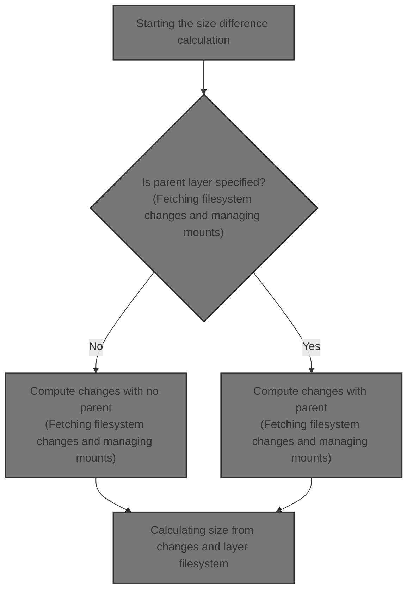
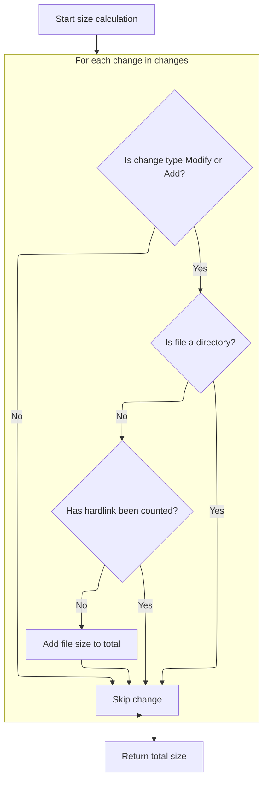

This document explains how the size difference between container filesystem layers is calculated. The flow receives a layer and optionally its parent layer as input, retrieves the filesystem changes between them, accesses the filesystems by managing mounts, and calculates the total size difference by summing the sizes of modified and added files, accounting for hardlinks to avoid double counting.



# Starting the size difference calculation

This section initiates the calculation of the size difference between filesystem layers by calling the Changes function to retrieve the necessary filesystem changes and immediately handling any errors that occur.

| Category       | Rule Name                        | Description                                                                                                                    |
| -------------- | -------------------------------- | ------------------------------------------------------------------------------------------------------------------------------ |
| Business logic | Dependency on filesystem changes | The size difference calculation depends on the accurate retrieval of filesystem changes between the current and parent layers. |

<SwmSnippet path="/daemon/graphdriver/fsdiff.go" line="147">

---

Here we call Changes to get the filesystem changes needed for size calculation, and handle errors right away.

```go
func (gdw *NaiveDiffDriver) DiffSize(id, parent string) (size int64, err error) {
	driver := gdw.ProtoDriver

	changes, err := gdw.Changes(id, parent)
	if err != nil {
		return
	}

```

---

</SwmSnippet>

## Fetching filesystem changes and managing mounts

```mermaid
%%{init: {"flowchart": {"defaultRenderer": "elk"}} }%%
flowchart TD
    node1["Start: Access current layer filesystem"] --> node2{"Access current layer successful?"}
    click node1 openCode "daemon/graphdriver/fsdiff.go:97:101"
    node2 -->|"No"| node3["Return error"]
    click node2 openCode "daemon/graphdriver/fsdiff.go:101:103"
    node2 -->|"Yes"| node4{"Is parent layer specified?"}
    click node4 openCode "daemon/graphdriver/fsdiff.go:108:110"
    node4 -->|"No"| node5["Compute changes with no parent"]
    click node5 openCode "daemon/graphdriver/fsdiff.go:116:117"
    node4 -->|"Yes"| node6["Access parent layer filesystem"]
    click node6 openCode "daemon/graphdriver/fsdiff.go:109:111"
    node6 --> node7{"Access parent layer successful?"}
    click node7 openCode "daemon/graphdriver/fsdiff.go:110:112"
    node7 -->|"No"| node8["Return error"]
    click node8 openCode "daemon/graphdriver/fsdiff.go:111:112"
    node7 -->|"Yes"| node9["Compute changes between current and parent"]
    click node9 openCode "daemon/graphdriver/fsdiff.go:116:117"
    node5 --> node10["Release current layer resource"]
    click node10 openCode "daemon/graphdriver/fsdiff.go:104:105"
    node9 --> node11["Release parent layer resource"]
    click node11 openCode "daemon/graphdriver/fsdiff.go:113:114"
    node11 --> node10
    node10 --> node12["Return changes result"]
    click node12 openCode "daemon/graphdriver/fsdiff.go:116:117"
classDef HeadingStyle fill:#777777,stroke:#333,stroke-width:2px;

%% Swimm:
%% %%{init: {"flowchart": {"defaultRenderer": "elk"}} }%%
%% flowchart TD
%%     node1["Start: Access current layer filesystem"] --> node2{"Access current layer successful?"}
%%     click node1 openCode "<SwmPath>[daemon/graphdriver/fsdiff.go](daemon/graphdriver/fsdiff.go)</SwmPath>:97:101"
%%     node2 -->|"No"| node3["Return error"]
%%     click node2 openCode "<SwmPath>[daemon/graphdriver/fsdiff.go](daemon/graphdriver/fsdiff.go)</SwmPath>:101:103"
%%     node2 -->|"Yes"| node4{"Is parent layer specified?"}
%%     click node4 openCode "<SwmPath>[daemon/graphdriver/fsdiff.go](daemon/graphdriver/fsdiff.go)</SwmPath>:108:110"
%%     node4 -->|"No"| node5["Compute changes with no parent"]
%%     click node5 openCode "<SwmPath>[daemon/graphdriver/fsdiff.go](daemon/graphdriver/fsdiff.go)</SwmPath>:116:117"
%%     node4 -->|"Yes"| node6["Access parent layer filesystem"]
%%     click node6 openCode "<SwmPath>[daemon/graphdriver/fsdiff.go](daemon/graphdriver/fsdiff.go)</SwmPath>:109:111"
%%     node6 --> node7{"Access parent layer successful?"}
%%     click node7 openCode "<SwmPath>[daemon/graphdriver/fsdiff.go](daemon/graphdriver/fsdiff.go)</SwmPath>:110:112"
%%     node7 -->|"No"| node8["Return error"]
%%     click node8 openCode "<SwmPath>[daemon/graphdriver/fsdiff.go](daemon/graphdriver/fsdiff.go)</SwmPath>:111:112"
%%     node7 -->|"Yes"| node9["Compute changes between current and parent"]
%%     click node9 openCode "<SwmPath>[daemon/graphdriver/fsdiff.go](daemon/graphdriver/fsdiff.go)</SwmPath>:116:117"
%%     node5 --> node10["Release current layer resource"]
%%     click node10 openCode "<SwmPath>[daemon/graphdriver/fsdiff.go](daemon/graphdriver/fsdiff.go)</SwmPath>:104:105"
%%     node9 --> node11["Release parent layer resource"]
%%     click node11 openCode "<SwmPath>[daemon/graphdriver/fsdiff.go](daemon/graphdriver/fsdiff.go)</SwmPath>:113:114"
%%     node11 --> node10
%%     node10 --> node12["Return changes result"]
%%     click node12 openCode "<SwmPath>[daemon/graphdriver/fsdiff.go](daemon/graphdriver/fsdiff.go)</SwmPath>:116:117"
%% classDef HeadingStyle fill:#777777,stroke:#333,stroke-width:2px;
```



This section describes the process of fetching filesystem changes between container layers and managing mounts to ensure accurate and efficient layer comparison.

| Category       | Rule Name                          | Description                                                                                                                               |
| -------------- | ---------------------------------- | ----------------------------------------------------------------------------------------------------------------------------------------- |
| Business logic | Changes computation without parent | When no parent layer is specified, compute changes based solely on the current layer's filesystem state.                                  |
| Business logic | Changes computation with parent    | When a parent layer exists and is accessible, compute changes by comparing the current layer filesystem with the parent layer filesystem. |

<SwmSnippet path="/daemon/graphdriver/fsdiff.go" line="97">

---

In Changes we first get the filesystem path for the given layer by calling <SwmToken path="daemon/graphdriver/fsdiff.go" pos="100:8:10" line-data="	layerFs, err := driver.Get(id, &quot;&quot;)">`driver.Get`</SwmToken>. This mounts the layer if needed and gives us the path to work with. We handle errors immediately to avoid invalid data downstream.

```go
func (gdw *NaiveDiffDriver) Changes(id, parent string) ([]archive.Change, error) {
	driver := gdw.ProtoDriver

	layerFs, err := driver.Get(id, "")
	if err != nil {
		return nil, err
	}
```

---

</SwmSnippet>

<SwmSnippet path="/daemon/graphdriver/overlay2/overlay.go" line="383">

---

This Get function checks if the layer directory exists, reads the lower layers file, and if present, mounts an overlay filesystem with proper options. It uses reference counting to track mounts and changes ownership of the work directory for user namespace compatibility. It also handles errors like mount label size and mount failures.

```go
func (d *Driver) Get(id string, mountLabel string) (s string, err error) {
	dir := d.dir(id)
	if _, err := os.Stat(dir); err != nil {
		return "", err
	}

	diffDir := path.Join(dir, "diff")
	lowers, err := ioutil.ReadFile(path.Join(dir, lowerFile))
	if err != nil {
		// If no lower, just return diff directory
		if os.IsNotExist(err) {
			return diffDir, nil
		}
		return "", err
	}

	mergedDir := path.Join(dir, "merged")
	if count := d.ctr.Increment(mergedDir); count > 1 {
		return mergedDir, nil
	}
	defer func() {
		if err != nil {
			if c := d.ctr.Decrement(mergedDir); c <= 0 {
				syscall.Unmount(mergedDir, 0)
			}
		}
	}()

	workDir := path.Join(dir, "work")
	opts := fmt.Sprintf("lowerdir=%s,upperdir=%s,workdir=%s", string(lowers), path.Join(id, "diff"), path.Join(id, "work"))
	mountLabel = label.FormatMountLabel(opts, mountLabel)
	if len(mountLabel) > syscall.Getpagesize() {
		return "", fmt.Errorf("cannot mount layer, mount label too large %d", len(mountLabel))
	}

	if err := mountFrom(d.home, "overlay", path.Join(id, "merged"), "overlay", mountLabel); err != nil {
		return "", fmt.Errorf("error creating overlay mount to %s: %v", mergedDir, err)
	}

	// chown "workdir/work" to the remapped root UID/GID. Overlay fs inside a
	// user namespace requires this to move a directory from lower to upper.
	rootUID, rootGID, err := idtools.GetRootUIDGID(d.uidMaps, d.gidMaps)
	if err != nil {
		return "", err
	}

	if err := os.Chown(path.Join(workDir, "work"), rootUID, rootGID); err != nil {
		return "", err
	}

	return mergedDir, nil
}
```

---

</SwmSnippet>

<SwmSnippet path="/daemon/graphdriver/fsdiff.go" line="104">

---

We defer <SwmToken path="daemon/graphdriver/fsdiff.go" pos="104:3:5" line-data="	defer driver.Put(id)">`driver.Put`</SwmToken> to release the mount when Changes is done, managing mount lifecycle properly.

```go
	defer driver.Put(id)

```

---

</SwmSnippet>

<SwmSnippet path="/daemon/graphdriver/zfs/zfs.go" line="389">

---

This Put function decrements the mount reference count for the given id's mount path. It checks if the mount is a ZFS filesystem and only unmounts if no users remain. This prevents unmounting active mounts and manages resources safely.

```go
func (d *Driver) Put(id string) error {
	mountpoint := d.mountPath(id)
	if count := d.ctr.Decrement(mountpoint); count > 0 {
		return nil
	}
	mounted, err := graphdriver.Mounted(graphdriver.FsMagicZfs, mountpoint)
	if err != nil || !mounted {
		return err
	}

	logrus.Debugf(`[zfs] unmount("%s")`, mountpoint)

	if err := mount.Unmount(mountpoint); err != nil {
		return fmt.Errorf("error unmounting to %s: %v", mountpoint, err)
	}
	return nil
}
```

---

</SwmSnippet>

<SwmSnippet path="/daemon/graphdriver/fsdiff.go" line="106">

---

After releasing the current layer mount, we get the parent layer's filesystem path if a parent exists. This lets us compare the two layers to find changes. We handle errors immediately to avoid invalid comparisons.

```go
	parentFs := ""

	if parent != "" {
		parentFs, err = driver.Get(parent, "")
		if err != nil {
			return nil, err
		}
```

---

</SwmSnippet>

<SwmSnippet path="/daemon/graphdriver/fsdiff.go" line="113">

---

Finally we call <SwmToken path="daemon/graphdriver/fsdiff.go" pos="116:3:5" line-data="	return archive.ChangesDirs(layerFs, parentFs)">`archive.ChangesDirs`</SwmToken> with the current and parent filesystem paths to get the list of changes. We defer <SwmToken path="daemon/graphdriver/fsdiff.go" pos="113:3:5" line-data="		defer driver.Put(parent)">`driver.Put`</SwmToken> for the parent to release its mount after we're done.

```go
		defer driver.Put(parent)
	}

	return archive.ChangesDirs(layerFs, parentFs)
}
```

---

</SwmSnippet>

## Calculating size from changes and layer filesystem



<SwmSnippet path="/daemon/graphdriver/fsdiff.go" line="155">

---

After getting the changes, we get the layer filesystem path again to access the files for size calculation. We handle errors immediately to avoid invalid data.

```go
	layerFs, err := driver.Get(id, "")
	if err != nil {
		return
	}
```

---

</SwmSnippet>

<SwmSnippet path="/daemon/graphdriver/fsdiff.go" line="159">

---

We defer <SwmToken path="daemon/graphdriver/fsdiff.go" pos="159:3:5" line-data="	defer driver.Put(id)">`driver.Put`</SwmToken> to release the mount after we're done calculating size, managing resources properly.

```go
	defer driver.Put(id)

```

---

</SwmSnippet>

<SwmSnippet path="/daemon/graphdriver/fsdiff.go" line="161">

---

Finally we call <SwmToken path="daemon/graphdriver/fsdiff.go" pos="161:5:5" line-data="	return archive.ChangesSize(layerFs, changes), nil">`ChangesSize`</SwmToken> with the layer filesystem path and changes list to sum the sizes of changed files, handling hardlinks properly. This returns the total size difference.

```go
	return archive.ChangesSize(layerFs, changes), nil
}
```

---

</SwmSnippet>

<SwmSnippet path="/pkg/archive/changes.go" line="363">

---

It sums sizes of modified and added files, tracking hardlinked inodes to avoid double counting.

```go
func ChangesSize(newDir string, changes []Change) int64 {
	var (
		size int64
		sf   = make(map[uint64]struct{})
	)
	for _, change := range changes {
		if change.Kind == ChangeModify || change.Kind == ChangeAdd {
			file := filepath.Join(newDir, change.Path)
			fileInfo, err := os.Lstat(file)
			if err != nil {
				logrus.Errorf("Can not stat %q: %s", file, err)
				continue
			}

			if fileInfo != nil && !fileInfo.IsDir() {
				if hasHardlinks(fileInfo) {
					inode := getIno(fileInfo)
					if _, ok := sf[inode]; !ok {
						size += fileInfo.Size()
						sf[inode] = struct{}{}
					}
				} else {
					size += fileInfo.Size()
				}
			}
		}
	}
```

---

</SwmSnippet>

&nbsp;

*This is an auto-generated document by Swimm 🌊 and has not yet been verified by a human*

<SwmMeta version="3.0.0" repo-id="Z2l0aHViJTNBJTNBS3ViZXJuZXRlc01vYnklM0ElM0FHb3BpbmF0aHJlZGR5NjY=" repo-name="KubernetesMoby"><sup>Powered by [Swimm](https://app.swimm.io/)</sup></SwmMeta>
