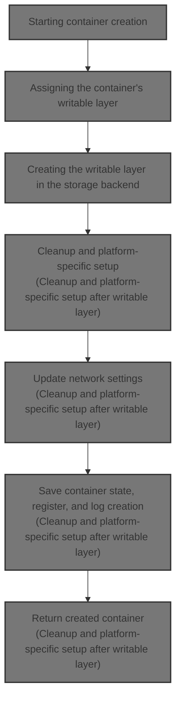
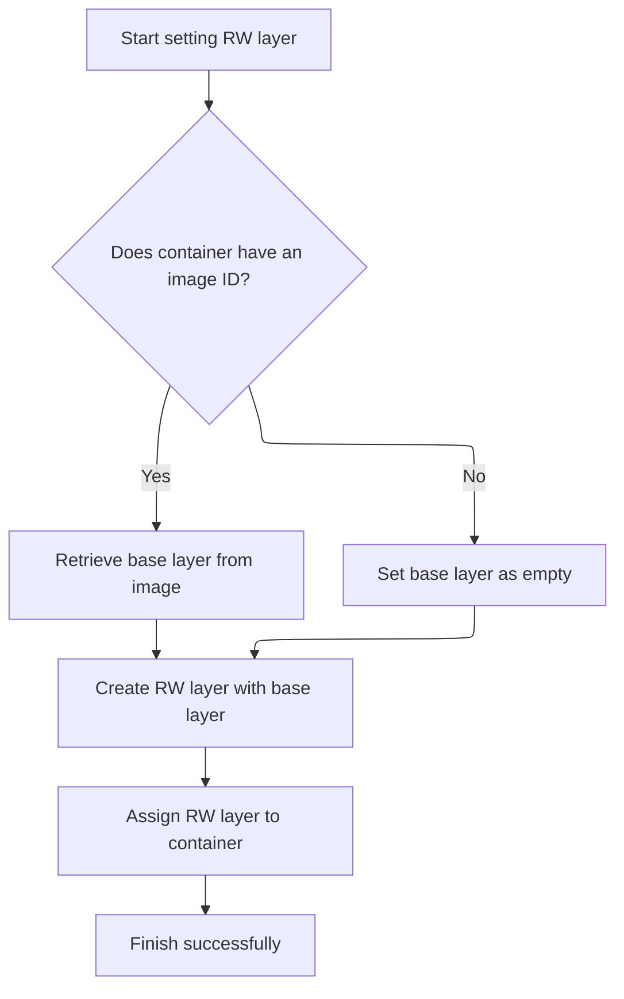
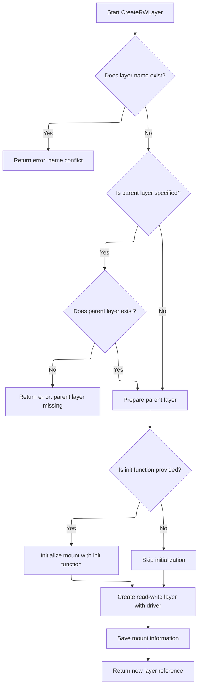
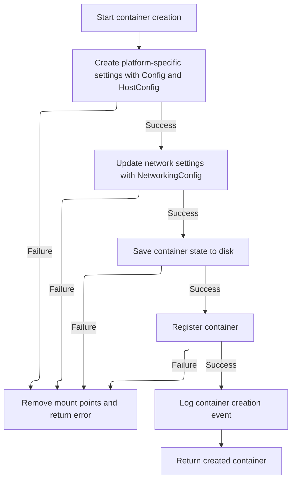

This document describes the container creation process, using input parameters to create a container with an isolated writable filesystem layer. It covers configuration verification, writable layer setup, platform-specific settings, network updates, and container registration, resulting in a ready-to-use container.



# Starting container creation

<SwmSnippet path="/daemon/create.go" line="64">

---

In `Daemon.create` we start by fetching the image and verifying configs. Then we create the container object. We call `setRWLayer` next to set up the container's writable layer, which is where container-specific filesystem changes will happen, separate from the base image.

```go
func (daemon *Daemon) create(params types.ContainerCreateConfig, managed bool) (retC *container.Container, retErr error) {
	var (
		container *container.Container
		img       *image.Image
		imgID     image.ID
		err       error
	)

	if params.Config.Image != "" {
		img, err = daemon.GetImage(params.Config.Image)
		if err != nil {
			return nil, err
		}
		imgID = img.ID()
	}

	if err := daemon.mergeAndVerifyConfig(params.Config, img); err != nil {
		return nil, err
	}

	if err := daemon.mergeAndVerifyLogConfig(&params.HostConfig.LogConfig); err != nil {
		return nil, err
	}

	if container, err = daemon.newContainer(params.Name, params.Config, imgID, managed); err != nil {
		return nil, err
	}
	defer func() {
		if retErr != nil {
			if err := daemon.cleanupContainer(container, true); err != nil {
				logrus.Errorf("failed to cleanup container on create error: %v", err)
			}
		}
	}()

	if err := daemon.setSecurityOptions(container, params.HostConfig); err != nil {
		return nil, err
	}

	container.HostConfig.StorageOpt = params.HostConfig.StorageOpt

	// Set RWLayer for container after mount labels have been set
	if err := daemon.setRWLayer(container); err != nil {
		return nil, err
	}

	rootUID, rootGID, err := idtools.GetRootUIDGID(daemon.uidMaps, daemon.gidMaps)
	if err != nil {
		return nil, err
	}
	if err := idtools.MkdirAs(container.Root, 0700, rootUID, rootGID); err != nil {
		return nil, err
	}

	if err := daemon.setHostConfig(container, params.HostConfig); err != nil {
		return nil, err
	}
```

---

</SwmSnippet>

## Assigning the container's writable layer



<SwmSnippet path="/daemon/create.go" line="198">

---

`setRWLayer` checks if the container has an image and gets its root filesystem chain ID. Then it calls the layer store to create a new writable layer on top of that. This writable layer is where container changes will be stored.

```go
func (daemon *Daemon) setRWLayer(container *container.Container) error {
	var layerID layer.ChainID
	if container.ImageID != "" {
		img, err := daemon.imageStore.Get(container.ImageID)
		if err != nil {
			return err
		}
		layerID = img.RootFS.ChainID()
	}
	rwLayer, err := daemon.layerStore.CreateRWLayer(container.ID, layerID, container.MountLabel, daemon.setupInitLayer, container.HostConfig.StorageOpt)
	if err != nil {
		return err
	}
	container.RWLayer = rwLayer

	return nil
}
```

---

</SwmSnippet>

## Creating the writable layer in the storage backend



<SwmSnippet path="/layer/layer_store.go" line="432">

---

`CreateRWLayer` first checks if there's a parent layer and retrieves it. It defers releasing the parent if an error happens later. Then it creates a mountedLayer struct. If there's an init function, it calls `initMount` to prepare the mount point. Next, it uses the storage driver to create the writable layer and saves the mount state to track it.

```go
func (ls *layerStore) CreateRWLayer(name string, parent ChainID, mountLabel string, initFunc MountInit, storageOpt map[string]string) (RWLayer, error) {
	ls.mountL.Lock()
	defer ls.mountL.Unlock()
	m, ok := ls.mounts[name]
	if ok {
		return nil, ErrMountNameConflict
	}

	var err error
	var pid string
	var p *roLayer
	if string(parent) != "" {
		p = ls.get(parent)
		if p == nil {
			return nil, ErrLayerDoesNotExist
		}
		pid = p.cacheID

		// Release parent chain if error
		defer func() {
			if err != nil {
				ls.layerL.Lock()
				ls.releaseLayer(p)
				ls.layerL.Unlock()
			}
		}()
	}

	m = &mountedLayer{
		name:       name,
		parent:     p,
		mountID:    ls.mountID(name),
		layerStore: ls,
		references: map[RWLayer]*referencedRWLayer{},
	}

	if initFunc != nil {
		pid, err = ls.initMount(m.mountID, pid, mountLabel, initFunc, storageOpt)
		if err != nil {
			return nil, err
		}
		m.initID = pid
	}

	if err = ls.driver.CreateReadWrite(m.mountID, pid, "", storageOpt); err != nil {
		return nil, err
	}

	if err = ls.saveMount(m); err != nil {
		return nil, err
	}

	return m.getReference(), nil
}
```

---

</SwmSnippet>

<SwmSnippet path="/layer/layer_store.go" line="579">

---

`initMount` creates a special init layer with a '-init' suffix to keep compatibility with graph drivers. It creates the layer, gets a mount point, runs the init function on it, and cleans up if the init fails.

```go
func (ls *layerStore) initMount(graphID, parent, mountLabel string, initFunc MountInit, storageOpt map[string]string) (string, error) {
	// Use "<graph-id>-init" to maintain compatibility with graph drivers
	// which are expecting this layer with this special name. If all
	// graph drivers can be updated to not rely on knowing about this layer
	// then the initID should be randomly generated.
	initID := fmt.Sprintf("%s-init", graphID)

	if err := ls.driver.Create(initID, parent, mountLabel, storageOpt); err != nil {
		return "", err
	}
	p, err := ls.driver.Get(initID, "")
	if err != nil {
		return "", err
	}

	if err := initFunc(p); err != nil {
		ls.driver.Put(initID)
		return "", err
	}

	if err := ls.driver.Put(initID); err != nil {
		return "", err
	}

	return initID, nil
}
```

---

</SwmSnippet>

## Cleanup and platform-specific setup after writable layer



<SwmSnippet path="/daemon/create.go" line="121">

---

After returning from `setRWLayer` in `Daemon.create`, we set up a deferred cleanup to remove mount points if an error occurs later. Then we apply platform-specific container settings to finalize setup.

```go
	defer func() {
		if retErr != nil {
			if err := daemon.removeMountPoints(container, true); err != nil {
				logrus.Error(err)
			}
		}
	}()

	if err := daemon.createContainerPlatformSpecificSettings(container, params.Config, params.HostConfig); err != nil {
		return nil, err
	}

```

---

</SwmSnippet>

<SwmSnippet path="/daemon/mounts.go" line="20">

---

`removeMountPoints` goes through each mount point in the container. It dereferences volumes and removes them if allowed, but skips named volumes to avoid deleting user-defined persistent data.

```go
func (daemon *Daemon) removeMountPoints(container *container.Container, rm bool) error {
	var rmErrors []string
	for _, m := range container.MountPoints {
		if m.Volume == nil {
			continue
		}
		daemon.volumes.Dereference(m.Volume, container.ID)
		if rm {
			// Do not remove named mountpoints
			// these are mountpoints specified like `docker run -v <name>:/foo`
			if m.Named {
				continue
			}
			err := daemon.volumes.Remove(m.Volume)
			// Ignore volume in use errors because having this
			// volume being referenced by other container is
			// not an error, but an implementation detail.
			// This prevents docker from logging "ERROR: Volume in use"
			// where there is another container using the volume.
			if err != nil && !volumestore.IsInUse(err) {
				rmErrors = append(rmErrors, err.Error())
			}
		}
	}
```

---

</SwmSnippet>

<SwmSnippet path="/daemon/create.go" line="133">

---

After returning from `removeMountPoints` in `Daemon.create`, we update network settings, save the container state to disk, register it with the daemon, and log the creation event.

```go
	var endpointsConfigs map[string]*networktypes.EndpointSettings
	if params.NetworkingConfig != nil {
		endpointsConfigs = params.NetworkingConfig.EndpointsConfig
	}
	// Make sure NetworkMode has an acceptable value. We do this to ensure
	// backwards API compatibility.
	container.HostConfig = runconfig.SetDefaultNetModeIfBlank(container.HostConfig)

	if err := daemon.updateContainerNetworkSettings(container, endpointsConfigs); err != nil {
		return nil, err
	}

	if err := container.ToDisk(); err != nil {
		logrus.Errorf("Error saving new container to disk: %v", err)
		return nil, err
	}
	if err := daemon.Register(container); err != nil {
		return nil, err
	}
	daemon.LogContainerEvent(container, "create")
	return container, nil
}
```

---

</SwmSnippet>

&nbsp;

*This is an auto-generated document by Swimm 🌊 and has not yet been verified by a human*

<SwmMeta version="3.0.0" repo-id="Z2l0aHViJTNBJTNBS3ViZXJuZXRlc01vYnklM0ElM0FHb3BpbmF0aHJlZGR5NjY=" repo-name="KubernetesMoby"><sup>Powered by [Swimm](https://app.swimm.io/)</sup></SwmMeta>
