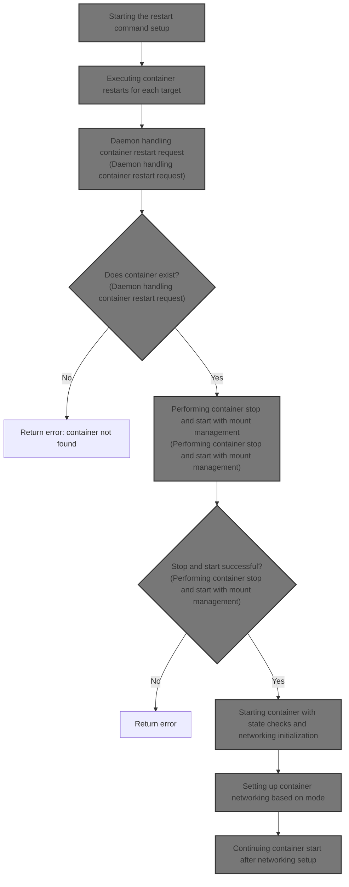
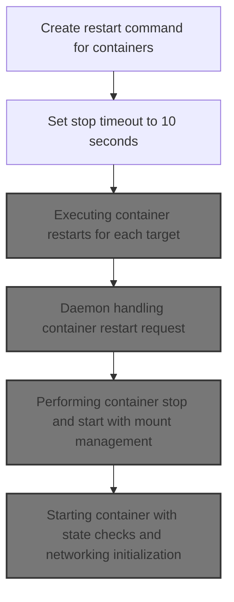
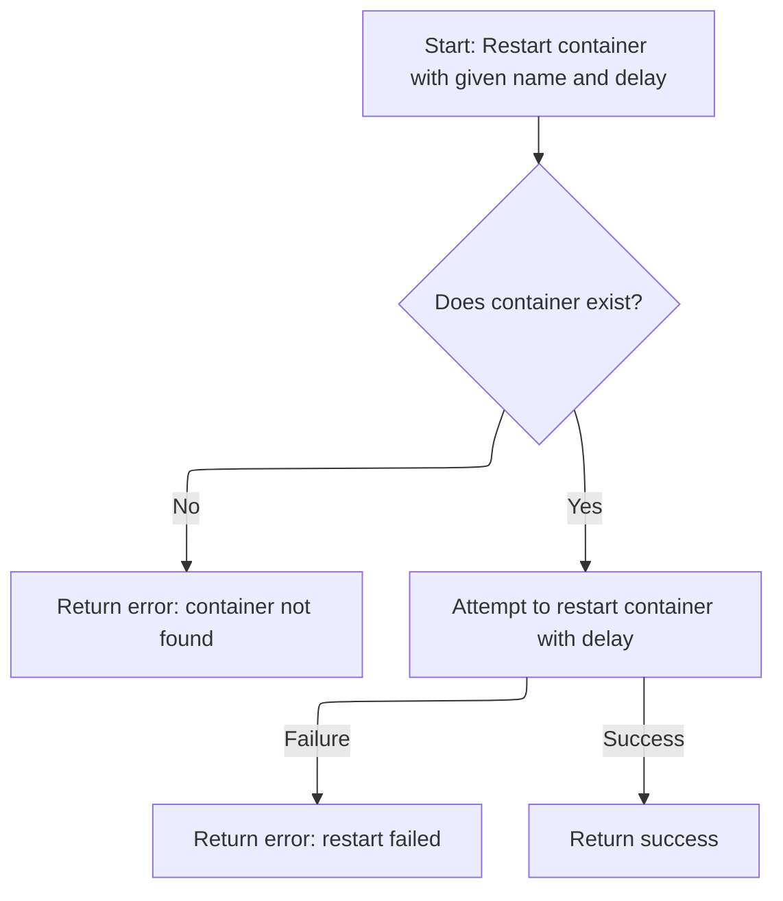
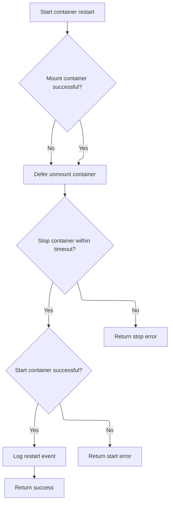
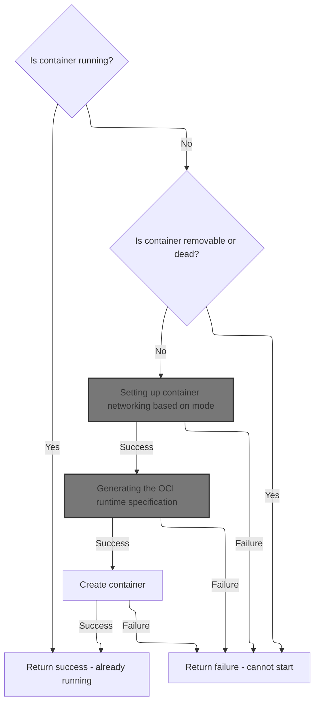
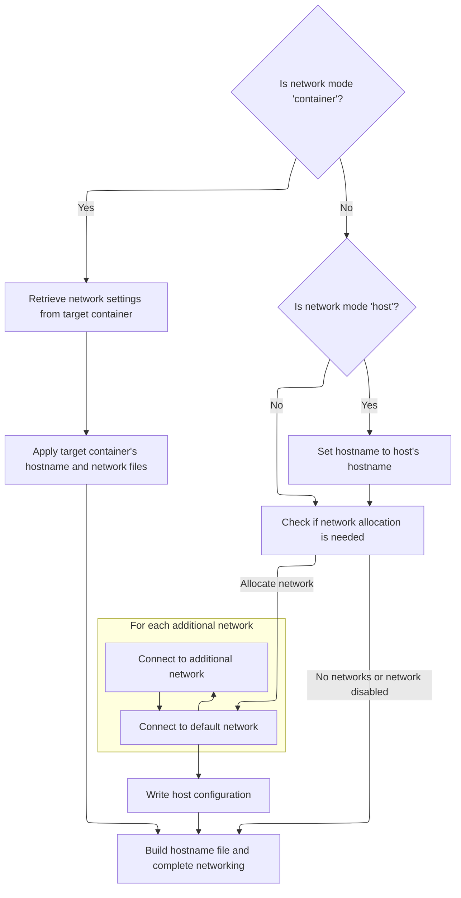
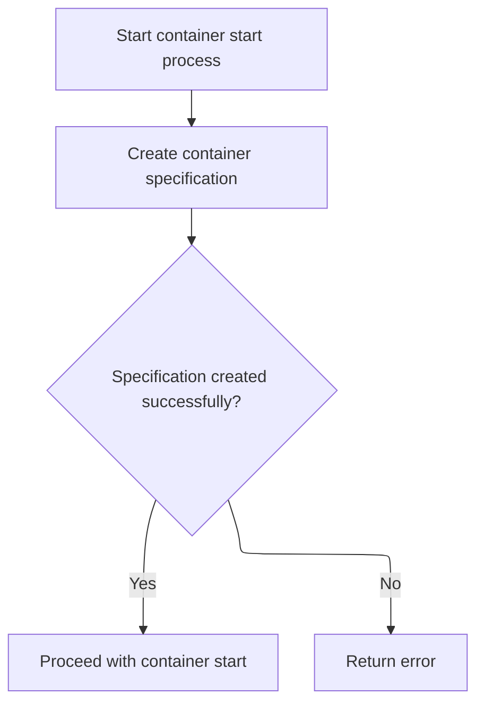

This document describes the flow of restarting containers via a CLI command. Users provide container names and options such as timeout. The flow processes each container restart request, interacting with the daemon to stop and start containers properly. It includes managing mounts, initializing networking, checking container states, generating runtime specifications, and creating container processes. The flow outputs the status of each container restart.



# Starting the restart command setup



<SwmSnippet path="/api/client/container/restart.go" line="22">

---

In <SwmToken path="api/client/container/restart.go" pos="22:2:2" line-data="func NewRestartCommand(dockerCli *client.DockerCli) *cobra.Command {">`NewRestartCommand`</SwmToken> we set up the CLI command for restarting containers. We parse the container names from the command arguments and then call <SwmToken path="api/client/container/restart.go" pos="31:3:3" line-data="			return runRestart(dockerCli, &amp;opts)">`runRestart`</SwmToken> to actually perform the restart operations on those containers.

```go
func NewRestartCommand(dockerCli *client.DockerCli) *cobra.Command {
	var opts restartOptions

	cmd := &cobra.Command{
		Use:   "restart [OPTIONS] CONTAINER [CONTAINER...]",
		Short: "Restart a container",
		Args:  cli.RequiresMinArgs(1),
		RunE: func(cmd *cobra.Command, args []string) error {
			opts.containers = args
			return runRestart(dockerCli, &opts)
		},
	}

```

---

</SwmSnippet>

## Executing container restarts for each target

```mermaid
%%{init: {"flowchart": {"defaultRenderer": "elk"}} }%%
flowchart TD
    node1["Start runRestart"] --> subgraph loop1["For each container in list"]
        node2["Restart container with timeout (nSeconds)"]
        node2 --> node3{"Restart successful?"}
        node3 -->|"Yes"| node4["Report container restarted"]
        node3 -->|"No"| node5["Record error message"]
        node4 --> node2
        node5 --> node2
    end
    loop1 --> node6{"Any errors collected?"}
    node6 -->|"Yes"| node7["Return combined error"]
    node6 -->|"No"| node8["Return success"]
classDef HeadingStyle fill:#777777,stroke:#333,stroke-width:2px;

%% Swimm:
%% %%{init: {"flowchart": {"defaultRenderer": "elk"}} }%%
%% flowchart TD
%%     node1["Start <SwmToken path="api/client/container/restart.go" pos="31:3:3" line-data="			return runRestart(dockerCli, &amp;opts)">`runRestart`</SwmToken>"] --> subgraph loop1["For each container in list"]
%%         node2["Restart container with timeout (<SwmToken path="api/client/container/restart.go" pos="36:8:8" line-data="	flags.IntVarP(&amp;opts.nSeconds, &quot;time&quot;, &quot;t&quot;, 10, &quot;Seconds to wait for stop before killing the container&quot;)">`nSeconds`</SwmToken>)"]
%%         node2 --> node3{"Restart successful?"}
%%         node3 -->|"Yes"| node4["Report container restarted"]
%%         node3 -->|"No"| node5["Record error message"]
%%         node4 --> node2
%%         node5 --> node2
%%     end
%%     loop1 --> node6{"Any errors collected?"}
%%     node6 -->|"Yes"| node7["Return combined error"]
%%     node6 -->|"No"| node8["Return success"]
%% classDef HeadingStyle fill:#777777,stroke:#333,stroke-width:2px;
```

<SwmSnippet path="/api/client/container/restart.go" line="40">

---

<SwmToken path="api/client/container/restart.go" pos="40:2:2" line-data="func runRestart(dockerCli *client.DockerCli, opts *restartOptions) error {">`runRestart`</SwmToken> loops over each container name and calls the Docker client API to restart them with a timeout. It collects errors and prints successful restarts. Calling the daemon restart function next is necessary because the client API triggers the actual container restart logic on the daemon side.

```go
func runRestart(dockerCli *client.DockerCli, opts *restartOptions) error {
	ctx := context.Background()
	var errs []string
	for _, name := range opts.containers {
		timeout := time.Duration(opts.nSeconds) * time.Second
		if err := dockerCli.Client().ContainerRestart(ctx, name, &timeout); err != nil {
			errs = append(errs, err.Error())
		} else {
			fmt.Fprintf(dockerCli.Out(), "%s\n", name)
		}
	}
	if len(errs) > 0 {
		return fmt.Errorf("%s", strings.Join(errs, "\n"))
	}
	return nil
}
```

---

</SwmSnippet>

## Daemon handling container restart request



<SwmSnippet path="/daemon/restart.go" line="15">

---

<SwmToken path="daemon/restart.go" pos="15:9:9" line-data="func (daemon *Daemon) ContainerRestart(name string, seconds int) error {">`ContainerRestart`</SwmToken> in the daemon looks up the container by name and calls <SwmToken path="daemon/restart.go" pos="20:9:9" line-data="	if err := daemon.containerRestart(container, seconds); err != nil {">`containerRestart`</SwmToken> to do the actual restart steps. This bridges the client request to the container lifecycle management.

```go
func (daemon *Daemon) ContainerRestart(name string, seconds int) error {
	container, err := daemon.GetContainer(name)
	if err != nil {
		return err
	}
	if err := daemon.containerRestart(container, seconds); err != nil {
		return fmt.Errorf("Cannot restart container %s: %v", name, err)
	}
	return nil
}
```

---

</SwmSnippet>

## Performing container stop and start with mount management



<SwmSnippet path="/daemon/restart.go" line="30">

---

<SwmToken path="daemon/restart.go" pos="30:9:9" line-data="func (daemon *Daemon) containerRestart(container *container.Container, seconds int) error {">`containerRestart`</SwmToken> mounts the container, stops it with a timeout, then starts it again. It defers unmounting and logs the restart event. Calling <SwmToken path="daemon/restart.go" pos="42:9:9" line-data="	if err := daemon.containerStart(container); err != nil {">`containerStart`</SwmToken> next is needed to bring the container back up after stopping it.

```go
func (daemon *Daemon) containerRestart(container *container.Container, seconds int) error {
	// Avoid unnecessarily unmounting and then directly mounting
	// the container when the container stops and then starts
	// again
	if err := daemon.Mount(container); err == nil {
		defer daemon.Unmount(container)
	}

	if err := daemon.containerStop(container, seconds); err != nil {
		return err
	}

	if err := daemon.containerStart(container); err != nil {
		return err
	}

	daemon.LogContainerEvent(container, "restart")
	return nil
}
```

---

</SwmSnippet>

## Starting container with state checks and networking initialization



<SwmSnippet path="/daemon/start.go" line="92">

---

In <SwmToken path="daemon/start.go" pos="92:9:9" line-data="func (daemon *Daemon) containerStart(container *container.Container) (err error) {">`containerStart`</SwmToken> we lock the container, check if it's already running or marked for removal/dead, and refuse to start if so. We defer error handling cleanup and then initialize networking by calling <SwmToken path="daemon/start.go" pos="126:9:9" line-data="	if err := daemon.initializeNetworking(container); err != nil {">`initializeNetworking`</SwmToken>. This sets up the container's network before continuing the start process.

```go
func (daemon *Daemon) containerStart(container *container.Container) (err error) {
	container.Lock()
	defer container.Unlock()

	if container.Running {
		return nil
	}

	if container.RemovalInProgress || container.Dead {
		return fmt.Errorf("Container is marked for removal and cannot be started.")
	}

	// if we encounter an error during start we need to ensure that any other
	// setup has been cleaned up properly
	defer func() {
		if err != nil {
			container.SetError(err)
			// if no one else has set it, make sure we don't leave it at zero
			if container.ExitCode() == 0 {
				container.SetExitCode(128)
			}
			container.ToDisk()
			daemon.Cleanup(container)
		}
	}()

	if err := daemon.conditionalMountOnStart(container); err != nil {
		return err
	}

	// Make sure NetworkMode has an acceptable value. We do this to ensure
	// backwards API compatibility.
	container.HostConfig = runconfig.SetDefaultNetModeIfBlank(container.HostConfig)

	if err := daemon.initializeNetworking(container); err != nil {
		return err
	}

```

---

</SwmSnippet>

### Setting up container networking based on mode



<SwmSnippet path="/daemon/container_operations.go" line="679">

---

<SwmToken path="daemon/container_operations.go" pos="679:9:9" line-data="func (daemon *Daemon) initializeNetworking(container *container.Container) error {">`initializeNetworking`</SwmToken> sets up the container's network based on its mode. It copies network files from another container if in container mode, sets hostname for host mode, or allocates network resources otherwise. It calls <SwmToken path="daemon/container_operations.go" pos="703:9:9" line-data="	if err := daemon.allocateNetwork(container); err != nil {">`allocateNetwork`</SwmToken> to handle resource allocation and network connections.

```go
func (daemon *Daemon) initializeNetworking(container *container.Container) error {
	var err error

	if container.HostConfig.NetworkMode.IsContainer() {
		// we need to get the hosts files from the container to join
		nc, err := daemon.getNetworkedContainer(container.ID, container.HostConfig.NetworkMode.ConnectedContainer())
		if err != nil {
			return err
		}
		container.HostnamePath = nc.HostnamePath
		container.HostsPath = nc.HostsPath
		container.ResolvConfPath = nc.ResolvConfPath
		container.Config.Hostname = nc.Config.Hostname
		container.Config.Domainname = nc.Config.Domainname
		return nil
	}

	if container.HostConfig.NetworkMode.IsHost() {
		container.Config.Hostname, err = os.Hostname()
		if err != nil {
			return err
		}
	}

	if err := daemon.allocateNetwork(container); err != nil {
		return err
	}

	return container.BuildHostnameFile()
}
```

---

</SwmSnippet>

<SwmSnippet path="/daemon/container_operations.go" line="386">

---

<SwmToken path="daemon/container_operations.go" pos="386:9:9" line-data="func (daemon *Daemon) allocateNetwork(container *container.Container) error {">`allocateNetwork`</SwmToken> cleans stale sandboxes, updates network settings if missing, connects default network first for link support, then others, and saves config.

```go
func (daemon *Daemon) allocateNetwork(container *container.Container) error {
	controller := daemon.netController

	if daemon.netController == nil {
		return nil
	}

	// Cleanup any stale sandbox left over due to ungraceful daemon shutdown
	if err := controller.SandboxDestroy(container.ID); err != nil {
		logrus.Errorf("failed to cleanup up stale network sandbox for container %s", container.ID)
	}

	updateSettings := false
	if len(container.NetworkSettings.Networks) == 0 {
		if container.Config.NetworkDisabled || container.HostConfig.NetworkMode.IsContainer() {
			return nil
		}

		err := daemon.updateContainerNetworkSettings(container, nil)
		if err != nil {
			return err
		}
		updateSettings = true
	}

	// always connect default network first since only default
	// network mode support link and we need do some setting
	// on sandbox initialize for link, but the sandbox only be initialized
	// on first network connecting.
	defaultNetName := runconfig.DefaultDaemonNetworkMode().NetworkName()
	if nConf, ok := container.NetworkSettings.Networks[defaultNetName]; ok {
		if err := daemon.connectToNetwork(container, defaultNetName, nConf, updateSettings); err != nil {
			return err
		}

	}
	for n, nConf := range container.NetworkSettings.Networks {
		if n == defaultNetName {
			continue
		}
		if err := daemon.connectToNetwork(container, n, nConf, updateSettings); err != nil {
			return err
		}
	}

	return container.WriteHostConfig()
}
```

---

</SwmSnippet>

### Continuing container start after networking setup



<SwmSnippet path="/daemon/start.go" line="130">

---

After returning from <SwmToken path="daemon/start.go" pos="126:9:9" line-data="	if err := daemon.initializeNetworking(container); err != nil {">`initializeNetworking`</SwmToken>, <SwmToken path="daemon/restart.go" pos="42:9:9" line-data="	if err := daemon.containerStart(container); err != nil {">`containerStart`</SwmToken> calls <SwmToken path="daemon/start.go" pos="130:10:10" line-data="	spec, err := daemon.createSpec(container)">`createSpec`</SwmToken> to generate the OCI spec for the container. This spec defines how the container runtime should start the container. We need to call the OCI runtime next to create and start the container process based on this spec.

```go
	spec, err := daemon.createSpec(container)
	if err != nil {
		return err
	}

```

---

</SwmSnippet>

### Generating the OCI runtime specification

See <SwmLink doc-title="Creating Windows container specification flow">[Creating Windows container specification flow](.swm%5Ccreating-windows-container-specification-flow.b9x1j7lh.sw.md)</SwmLink>

### Creating container process and handling start errors

```mermaid
%%{init: {"flowchart": {"defaultRenderer": "elk"}} }%%
flowchart TD
    node1["Prepare initial create options for container"]
    click node1 openCode "daemon/start.go:135:136"
    node1 --> node2{"Additional create options available?"}
    click node2 openCode "daemon/start.go:136:142"
    node2 -->|"Yes"| node3["Append additional create options"]
    click node3 openCode "daemon/start.go:141:142"
    node2 -->|"No"| node4["Attempt to create container with options"]
    click node4 openCode "daemon/start.go:144:146"
    node3 --> node4
    node4 --> node5{"Did container creation fail?"}
    click node5 openCode "daemon/start.go:144:164"
    node5 -->|"Yes"| node6{"Is error due to missing executable or file?"}
    node6 -->|"Yes"| node7["Set exit code 127 for missing executable"]
    click node7 openCode "daemon/start.go:150:155"
    node6 -->|"No"| node8{"Is error due to permission denied?"}
    click node8 openCode "daemon/start.go:156:159"
    node8 -->|"Yes"| node10["Set exit code 126 for permission denied"]
    click node10 openCode "daemon/start.go:157:159"
    node8 -->|"No"| node11["Reset container state"]
    click node11 openCode "daemon/start.go:161:162"
    node7 --> node11
    node10 --> node11
    node11 --> node12["Return error description"]
    click node12 openCode "daemon/start.go:163:164"
    node5 -->|"No"| node9["Return success"]
    click node9 openCode "daemon/start.go:166:167"
    node9 --> end["End"]
classDef HeadingStyle fill:#777777,stroke:#333,stroke-width:2px;

%% Swimm:
%% %%{init: {"flowchart": {"defaultRenderer": "elk"}} }%%
%% flowchart TD
%%     node1["Prepare initial create options for container"]
%%     click node1 openCode "<SwmPath>[daemon/start.go](daemon/start.go)</SwmPath>:135:136"
%%     node1 --> node2{"Additional create options available?"}
%%     click node2 openCode "<SwmPath>[daemon/start.go](daemon/start.go)</SwmPath>:136:142"
%%     node2 -->|"Yes"| node3["Append additional create options"]
%%     click node3 openCode "<SwmPath>[daemon/start.go](daemon/start.go)</SwmPath>:141:142"
%%     node2 -->|"No"| node4["Attempt to create container with options"]
%%     click node4 openCode "<SwmPath>[daemon/start.go](daemon/start.go)</SwmPath>:144:146"
%%     node3 --> node4
%%     node4 --> node5{"Did container creation fail?"}
%%     click node5 openCode "<SwmPath>[daemon/start.go](daemon/start.go)</SwmPath>:144:164"
%%     node5 -->|"Yes"| node6{"Is error due to missing executable or file?"}
%%     node6 -->|"Yes"| node7["Set exit code 127 for missing executable"]
%%     click node7 openCode "<SwmPath>[daemon/start.go](daemon/start.go)</SwmPath>:150:155"
%%     node6 -->|"No"| node8{"Is error due to permission denied?"}
%%     click node8 openCode "<SwmPath>[daemon/start.go](daemon/start.go)</SwmPath>:156:159"
%%     node8 -->|"Yes"| node10["Set exit code 126 for permission denied"]
%%     click node10 openCode "<SwmPath>[daemon/start.go](daemon/start.go)</SwmPath>:157:159"
%%     node8 -->|"No"| node11["Reset container state"]
%%     click node11 openCode "<SwmPath>[daemon/start.go](daemon/start.go)</SwmPath>:161:162"
%%     node7 --> node11
%%     node10 --> node11
%%     node11 --> node12["Return error description"]
%%     click node12 openCode "<SwmPath>[daemon/start.go](daemon/start.go)</SwmPath>:163:164"
%%     node5 -->|"No"| node9["Return success"]
%%     click node9 openCode "<SwmPath>[daemon/start.go](daemon/start.go)</SwmPath>:166:167"
%%     node9 --> end["End"]
%% classDef HeadingStyle fill:#777777,stroke:#333,stroke-width:2px;
```

<SwmSnippet path="/daemon/start.go" line="135">

---

Back in <SwmToken path="daemon/restart.go" pos="42:9:9" line-data="	if err := daemon.containerStart(container); err != nil {">`containerStart`</SwmToken> after creating the OCI spec, we prepare options and call the containerd runtime to create the container process. If creation fails, we log the error, set exit codes 126 or 127 based on error type, reset the container state, and return the error. This handles start failures gracefully and signals specific failure reasons.

```go
	createOptions := []libcontainerd.CreateOption{libcontainerd.WithRestartManager(container.RestartManager(true))}
	copts, err := daemon.getLibcontainerdCreateOptions(container)
	if err != nil {
		return err
	}
	if copts != nil {
		createOptions = append(createOptions, *copts...)
	}

	if err := daemon.containerd.Create(container.ID, *spec, container.InitializeStdio, createOptions...); err != nil {
		errDesc := grpc.ErrorDesc(err)
		logrus.Errorf("Create container failed with error: %s", errDesc)
		// if we receive an internal error from the initial start of a container then lets
		// return it instead of entering the restart loop
		// set to 127 for container cmd not found/does not exist)
		if strings.Contains(errDesc, container.Path) &&
			(strings.Contains(errDesc, "executable file not found") ||
				strings.Contains(errDesc, "no such file or directory") ||
				strings.Contains(errDesc, "system cannot find the file specified")) {
			container.SetExitCode(127)
		}
		// set to 126 for container cmd can't be invoked errors
		if strings.Contains(errDesc, syscall.EACCES.Error()) {
			container.SetExitCode(126)
		}

		container.Reset(false)

		return fmt.Errorf("%s", errDesc)
	}

	return nil
}
```

---

</SwmSnippet>

## Finalizing restart command with flags

<SwmSnippet path="/api/client/container/restart.go" line="35">

---

After returning from <SwmToken path="api/client/container/restart.go" pos="31:3:3" line-data="			return runRestart(dockerCli, &amp;opts)">`runRestart`</SwmToken>, <SwmToken path="api/client/container/restart.go" pos="22:2:2" line-data="func NewRestartCommand(dockerCli *client.DockerCli) *cobra.Command {">`NewRestartCommand`</SwmToken> sets up the command flags, including the timeout for stopping containers before killing them. This finalizes the CLI command setup for user input handling.

```go
	flags := cmd.Flags()
	flags.IntVarP(&opts.nSeconds, "time", "t", 10, "Seconds to wait for stop before killing the container")
	return cmd
}
```

---

</SwmSnippet>

&nbsp;

*This is an auto-generated document by Swimm 🌊 and has not yet been verified by a human*

<SwmMeta version="3.0.0" repo-id="Z2l0aHViJTNBJTNBS3ViZXJuZXRlc01vYnklM0ElM0FHb3BpbmF0aHJlZGR5NjY=" repo-name="KubernetesMoby"><sup>Powered by [Swimm](https://app.swimm.io/)</sup></SwmMeta>
