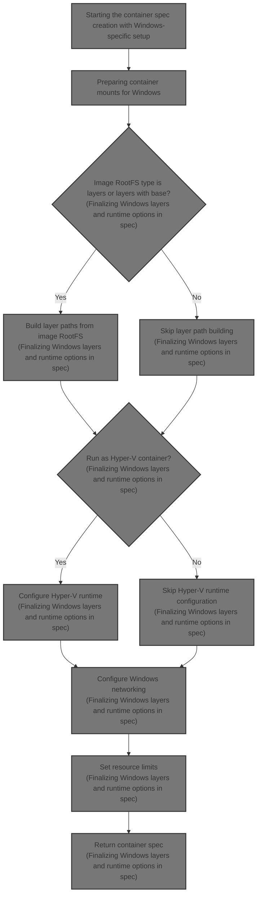
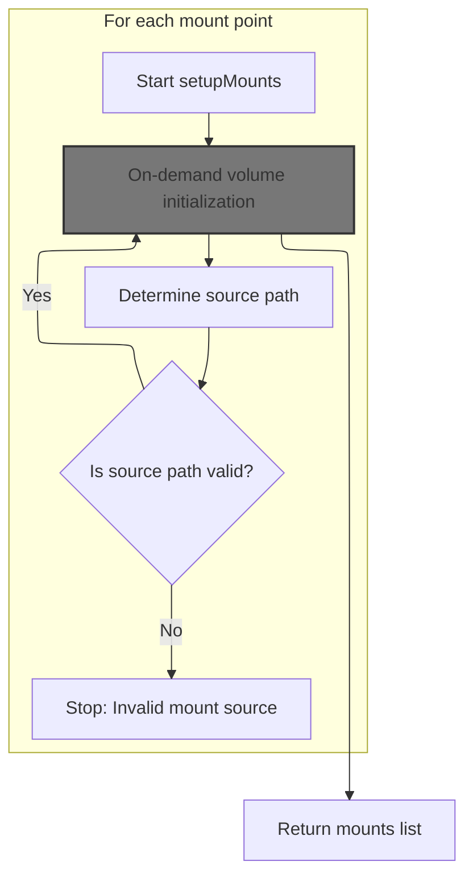

This document explains the creation of a Windows container specification that defines how a container should run. It involves setting up Windows-specific layers and mounts, configuring runtime options including isolation and networking, and setting resource limits. The input is container configuration and image data, and the output is a complete container specification.



# Starting the container spec creation with Windows-specific setup

<SwmSnippet path="/daemon/oci_windows.go" line="18">

---

`createSpec` starts by configuring Windows-specific container layers and runtime options, then calls volumes_windows.go to set up mounts needed for the container's filesystem.

```go
func (daemon *Daemon) createSpec(c *container.Container) (*libcontainerd.Spec, error) {
	s := oci.DefaultSpec()

	linkedEnv, err := daemon.setupLinkedContainers(c)
	if err != nil {
		return nil, err
	}

	// TODO Windows - this can be removed. Not used (UID/GID)
	rootUID, rootGID := daemon.GetRemappedUIDGID()
	if err := c.SetupWorkingDirectory(rootUID, rootGID); err != nil {
		return nil, err
	}

	img, err := daemon.imageStore.Get(c.ImageID)
	if err != nil {
		return nil, fmt.Errorf("Failed to graph.Get on ImageID %s - %s", c.ImageID, err)
	}

	s.Platform.OSVersion = img.OSVersion

	// In base spec
	s.Hostname = c.FullHostname()

	// In s.Mounts
	mounts, err := daemon.setupMounts(c)
	if err != nil {
		return nil, err
	}
	for _, mount := range mounts {
		s.Mounts = append(s.Mounts, windowsoci.Mount{
			Source:      mount.Source,
			Destination: mount.Destination,
			Readonly:    !mount.Writable,
		})
	}

	// In s.Process
	s.Process.Args = append([]string{c.Path}, c.Args...)
	if !c.Config.ArgsEscaped {
		s.Process.Args = escapeArgs(s.Process.Args)
	}
	s.Process.Cwd = c.Config.WorkingDir
	if len(s.Process.Cwd) == 0 {
		// We default to C:\ to workaround the oddity of the case that the
		// default directory for cmd running as LocalSystem (or
		// ContainerAdministrator) is c:\windows\system32. Hence docker run
		// <image> cmd will by default end in c:\windows\system32, rather
		// than 'root' (/) on Linux. The oddity is that if you have a dockerfile
		// which has no WORKDIR and has a COPY file ., . will be interpreted
		// as c:\. Hence, setting it to default of c:\ makes for consistency.
		s.Process.Cwd = `C:\`
	}
	s.Process.Env = c.CreateDaemonEnvironment(linkedEnv)
	s.Process.InitialConsoleSize = c.HostConfig.ConsoleSize
	s.Process.Terminal = c.Config.Tty
	s.Process.User.User = c.Config.User

	// In spec.Root
	s.Root.Path = c.BaseFS
	s.Root.Readonly = c.HostConfig.ReadonlyRootfs

	// In s.Windows
	s.Windows.FirstStart = !c.HasBeenStartedBefore

	// s.Windows.LayerFolder.
	m, err := c.RWLayer.Metadata()
	if err != nil {
		return nil, fmt.Errorf("Failed to get layer metadata - %s", err)
	}
	s.Windows.LayerFolder = m["dir"]

```

---

</SwmSnippet>

## Preparing container mounts for Windows



<SwmSnippet path="/daemon/volumes_windows.go" line="22">

---

`setupMounts` initializes volumes for each mount point to prepare them for mounting.

```go
func (daemon *Daemon) setupMounts(c *container.Container) ([]container.Mount, error) {
	var mnts []container.Mount
	for _, mount := range c.MountPoints { // type is volume.MountPoint
		if err := daemon.lazyInitializeVolume(c.ID, mount); err != nil {
			return nil, err
		}
```

---

</SwmSnippet>

### On-demand volume initialization

<SwmSnippet path="/daemon/volumes.go" line="176">

---

`lazyInitializeVolume` checks if the mount point has a driver but no volume assigned. If so, it fetches the volume from the volume store with a reference to the container ID. This links the volume to the container and prepares it for mounting.

```go
func (daemon *Daemon) lazyInitializeVolume(containerID string, m *volume.MountPoint) error {
	if len(m.Driver) > 0 && m.Volume == nil {
		v, err := daemon.volumes.GetWithRef(m.Name, m.Driver, containerID)
		if err != nil {
			return err
		}
		m.Volume = v
	}
	return nil
}
```

---

</SwmSnippet>

### Retrieving volume references

See <SwmLink doc-title="Volume retrieval and association flow">[Volume retrieval and association flow](\.swm\volume-retrieval-and-association-flow.tqsqshsy.sw.md)</SwmLink>

### Finalizing mount sources and sorting

```mermaid
%%{init: {"flowchart": {"defaultRenderer": "elk"}} }%%
flowchart TD
    node1["Start setup mounts"] --> subgraph loop1["For each mount"]
    node2{"Is mount source provided?"}
    node2 -->|"Yes"| node3["Use mount source"]
    node2 -->|"No"| node4{"Is volume associated with mount?"}
    node4 -->|"Yes"| node5["Use volume path as source"]
    node4 -->|"No"| node6["Return error: No source for mount"]
    node3 --> node7["Create mount entry"]
    node5 --> node7
    node7 --> loop1
    end
    loop1 --> node8["Sort mounts"]
    node8 --> node9["Return mounts list"]

    click node1 openCode "daemon/volumes_windows.go:28:29"
    click node2 openCode "daemon/volumes_windows.go:29:31"
    click node3 openCode "daemon/volumes_windows.go:29:31"
    click node4 openCode "daemon/volumes_windows.go:30:32"
    click node5 openCode "daemon/volumes_windows.go:31:32"
    click node6 openCode "daemon/volumes_windows.go:33:35"
    click node7 openCode "daemon/volumes_windows.go:36:40"
    click node8 openCode "daemon/volumes_windows.go:43:44"
    click node9 openCode "daemon/volumes_windows.go:44:45"
classDef HeadingStyle fill:#777777,stroke:#333,stroke-width:2px;
```

<SwmSnippet path="/daemon/volumes_windows.go" line="28">

---

After returning from `lazyInitializeVolume` in `setupMounts`, we check if the mount source is empty. If so, we get it from the volume's path. If still empty, we error out. Then we append the mount info to the list and sort it before returning.

```go
		// If there is no source, take it from the volume path
		s := mount.Source
		if s == "" && mount.Volume != nil {
			s = mount.Volume.Path()
		}
		if s == "" {
			return nil, fmt.Errorf("No source for mount name '%s' driver %q destination '%s'", mount.Name, mount.Driver, mount.Destination)
		}
		mnts = append(mnts, container.Mount{
			Source:      s,
			Destination: mount.Destination,
			Writable:    mount.RW,
		})
	}

	sort.Sort(mounts(mnts))
	return mnts, nil
}
```

---

</SwmSnippet>

## Finalizing Windows layers and runtime options in spec

```mermaid
%%{init: {"flowchart": {"defaultRenderer": "elk"}} }%%
flowchart TD
    node1["Start creating container spec"] --> node2{"Image RootFS type is layers or layers with base?"}
    node2 -->|"Yes"| subgraph loop1["For each layer in image RootFS"]
        nodeLayer["Append layer path"]
        nodeLayer --> nodeLayer
    end
    node2 -->|"No"| node4
    node4{"Run as Hyper-V container?"}
    node4 -->|"Yes"| node5["Configure Hyper-V runtime"]
    node4 -->|"No"| node6
    node5 --> node7{"Container has network settings?"}
    node6 --> node7
    node7 -->|"Yes"| subgraph loop2["For each network in container settings"]
        nodeNet["Collect network endpoint ID"]
        nodeNet --> nodeNet
    end
    node7 -->|"No"| node9
    subgraph loop2
        nodeNet --> node9["Configure Windows networking"]
    end
    node9 --> node10["Configure resource limits: CPU shares, CPU percent, IO bandwidth, IO ops"]
    node10 --> node11["Return container spec"]

    click node1 openCode "daemon/oci_windows.go:90:92"
    click node2 openCode "daemon/oci_windows.go:92:100"
    click nodeLayer openCode "daemon/oci_windows.go:100:108"
    click node4 openCode "daemon/oci_windows.go:113:120"
    click node5 openCode "daemon/oci_windows.go:121:140"
    click node6 openCode "daemon/oci_windows.go:140:141"
    click node7 openCode "daemon/oci_windows.go:144:165"
    click nodeNet openCode "daemon/oci_windows.go:146:164"
    click node9 openCode "daemon/oci_windows.go:166:168"
    click node10 openCode "daemon/oci_windows.go:171:190"
    click node11 openCode "daemon/oci_windows.go:191:192"
classDef HeadingStyle fill:#777777,stroke:#333,stroke-width:2px;
```

<SwmSnippet path="/daemon/oci_windows.go" line="90">

---

Back in `createSpec` after returning from `setupMounts`, we build LayerPaths by iterating over the image's RootFS DiffIDs. We adjust the start index based on RootFS type, slice DiffIDs, get chain IDs, and fetch layer paths from the layer store. We prepend paths to get them in reverse order as expected by the runtime.

```go
	// s.Windows.LayerPaths
	var layerPaths []string
	if img.RootFS != nil && (img.RootFS.Type == image.TypeLayers || img.RootFS.Type == image.TypeLayersWithBase) {
		// Get the layer path for each layer.
		start := 1
		if img.RootFS.Type == image.TypeLayersWithBase {
			// Include an empty slice to get the base layer ID.
			start = 0
		}
		max := len(img.RootFS.DiffIDs)
		for i := start; i <= max; i++ {
			img.RootFS.DiffIDs = img.RootFS.DiffIDs[:i]
			path, err := layer.GetLayerPath(daemon.layerStore, img.RootFS.ChainID())
			if err != nil {
				return nil, fmt.Errorf("Failed to get layer path from graphdriver %s for ImageID %s - %s", daemon.layerStore, img.RootFS.ChainID(), err)
			}
			// Reverse order, expecting parent most first
			layerPaths = append([]string{path}, layerPaths...)
		}
```

---

</SwmSnippet>

<SwmSnippet path="/daemon/oci_windows.go" line="112">

---

Finally in `createSpec` we decide if the container runs as Hyper-V based on HostConfig or daemon defaults. If yes, we set up the HvRuntime and check for the utility VM image path. We also gather network endpoint IDs for Windows networking and set resource limits like CPU, memory, and storage in the spec before returning it.

```go
	// Are we going to run as a Hyper-V container?
	hv := false
	if c.HostConfig.Isolation.IsDefault() {
		// Container is set to use the default, so take the default from the daemon configuration
		hv = daemon.defaultIsolation.IsHyperV()
	} else {
		// Container is requesting an isolation mode. Honour it.
		hv = c.HostConfig.Isolation.IsHyperV()
	}
	if hv {
		hvr := &windowsoci.HvRuntime{}
		if img.RootFS != nil && img.RootFS.Type == image.TypeLayers {
			// For TP5, the utility VM is part of the base layer.
			// TODO-jstarks: Add support for separate utility VM images
			// once it is decided how they can be stored.
			uvmpath := filepath.Join(layerPaths[len(layerPaths)-1], "UtilityVM")
			_, err = os.Stat(uvmpath)
			if err != nil {
				if os.IsNotExist(err) {
					err = errors.New("container image does not contain a utility VM")
				}
				return nil, err
			}

			hvr.ImagePath = uvmpath
		}

		s.Windows.HvRuntime = hvr
	}

	// In s.Windows.Networking
	// Connect all the libnetwork allocated networks to the container
	var epList []string
	if c.NetworkSettings != nil {
		for n := range c.NetworkSettings.Networks {
			sn, err := daemon.FindNetwork(n)
			if err != nil {
				continue
			}

			ep, err := c.GetEndpointInNetwork(sn)
			if err != nil {
				continue
			}

			data, err := ep.DriverInfo()
			if err != nil {
				continue
			}
			if data["hnsid"] != nil {
				epList = append(epList, data["hnsid"].(string))
			}
		}
	}
	s.Windows.Networking = &windowsoci.Networking{
		EndpointList: epList,
	}

	// In s.Windows.Resources
	// @darrenstahlmsft implement these resources
	cpuShares := uint64(c.HostConfig.CPUShares)
	s.Windows.Resources = &windowsoci.Resources{
		CPU: &windowsoci.CPU{
			Percent: &c.HostConfig.CPUPercent,
			Shares:  &cpuShares,
		},
		Memory: &windowsoci.Memory{
		//TODO Limit: ...,
		//TODO Reservation: ...,
		},
		Network: &windowsoci.Network{
		//TODO Bandwidth: ...,
		},
		Storage: &windowsoci.Storage{
			Bps:  &c.HostConfig.IOMaximumBandwidth,
			Iops: &c.HostConfig.IOMaximumIOps,
			//TODO SandboxSize: ...,
		},
	}
	return (*libcontainerd.Spec)(&s), nil
}
```

---

</SwmSnippet>

&nbsp;

*This is an auto-generated document by Swimm 🌊 and has not yet been verified by a human*

<SwmMeta version="3.0.0" repo-id="Z2l0aHViJTNBJTNBS3ViZXJuZXRlc01vYnklM0ElM0FHb3BpbmF0aHJlZGR5NjY=" repo-name="KubernetesMoby"><sup>Powered by [Swimm](https://app.swimm.io/)</sup></SwmMeta>
