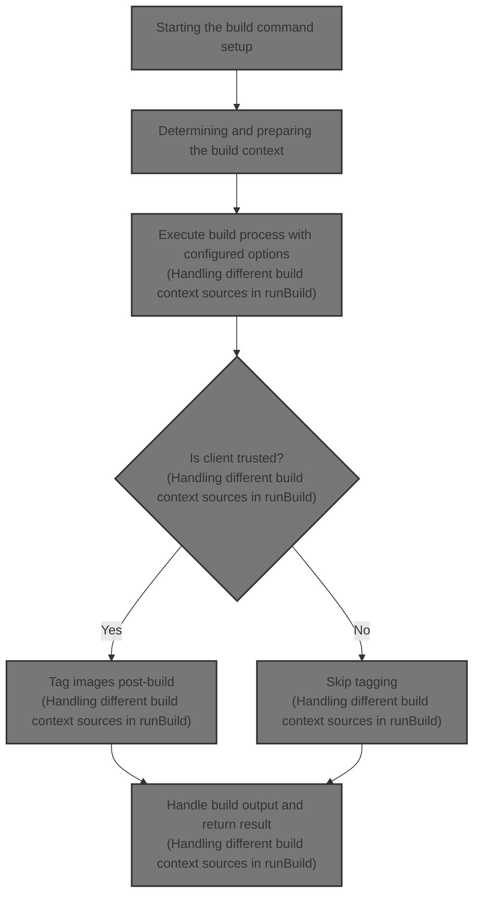
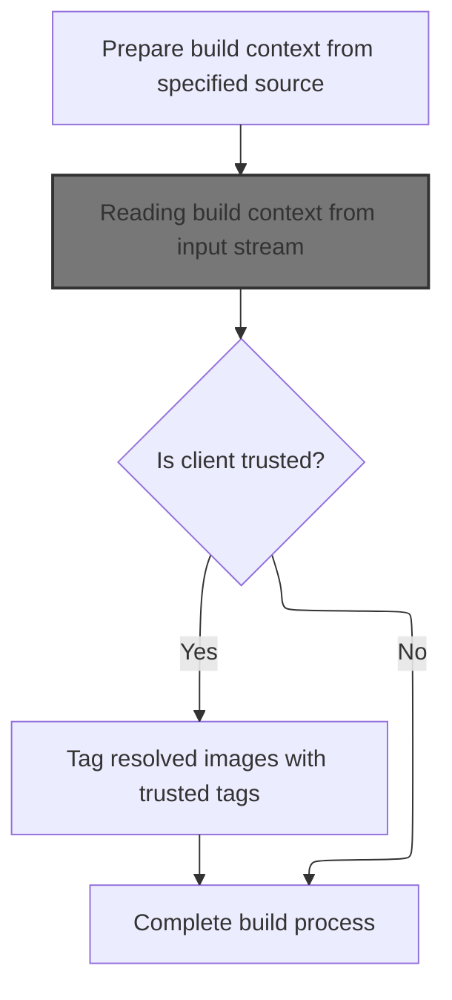
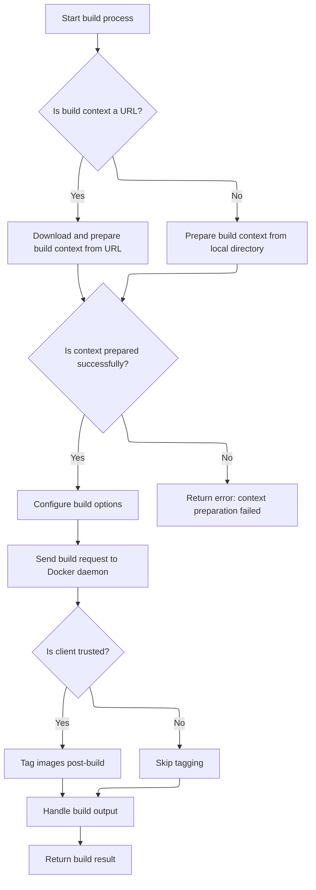
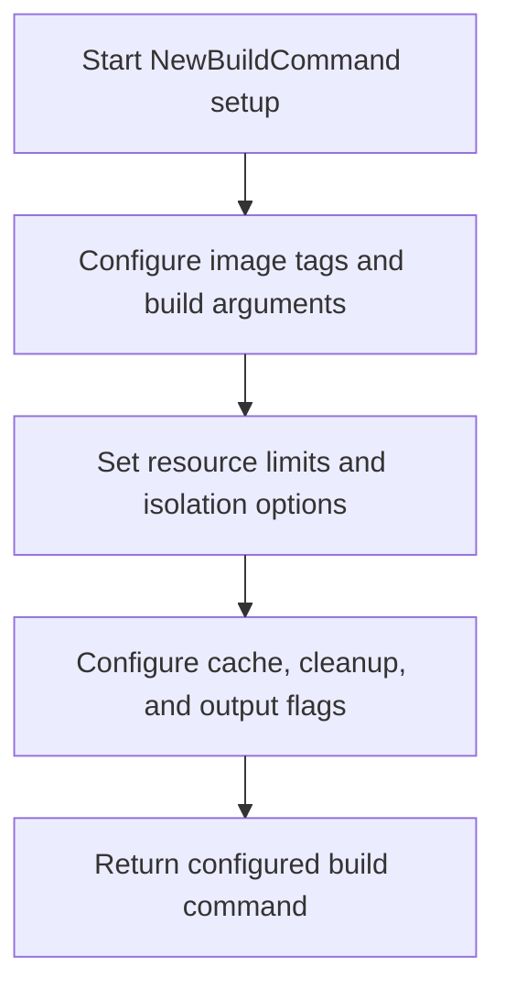

This document describes the flow of the Docker image build command, enabling users to build images from local directories, URLs, or input streams. It explains how the command is configured with options like tags, resource limits, and labels, and how the build context is prepared and sent to the Docker daemon. The flow manages tagging for trusted clients and outputs the build result.



# Starting the build command setup

This section defines the CLI command setup for building Docker images, including the configuration of flags and options, and initiates the build process.

| Category       | Rule Name                           | Description                                                                                                         |
| -------------- | ----------------------------------- | ------------------------------------------------------------------------------------------------------------------- |
| Business logic | Support build customization options | The build command must support options for tags, build arguments, ulimits, and labels to customize the image build. |

<SwmSnippet path="/api/client/image/build.go" line="61">

---

In <SwmToken path="api/client/image/build.go" pos="61:2:2" line-data="func NewBuildCommand(dockerCli *client.DockerCli) *cobra.Command {">`NewBuildCommand`</SwmToken>, we set up the CLI command for building images, defining flags and options. We then call <SwmToken path="api/client/image/build.go" pos="76:3:3" line-data="			return runBuild(dockerCli, options)">`runBuild`</SwmToken> to actually execute the build process with the collected options.

```go
func NewBuildCommand(dockerCli *client.DockerCli) *cobra.Command {
	ulimits := make(map[string]*units.Ulimit)
	options := buildOptions{
		tags:      opts.NewListOpts(validateTag),
		buildArgs: opts.NewListOpts(runconfigopts.ValidateEnv),
		ulimits:   runconfigopts.NewUlimitOpt(&ulimits),
		labels:    opts.NewListOpts(runconfigopts.ValidateEnv),
	}

	cmd := &cobra.Command{
		Use:   "build [OPTIONS] PATH | URL | -",
		Short: "Build an image from a Dockerfile",
		Args:  cli.ExactArgs(1),
		RunE: func(cmd *cobra.Command, args []string) error {
			options.context = args[0]
			return runBuild(dockerCli, options)
		},
	}

```

---

</SwmSnippet>

## Determining and preparing the build context



This section determines and prepares the build context for Docker image builds, handling different sources such as input streams and Git URLs, and applying trusted tags if the client is trusted.

| Category       | Rule Name                         | Description                                                                                          |
| -------------- | --------------------------------- | ---------------------------------------------------------------------------------------------------- |
| Business logic | Trusted client image tagging      | If the client is trusted, resolved images must be tagged with trusted tags during the build process. |
| Business logic | Untrusted client build completion | If the client is not trusted, the build process completes without applying trusted tags to images.   |

<SwmSnippet path="/api/client/image/build.go" line="108">

---

<SwmToken path="api/client/image/build.go" pos="108:2:2" line-data="func runBuild(dockerCli *client.DockerCli, options buildOptions) error {">`runBuild`</SwmToken> determines the build context source and calls <SwmPath>[builder/context.go](builder/context.go)</SwmPath> functions to fetch or prepare it accordingly.

```go
func runBuild(dockerCli *client.DockerCli, options buildOptions) error {

	var (
		buildCtx io.ReadCloser
		err      error
	)

	specifiedContext := options.context

	var (
		contextDir    string
		tempDir       string
		relDockerfile string
		progBuff      io.Writer
		buildBuff     io.Writer
	)

	progBuff = dockerCli.Out()
	buildBuff = dockerCli.Out()
	if options.quiet {
		progBuff = bytes.NewBuffer(nil)
		buildBuff = bytes.NewBuffer(nil)
	}

	switch {
	case specifiedContext == "-":
		buildCtx, relDockerfile, err = builder.GetContextFromReader(dockerCli.In(), options.dockerfileName)
	case urlutil.IsGitURL(specifiedContext):
		tempDir, relDockerfile, err = builder.GetContextFromGitURL(specifiedContext, options.dockerfileName)
```

---

</SwmSnippet>

### Reading build context from input stream

This section describes the process of reading the build context from an input stream during Docker image building.

See <SwmLink doc-title="Preparing Docker build context flow">[Preparing Docker build context flow](.swm%5Cpreparing-docker-build-context-flow.43dkwc51.sw.md)</SwmLink>

### Handling different build context sources in <SwmToken path="api/client/image/build.go" pos="76:3:3" line-data="			return runBuild(dockerCli, options)">`runBuild`</SwmToken>



<SwmSnippet path="/api/client/image/build.go" line="137">

---

<SwmToken path="api/client/image/build.go" pos="76:3:3" line-data="			return runBuild(dockerCli, options)">`runBuild`</SwmToken> continues handling context sources by calling <SwmPath>[builder/context.go](builder/context.go)</SwmPath> for HTTP URLs and local directories.

```go
	case urlutil.IsURL(specifiedContext):
		buildCtx, relDockerfile, err = builder.GetContextFromURL(progBuff, specifiedContext, options.dockerfileName)
	default:
		contextDir, relDockerfile, err = builder.GetContextFromLocalDir(specifiedContext, options.dockerfileName)
	}

```

---

</SwmSnippet>

<SwmSnippet path="/builder/context.go" line="142">

---

<SwmToken path="builder/context.go" pos="142:2:2" line-data="func GetContextFromURL(out io.Writer, remoteURL, dockerfileName string) (io.ReadCloser, string, error) {">`GetContextFromURL`</SwmToken> in <SwmPath>[builder/context.go](builder/context.go)</SwmPath> downloads the build context from a remote URL, wraps the response body with progress reporting, and then calls <SwmToken path="builder/context.go" pos="152:3:3" line-data="	return GetContextFromReader(ioutils.NewReadCloserWrapper(progReader, func() error { return response.Body.Close() }), dockerfileName)">`GetContextFromReader`</SwmToken> to process the stream further.

```go
func GetContextFromURL(out io.Writer, remoteURL, dockerfileName string) (io.ReadCloser, string, error) {
	response, err := httputils.Download(remoteURL)
	if err != nil {
		return nil, "", fmt.Errorf("unable to download remote context %s: %v", remoteURL, err)
	}
	progressOutput := streamformatter.NewStreamFormatter().NewProgressOutput(out, true)

	// Pass the response body through a progress reader.
	progReader := progress.NewProgressReader(response.Body, progressOutput, response.ContentLength, "", fmt.Sprintf("Downloading build context from remote url: %s", remoteURL))

	return GetContextFromReader(ioutils.NewReadCloserWrapper(progReader, func() error { return response.Body.Close() }), dockerfileName)
}
```

---

</SwmSnippet>

<SwmSnippet path="/api/client/image/build.go" line="143">

---

Back in <SwmToken path="api/client/image/build.go" pos="76:3:3" line-data="			return runBuild(dockerCli, options)">`runBuild`</SwmToken> after returning from <SwmPath>[builder/context.go](builder/context.go)</SwmPath>, we prepare the local directory build context by reading <SwmPath>[.dockerignore](.dockerignore)</SwmPath>, validating the context, and archiving it with <SwmPath>[pkg/archive/archive.go](pkg/archive/archive.go)</SwmPath> to send to the daemon.

```go
	if err != nil {
		if options.quiet && urlutil.IsURL(specifiedContext) {
			fmt.Fprintln(dockerCli.Err(), progBuff)
		}
		return fmt.Errorf("unable to prepare context: %s", err)
	}

	if tempDir != "" {
		defer os.RemoveAll(tempDir)
		contextDir = tempDir
	}

	if buildCtx == nil {
		// And canonicalize dockerfile name to a platform-independent one
		relDockerfile, err = archive.CanonicalTarNameForPath(relDockerfile)
		if err != nil {
			return fmt.Errorf("cannot canonicalize dockerfile path %s: %v", relDockerfile, err)
		}

		f, err := os.Open(filepath.Join(contextDir, ".dockerignore"))
		if err != nil && !os.IsNotExist(err) {
			return err
		}

		var excludes []string
		if err == nil {
			excludes, err = dockerignore.ReadAll(f)
			if err != nil {
				return err
			}
		}

		if err := builder.ValidateContextDirectory(contextDir, excludes); err != nil {
			return fmt.Errorf("Error checking context: '%s'.", err)
		}

		// If .dockerignore mentions .dockerignore or the Dockerfile
		// then make sure we send both files over to the daemon
		// because Dockerfile is, obviously, needed no matter what, and
		// .dockerignore is needed to know if either one needs to be
		// removed. The daemon will remove them for us, if needed, after it
		// parses the Dockerfile. Ignore errors here, as they will have been
		// caught by validateContextDirectory above.
		var includes = []string{"."}
		keepThem1, _ := fileutils.Matches(".dockerignore", excludes)
		keepThem2, _ := fileutils.Matches(relDockerfile, excludes)
		if keepThem1 || keepThem2 {
			includes = append(includes, ".dockerignore", relDockerfile)
		}

		buildCtx, err = archive.TarWithOptions(contextDir, &archive.TarOptions{
			Compression:     archive.Uncompressed,
			ExcludePatterns: excludes,
			IncludeFiles:    includes,
		})
		if err != nil {
			return err
		}
	}

```

---

</SwmSnippet>

<SwmSnippet path="/api/client/image/build.go" line="203">

---

At the end of <SwmToken path="api/client/image/build.go" pos="76:3:3" line-data="			return runBuild(dockerCli, options)">`runBuild`</SwmToken>, after getting the build context tar from <SwmPath>[pkg/archive/archive.go](pkg/archive/archive.go)</SwmPath>, we handle trusted builds by wrapping the tar to rewrite the <SwmPath>[Dockerfile](Dockerfile)</SwmPath>, parse resource limits, set build options, call the Docker API to build the image, and handle tagging of trusted images.

```go
	ctx := context.Background()

	var resolvedTags []*resolvedTag
	if client.IsTrusted() {
		// Wrap the tar archive to replace the Dockerfile entry with the rewritten
		// Dockerfile which uses trusted pulls.
		buildCtx = replaceDockerfileTarWrapper(ctx, buildCtx, relDockerfile, dockerCli.TrustedReference, &resolvedTags)
	}

	// Setup an upload progress bar
	progressOutput := streamformatter.NewStreamFormatter().NewProgressOutput(progBuff, true)

	var body io.Reader = progress.NewProgressReader(buildCtx, progressOutput, 0, "", "Sending build context to Docker daemon")

	var memory int64
	if options.memory != "" {
		parsedMemory, err := units.RAMInBytes(options.memory)
		if err != nil {
			return err
		}
		memory = parsedMemory
	}

	var memorySwap int64
	if options.memorySwap != "" {
		if options.memorySwap == "-1" {
			memorySwap = -1
		} else {
			parsedMemorySwap, err := units.RAMInBytes(options.memorySwap)
			if err != nil {
				return err
			}
			memorySwap = parsedMemorySwap
		}
	}

	var shmSize int64
	if options.shmSize != "" {
		shmSize, err = units.RAMInBytes(options.shmSize)
		if err != nil {
			return err
		}
	}

	buildOptions := types.ImageBuildOptions{
		Memory:         memory,
		MemorySwap:     memorySwap,
		Tags:           options.tags.GetAll(),
		SuppressOutput: options.quiet,
		NoCache:        options.noCache,
		Remove:         options.rm,
		ForceRemove:    options.forceRm,
		PullParent:     options.pull,
		Isolation:      container.Isolation(options.isolation),
		CPUSetCPUs:     options.cpuSetCpus,
		CPUSetMems:     options.cpuSetMems,
		CPUShares:      options.cpuShares,
		CPUQuota:       options.cpuQuota,
		CPUPeriod:      options.cpuPeriod,
		CgroupParent:   options.cgroupParent,
		Dockerfile:     relDockerfile,
		ShmSize:        shmSize,
		Ulimits:        options.ulimits.GetList(),
		BuildArgs:      runconfigopts.ConvertKVStringsToMap(options.buildArgs.GetAll()),
		AuthConfigs:    dockerCli.RetrieveAuthConfigs(),
		Labels:         runconfigopts.ConvertKVStringsToMap(options.labels.GetAll()),
	}

	response, err := dockerCli.Client().ImageBuild(ctx, body, buildOptions)
	if err != nil {
		return err
	}
	defer response.Body.Close()

	err = jsonmessage.DisplayJSONMessagesStream(response.Body, buildBuff, dockerCli.OutFd(), dockerCli.IsTerminalOut(), nil)
	if err != nil {
		if jerr, ok := err.(*jsonmessage.JSONError); ok {
			// If no error code is set, default to 1
			if jerr.Code == 0 {
				jerr.Code = 1
			}
			if options.quiet {
				fmt.Fprintf(dockerCli.Err(), "%s%s", progBuff, buildBuff)
			}
			return cli.StatusError{Status: jerr.Message, StatusCode: jerr.Code}
		}
	}

	// Windows: show error message about modified file permissions if the
	// daemon isn't running Windows.
	if response.OSType != "windows" && runtime.GOOS == "windows" {
		fmt.Fprintln(dockerCli.Err(), `SECURITY WARNING: You are building a Docker image from Windows against a non-Windows Docker host. All files and directories added to build context will have '-rwxr-xr-x' permissions. It is recommended to double check and reset permissions for sensitive files and directories.`)
	}

	// Everything worked so if -q was provided the output from the daemon
	// should be just the image ID and we'll print that to stdout.
	if options.quiet {
		fmt.Fprintf(dockerCli.Out(), "%s", buildBuff)
	}

	if client.IsTrusted() {
		// Since the build was successful, now we must tag any of the resolved
		// images from the above Dockerfile rewrite.
		for _, resolved := range resolvedTags {
			if err := dockerCli.TagTrusted(ctx, resolved.digestRef, resolved.tagRef); err != nil {
				return err
			}
		}
	}

	return nil
}
```

---

</SwmSnippet>

## Configuring build flags and options



<SwmSnippet path="/api/client/image/build.go" line="80">

---

Back in <SwmToken path="api/client/image/build.go" pos="61:2:2" line-data="func NewBuildCommand(dockerCli *client.DockerCli) *cobra.Command {">`NewBuildCommand`</SwmToken> after <SwmToken path="api/client/image/build.go" pos="76:3:3" line-data="			return runBuild(dockerCli, options)">`runBuild`</SwmToken> returns, we set up all the command flags that users can specify to control the build process. This configures the CLI interface for the build command.

```go
	flags := cmd.Flags()

	flags.VarP(&options.tags, "tag", "t", "Name and optionally a tag in the 'name:tag' format")
	flags.Var(&options.buildArgs, "build-arg", "Set build-time variables")
	flags.Var(options.ulimits, "ulimit", "Ulimit options")
	flags.StringVarP(&options.dockerfileName, "file", "f", "", "Name of the Dockerfile (Default is 'PATH/Dockerfile')")
	flags.StringVarP(&options.memory, "memory", "m", "", "Memory limit")
	flags.StringVar(&options.memorySwap, "memory-swap", "", "Swap limit equal to memory plus swap: '-1' to enable unlimited swap")
	flags.StringVar(&options.shmSize, "shm-size", "", "Size of /dev/shm, default value is 64MB")
	flags.Int64VarP(&options.cpuShares, "cpu-shares", "c", 0, "CPU shares (relative weight)")
	flags.Int64Var(&options.cpuPeriod, "cpu-period", 0, "Limit the CPU CFS (Completely Fair Scheduler) period")
	flags.Int64Var(&options.cpuQuota, "cpu-quota", 0, "Limit the CPU CFS (Completely Fair Scheduler) quota")
	flags.StringVar(&options.cpuSetCpus, "cpuset-cpus", "", "CPUs in which to allow execution (0-3, 0,1)")
	flags.StringVar(&options.cpuSetMems, "cpuset-mems", "", "MEMs in which to allow execution (0-3, 0,1)")
	flags.StringVar(&options.cgroupParent, "cgroup-parent", "", "Optional parent cgroup for the container")
	flags.StringVar(&options.isolation, "isolation", "", "Container isolation technology")
	flags.Var(&options.labels, "label", "Set metadata for an image")
	flags.BoolVar(&options.noCache, "no-cache", false, "Do not use cache when building the image")
	flags.BoolVar(&options.rm, "rm", true, "Remove intermediate containers after a successful build")
	flags.BoolVar(&options.forceRm, "force-rm", false, "Always remove intermediate containers")
	flags.BoolVarP(&options.quiet, "quiet", "q", false, "Suppress the build output and print image ID on success")
	flags.BoolVar(&options.pull, "pull", false, "Always attempt to pull a newer version of the image")

	client.AddTrustedFlags(flags, true)

	return cmd
}
```

---

</SwmSnippet>

&nbsp;

*This is an auto-generated document by Swimm 🌊 and has not yet been verified by a human*

<SwmMeta version="3.0.0" repo-id="Z2l0aHViJTNBJTNBS3ViZXJuZXRlc01vYnklM0ElM0FHb3BpbmF0aHJlZGR5NjY=" repo-name="KubernetesMoby"><sup>Powered by [Swimm](https://app.swimm.io/)</sup></SwmMeta>
