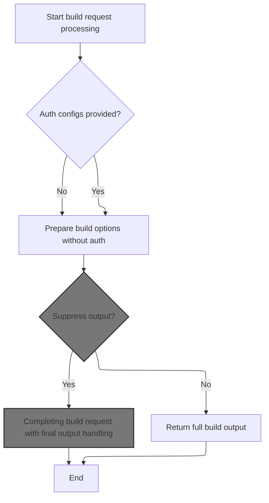
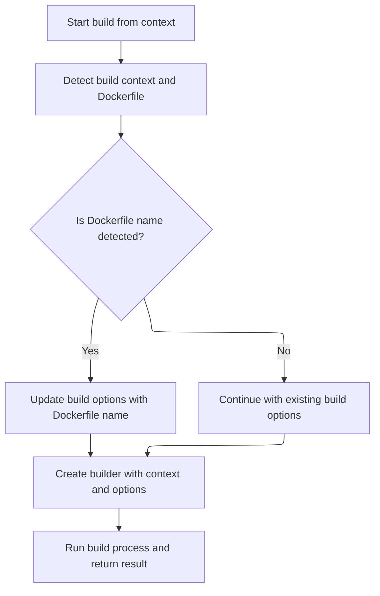
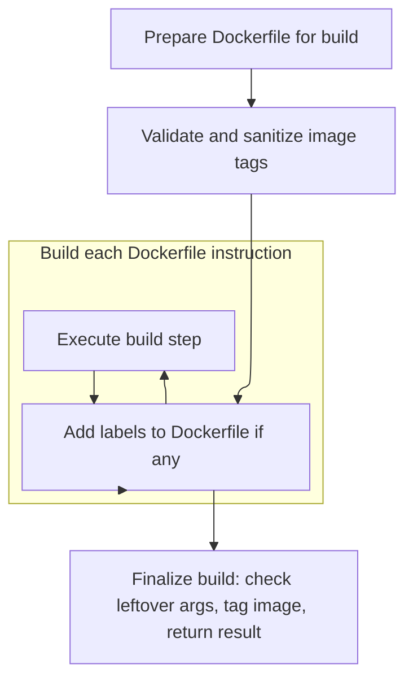
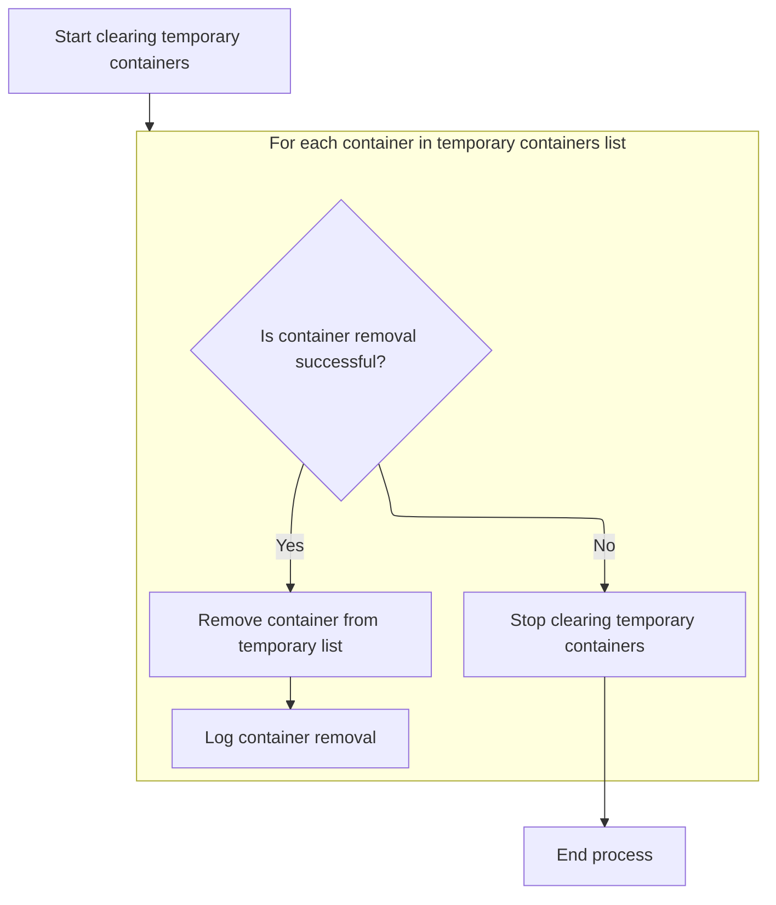
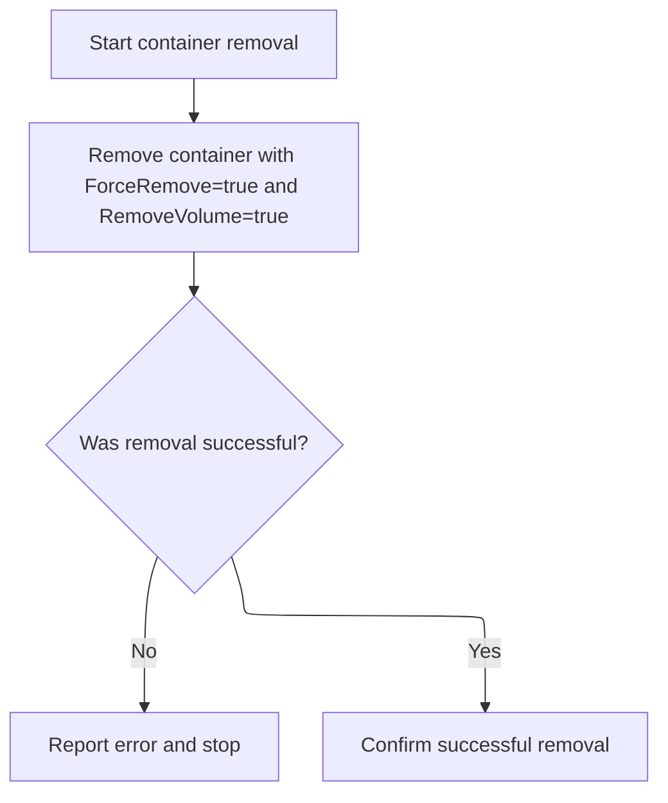
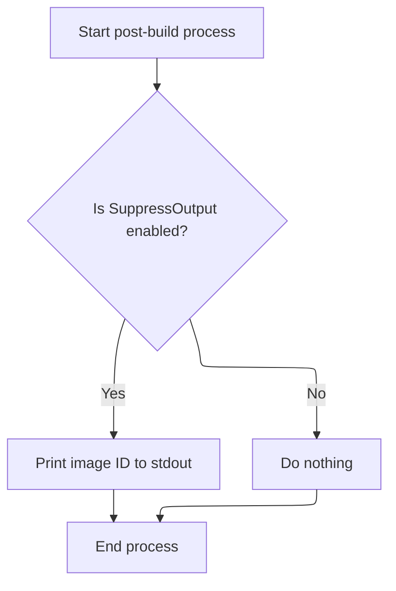

This document describes the flow of processing a Docker image build request, from receiving build options and authentication to producing a built Docker image. It covers preparing the build context, executing <SwmPath>[Dockerfile](Dockerfile)</SwmPath> instructions, managing intermediate containers, finalizing the build with tagging, and handling output formatting.



```mermaid
flowchart TD
 node1["Starting the build request and parsing build options
(Starting the build request and parsing build options)"]:::HeadingStyle --> node2{"Auth configs provided?
(Starting the build request and parsing build options)"}:::HeadingStyle
 node2 -->|"Yes"| node3["Preparing build context and initializing builder
(Preparing build context and initializing builder)"]:::HeadingStyle
 node2 -->|"No"| node3
 node3 --> node4{"Dockerfile name detected?
(Preparing build context and initializing builder)"}:::HeadingStyle
 node4 -->|"Yes"| node5["Executing Dockerfile instructions and managing build steps"]:::HeadingStyle
 node4 -->|"No"| node5
 node5 --> node6{"Suppress output enabled?
(Starting the build request and parsing build options)"}:::HeadingStyle
 node6 -->|"Yes"| node7["Finalizing build: validating args, tagging, and success output"]:::HeadingStyle
 node6 -->|"No"| node7

click node1 goToHeading "Starting the build request and parsing build options"
click node2 goToHeading "Starting the build request and parsing build options"
click node3 goToHeading "Preparing build context and initializing builder"
click node4 goToHeading "Preparing build context and initializing builder"
click node5 goToHeading "Executing Dockerfile instructions and managing build steps"
click node6 goToHeading "Starting the build request and parsing build options"
click node7 goToHeading "Finalizing build: validating args, tagging, and success output"
classDef HeadingStyle fill:#777777,stroke:#333,stroke-width:2px;

%% Swimm:
%% flowchart TD
%%  node1["Starting the build request and parsing build options
%% (Starting the build request and parsing build options)"]:::HeadingStyle --> node2{"Auth configs provided?
%% (Starting the build request and parsing build options)"}:::HeadingStyle
%%  node2 -->|"Yes"| node3["Preparing build context and initializing builder
%% (Preparing build context and initializing builder)"]:::HeadingStyle
%%  node2 -->|"No"| node3
%%  node3 --> node4{"<SwmPath>[Dockerfile](Dockerfile)</SwmPath> name detected?
%% (Preparing build context and initializing builder)"}:::HeadingStyle
%%  node4 -->|"Yes"| node5["Executing <SwmPath>[Dockerfile](Dockerfile)</SwmPath> instructions and managing build steps"]:::HeadingStyle
%%  node4 -->|"No"| node5
%%  node5 --> node6{"Suppress output enabled?
%% (Starting the build request and parsing build options)"}:::HeadingStyle
%%  node6 -->|"Yes"| node7["Finalizing build: validating args, tagging, and success output"]:::HeadingStyle
%%  node6 -->|"No"| node7
%% 
%% click node1 goToHeading "Starting the build request and parsing build options"
%% click node2 goToHeading "Starting the build request and parsing build options"
%% click node3 goToHeading "Preparing build context and initializing builder"
%% click node4 goToHeading "Preparing build context and initializing builder"
%% click node5 goToHeading "Executing <SwmPath>[Dockerfile](Dockerfile)</SwmPath> instructions and managing build steps"
%% click node6 goToHeading "Starting the build request and parsing build options"
%% click node7 goToHeading "Finalizing build: validating args, tagging, and success output"
%% classDef HeadingStyle fill:#777777,stroke:#333,stroke-width:2px;
```

# Starting the build request and parsing build options



This section handles starting the build request by parsing authentication and build options, setting up output streams for verbose or quiet modes, and initiating the build process with progress reporting.

| Category        | Rule Name                         | Description                                                                                                                                                                                                                                                                                                                                 |
| --------------- | --------------------------------- | ------------------------------------------------------------------------------------------------------------------------------------------------------------------------------------------------------------------------------------------------------------------------------------------------------------------------------------------- |
| Data validation | Isolation Mode Validation         | Validate isolation mode parameter to ensure it is supported; reject the build request if an unsupported isolation mode is specified.                                                                                                                                                                                                        |
| Data validation | JSON Parameter Validation         | If JSON parameters such as buildargs, labels, or ulimits are provided, they must be valid JSON strings; otherwise, the build request should be rejected with an error.                                                                                                                                                                      |
| Business logic  | Authentication Handling           | If authentication configuration is provided in the request header, decode and use it to authenticate the build process; otherwise, proceed with empty authentication configuration.                                                                                                                                                         |
| Business logic  | Build Options Parsing             | Build options must be parsed from the HTTP request parameters, with certain options gated by API version to ensure backward compatibility and feature support.                                                                                                                                                                              |
| Business logic  | Output Suppression                | If the <SwmToken path="api/server/router/build/build_routes.go" pos="42:3:3" line-data="	options.SuppressOutput = httputils.BoolValue(r, &quot;q&quot;)">`SuppressOutput`</SwmToken> (quiet) flag is set, the build output should be buffered and only sent at the end or on error; otherwise, output should be streamed live to the client. |
| Business logic  | Remote Context Progress Reporting | When a remote URL for the build context is specified, a progress reader must be created to report download progress back to the client.                                                                                                                                                                                                     |

<SwmSnippet path="/api/server/router/build/build_routes.go" line="111">

---

Here we start the build request by decoding registry authentication info from the request header and setting up output streams that handle verbose or quiet modes. We call <SwmToken path="api/server/router/build/build_routes.go" pos="148:8:8" line-data="	buildOptions, err := newImageBuildOptions(ctx, r)">`newImageBuildOptions`</SwmToken> next to parse all build parameters from the request, which configures how the build will run.

```go
func (br *buildRouter) postBuild(ctx context.Context, w http.ResponseWriter, r *http.Request, vars map[string]string) error {
	var (
		authConfigs        = map[string]types.AuthConfig{}
		authConfigsEncoded = r.Header.Get("X-Registry-Config")
		notVerboseBuffer   = bytes.NewBuffer(nil)
	)

	if authConfigsEncoded != "" {
		authConfigsJSON := base64.NewDecoder(base64.URLEncoding, strings.NewReader(authConfigsEncoded))
		if err := json.NewDecoder(authConfigsJSON).Decode(&authConfigs); err != nil {
			// for a pull it is not an error if no auth was given
			// to increase compatibility with the existing api it is defaulting
			// to be empty.
		}
	}

	w.Header().Set("Content-Type", "application/json")

	output := ioutils.NewWriteFlusher(w)
	defer output.Close()
	sf := streamformatter.NewJSONStreamFormatter()
	errf := func(err error) error {
		if httputils.BoolValue(r, "q") && notVerboseBuffer.Len() > 0 {
			output.Write(notVerboseBuffer.Bytes())
		}
		// Do not write the error in the http output if it's still empty.
		// This prevents from writing a 200(OK) when there is an internal error.
		if !output.Flushed() {
			return err
		}
		_, err = w.Write(sf.FormatError(err))
		if err != nil {
			logrus.Warnf("could not write error response: %v", err)
		}
		return nil
	}

	buildOptions, err := newImageBuildOptions(ctx, r)
	if err != nil {
		return errf(err)
	}
	buildOptions.AuthConfigs = authConfigs

```

---

</SwmSnippet>

<SwmSnippet path="/api/server/router/build/build_routes.go" line="27">

---

NewImageBuildOptions parses build parameters from the HTTP request, gating some options like Remove and <SwmToken path="api/server/router/build/build_routes.go" pos="38:3:3" line-data="		options.PullParent = true">`PullParent`</SwmToken> based on API version. It decodes JSON strings for buildargs, labels, and ulimits, and validates isolation modes. It assumes these parameters are either empty or valid JSON.

```go
func newImageBuildOptions(ctx context.Context, r *http.Request) (*types.ImageBuildOptions, error) {
	version := httputils.VersionFromContext(ctx)
	options := &types.ImageBuildOptions{}
	if httputils.BoolValue(r, "forcerm") && versions.GreaterThanOrEqualTo(version, "1.12") {
		options.Remove = true
	} else if r.FormValue("rm") == "" && versions.GreaterThanOrEqualTo(version, "1.12") {
		options.Remove = true
	} else {
		options.Remove = httputils.BoolValue(r, "rm")
	}
	if httputils.BoolValue(r, "pull") && versions.GreaterThanOrEqualTo(version, "1.16") {
		options.PullParent = true
	}

	options.Dockerfile = r.FormValue("dockerfile")
	options.SuppressOutput = httputils.BoolValue(r, "q")
	options.NoCache = httputils.BoolValue(r, "nocache")
	options.ForceRemove = httputils.BoolValue(r, "forcerm")
	options.MemorySwap = httputils.Int64ValueOrZero(r, "memswap")
	options.Memory = httputils.Int64ValueOrZero(r, "memory")
	options.CPUShares = httputils.Int64ValueOrZero(r, "cpushares")
	options.CPUPeriod = httputils.Int64ValueOrZero(r, "cpuperiod")
	options.CPUQuota = httputils.Int64ValueOrZero(r, "cpuquota")
	options.CPUSetCPUs = r.FormValue("cpusetcpus")
	options.CPUSetMems = r.FormValue("cpusetmems")
	options.CgroupParent = r.FormValue("cgroupparent")
	options.Tags = r.Form["t"]

	if r.Form.Get("shmsize") != "" {
		shmSize, err := strconv.ParseInt(r.Form.Get("shmsize"), 10, 64)
		if err != nil {
			return nil, err
		}
		options.ShmSize = shmSize
	}

	if i := container.Isolation(r.FormValue("isolation")); i != "" {
		if !container.Isolation.IsValid(i) {
			return nil, fmt.Errorf("Unsupported isolation: %q", i)
		}
		options.Isolation = i
	}

	var buildUlimits = []*units.Ulimit{}
	ulimitsJSON := r.FormValue("ulimits")
	if ulimitsJSON != "" {
		if err := json.NewDecoder(strings.NewReader(ulimitsJSON)).Decode(&buildUlimits); err != nil {
			return nil, err
		}
		options.Ulimits = buildUlimits
	}

	var buildArgs = map[string]string{}
	buildArgsJSON := r.FormValue("buildargs")
	if buildArgsJSON != "" {
		if err := json.NewDecoder(strings.NewReader(buildArgsJSON)).Decode(&buildArgs); err != nil {
			return nil, err
		}
		options.BuildArgs = buildArgs
	}
	var labels = map[string]string{}
	labelsJSON := r.FormValue("labels")
	if labelsJSON != "" {
		if err := json.NewDecoder(strings.NewReader(labelsJSON)).Decode(&labels); err != nil {
			return nil, err
		}
		options.Labels = labels
	}

	return options, nil
}
```

---

</SwmSnippet>

<SwmSnippet path="/api/server/router/build/build_routes.go" line="154">

---

After parsing build options, we set up output writers that respect quiet mode, create a progress reader to report download progress for remote contexts, and then call the backend's <SwmToken path="api/server/router/build/build_routes.go" pos="181:12:12" line-data="	imgID, err := br.backend.BuildFromContext(ctx, r.Body, remoteURL, buildOptions, pg)">`BuildFromContext`</SwmToken> to start the build, streaming progress back to the client.

```go
	remoteURL := r.FormValue("remote")

	// Currently, only used if context is from a remote url.
	// Look at code in DetectContextFromRemoteURL for more information.
	createProgressReader := func(in io.ReadCloser) io.ReadCloser {
		progressOutput := sf.NewProgressOutput(output, true)
		if buildOptions.SuppressOutput {
			progressOutput = sf.NewProgressOutput(notVerboseBuffer, true)
		}
		return progress.NewProgressReader(in, progressOutput, r.ContentLength, "Downloading context", remoteURL)
	}

	var out io.Writer = output
	if buildOptions.SuppressOutput {
		out = notVerboseBuffer
	}
	out = &syncWriter{w: out}
	stdout := &streamformatter.StdoutFormatter{Writer: out, StreamFormatter: sf}
	stderr := &streamformatter.StderrFormatter{Writer: out, StreamFormatter: sf}

	pg := backend.ProgressWriter{
		Output:             out,
		StdoutFormatter:    stdout,
		StderrFormatter:    stderr,
		ProgressReaderFunc: createProgressReader,
	}

	imgID, err := br.backend.BuildFromContext(ctx, r.Body, remoteURL, buildOptions, pg)
	if err != nil {
		return errf(err)
	}

```

---

</SwmSnippet>

## Preparing build context and initializing builder



This section handles preparing the build context and initializing the builder for Docker image builds.

| Category       | Rule Name                                                  | Description                                                                                                                                                                    |
| -------------- | ---------------------------------------------------------- | ------------------------------------------------------------------------------------------------------------------------------------------------------------------------------ |
| Business logic | <SwmPath>[Dockerfile](Dockerfile)</SwmPath> name detection | If a <SwmPath>[Dockerfile](Dockerfile)</SwmPath> name is detected in the build context, update the build options to use this <SwmPath>[Dockerfile](Dockerfile)</SwmPath> name. |
| Business logic | Default <SwmPath>[Dockerfile](Dockerfile)</SwmPath> usage  | If no <SwmPath>[Dockerfile](Dockerfile)</SwmPath> name is detected, continue the build process with the existing build options without modification.                           |
| Business logic | Builder initialization                                     | Create a builder instance using the prepared build context and the finalized build options before starting the build process.                                                  |
| Business logic | Build execution and result                                 | Execute the build process using the initialized builder and return the build result or error to the caller.                                                                    |

<SwmSnippet path="/builder/dockerfile/builder.go" line="91">

---

<SwmToken path="builder/dockerfile/builder.go" pos="91:9:9" line-data="func (bm *BuildManager) BuildFromContext(ctx context.Context, src io.ReadCloser, remote string, buildOptions *types.ImageBuildOptions, pg backend.ProgressWriter) (string, error) {">`BuildFromContext`</SwmToken> detects if the build context is remote and prepares it, sets the <SwmPath>[Dockerfile](Dockerfile)</SwmPath> name if found, creates a Builder with the context and options, and then calls build to execute the build steps.

```go
func (bm *BuildManager) BuildFromContext(ctx context.Context, src io.ReadCloser, remote string, buildOptions *types.ImageBuildOptions, pg backend.ProgressWriter) (string, error) {
	buildContext, dockerfileName, err := builder.DetectContextFromRemoteURL(src, remote, pg.ProgressReaderFunc)
	if err != nil {
		return "", err
	}
	defer func() {
		if err := buildContext.Close(); err != nil {
			logrus.Debugf("[BUILDER] failed to remove temporary context: %v", err)
		}
	}()
	if len(dockerfileName) > 0 {
		buildOptions.Dockerfile = dockerfileName
	}
	b, err := NewBuilder(ctx, buildOptions, bm.backend, builder.DockerIgnoreContext{ModifiableContext: buildContext}, nil)
	if err != nil {
		return "", err
	}
	return b.build(pg.StdoutFormatter, pg.StderrFormatter, pg.Output)
}
```

---

</SwmSnippet>

## Executing <SwmPath>[Dockerfile](Dockerfile)</SwmPath> instructions and managing build steps



This section describes the process of executing <SwmPath>[Dockerfile](Dockerfile)</SwmPath> instructions and managing build steps in Docker's build system.

| Category        | Rule Name                                                                                                                                                                                            | Description                                                                                                                                                                                                                                                                 |
| --------------- | ---------------------------------------------------------------------------------------------------------------------------------------------------------------------------------------------------- | --------------------------------------------------------------------------------------------------------------------------------------------------------------------------------------------------------------------------------------------------------------------------- |
| Data validation | Parse <SwmPath>[Dockerfile](Dockerfile)</SwmPath> Before Build                                                                                                                                       | If the <SwmPath>[Dockerfile](Dockerfile)</SwmPath> has not been parsed yet, it must be parsed before any build steps are executed.                                                                                                                                          |
| Data validation | Validate Image Tags                                                                                                                                                                                  | Image tags must be validated and sanitized before being applied to the built image.                                                                                                                                                                                         |
| Business logic  | Append Labels to <SwmPath>[Dockerfile](Dockerfile)</SwmPath>                                                                                                                                         | If labels are provided in the build options, they must be appended as LABEL instructions to the <SwmPath>[Dockerfile](Dockerfile)</SwmPath> before executing build steps.                                                                                                   |
| Business logic  | Sequential Execution with Cancellation                                                                                                                                                               | Each <SwmPath>[Dockerfile](Dockerfile)</SwmPath> instruction must be executed sequentially as a build step, and the build must be cancellable at any point.                                                                                                                 |
| Business logic  | Cleanup on Failure with <SwmToken path="api/server/router/build/build_routes.go" pos="44:3:3" line-data="	options.ForceRemove = httputils.BoolValue(r, &quot;forcerm&quot;)">`ForceRemove`</SwmToken> | If the <SwmToken path="api/server/router/build/build_routes.go" pos="44:3:3" line-data="	options.ForceRemove = httputils.BoolValue(r, &quot;forcerm&quot;)">`ForceRemove`</SwmToken> option is enabled and a build step fails, temporary build resources must be cleaned up. |
| Business logic  | Output Intermediate Image ID                                                                                                                                                                         | After each successful build step, the intermediate image ID must be truncated and output to the user.                                                                                                                                                                       |
| Business logic  | Cleanup on Success with Remove                                                                                                                                                                       | If the Remove option is enabled, temporary build resources must be cleaned up after each successful build step.                                                                                                                                                             |

<SwmSnippet path="/builder/dockerfile/builder.go" line="206">

---

In build we parse the <SwmPath>[Dockerfile](Dockerfile)</SwmPath> if not done yet, append LABEL instructions if any, then iterate over <SwmPath>[Dockerfile](Dockerfile)</SwmPath> instructions dispatching each. We handle cancellation and cleanup on errors.

```go
func (b *Builder) build(stdout io.Writer, stderr io.Writer, out io.Writer) (string, error) {
	b.Stdout = stdout
	b.Stderr = stderr
	b.Output = out

	// If Dockerfile was not parsed yet, extract it from the Context
	if b.dockerfile == nil {
		if err := b.readDockerfile(); err != nil {
			return "", err
		}
	}

	repoAndTags, err := sanitizeRepoAndTags(b.options.Tags)
	if err != nil {
		return "", err
	}

	if len(b.options.Labels) > 0 {
		line := "LABEL "
		for k, v := range b.options.Labels {
			line += fmt.Sprintf("%q=%q ", k, v)
		}
		_, node, err := parser.ParseLine(line, &b.directive)
		if err != nil {
			return "", err
		}
		b.dockerfile.Children = append(b.dockerfile.Children, node)
	}

	var shortImgID string
	for i, n := range b.dockerfile.Children {
		select {
		case <-b.clientCtx.Done():
			logrus.Debug("Builder: build cancelled!")
			fmt.Fprintf(b.Stdout, "Build cancelled")
			return "", fmt.Errorf("Build cancelled")
		default:
			// Not cancelled yet, keep going...
		}
		if err := b.dispatch(i, n); err != nil {
			if b.options.ForceRemove {
				b.clearTmp()
			}
			return "", err
		}

		shortImgID = stringid.TruncateID(b.image)
		fmt.Fprintf(b.Stdout, " ---> %s\n", shortImgID)
		if b.options.Remove {
			b.clearTmp()
		}
	}

```

---

</SwmSnippet>

### Cleaning up intermediate build containers



This section describes the process of cleaning up intermediate build containers during a Docker build, ensuring temporary containers are removed and logged appropriately.

| Category       | Rule Name                       | Description                                                                                                                                |
| -------------- | ------------------------------- | ------------------------------------------------------------------------------------------------------------------------------------------ |
| Business logic | Temporary container eligibility | Only containers tracked as temporary intermediate containers during the build are eligible for removal.                                    |
| Business logic | Remove from tracking list       | Upon successful removal of a container, it must be deleted from the temporary container tracking list to avoid redundant removal attempts. |
| Business logic | Log container removal           | Each successful container removal must be logged with a message indicating the container ID truncated for readability.                     |

<SwmSnippet path="/builder/dockerfile/internals.go" line="587">

---

ClearTmp removes all intermediate containers tracked during the build, printing removal messages and deleting them from the temporary container map.

```go
func (b *Builder) clearTmp() {
	for c := range b.tmpContainers {
		if err := b.removeContainer(c); err != nil {
			return
		}
		delete(b.tmpContainers, c)
		fmt.Fprintf(b.Stdout, "Removing intermediate container %s\n", stringid.TruncateID(c))
	}
}
```

---

</SwmSnippet>

### Force removing intermediate containers and volumes



This section describes the process of forcefully removing intermediate containers and their associated volumes during Docker image building.

| Category       | Rule Name               | Description                                                                                                    |
| -------------- | ----------------------- | -------------------------------------------------------------------------------------------------------------- |
| Business logic | Confirm removal success | Successful removal of intermediate containers and volumes must be confirmed to proceed with the build process. |

<SwmSnippet path="/builder/dockerfile/internals.go" line="575">

---

RemoveContainer calls Docker's container removal with force and volume removal enabled, logging errors if removal fails.

```go
func (b *Builder) removeContainer(c string) error {
	rmConfig := &types.ContainerRmConfig{
		ForceRemove:  true,
		RemoveVolume: true,
	}
	if err := b.docker.ContainerRm(c, rmConfig); err != nil {
		fmt.Fprintf(b.Stdout, "Error removing intermediate container %s: %v\n", stringid.TruncateID(c), err)
		return err
	}
	return nil
}
```

---

</SwmSnippet>

### Container removal with concurrency control and volume cleanup

```mermaid
%%{init: {"flowchart": {"defaultRenderer": "elk"}} }%%
flowchart TD
    node1["Start container removal"] --> node2{"Container exists?"}
    click node1 openCode "daemon/delete.go:21:50"
    node2 -->|"No"| node3["Return error: container not found"]
    click node2 openCode "daemon/delete.go:22:25"
    node2 -->|"Yes"| node4{"Removal in progress?"}
    click node4 openCode "daemon/delete.go:27:30"
    node4 -->|"Yes"| node5["Skip removal: already in progress"]
    click node5 openCode "daemon/delete.go:28:30"
    node4 -->|"No"| node6{"Remove link only? (config.RemoveLink)"}
    click node6 openCode "daemon/delete.go:38:40"
    node6 -->|"Yes"| node7["Remove container link"]
    click node7 openCode "daemon/delete.go:39:40"
    node6 -->|"No"| node8["Cleanup container"]
    click node8 openCode "daemon/delete.go:42:47"
    node8 --> node9{"Cleanup success or force remove? (config.ForceRemove)"}
    click node9 openCode "daemon/delete.go:43:47"
    node9 -->|"Yes"| node10["Remove mount points (config.RemoveVolume)"]
    click node10 openCode "daemon/delete.go:44:47"
    node9 -->|"No"| node11["Return cleanup error"]
    click node11 openCode "daemon/delete.go:49:50"

    subgraph loop1["For each mount point"]
        node10 --> node12{"Mount point has volume?"}
        click node12 openCode "daemon/mounts.go:22:26"
        node12 -->|"No"| node13["Skip volume removal"]
        node12 -->|"Yes"| node14["Dereference volume"]
        click node14 openCode "daemon/mounts.go:26:27"
        node14 --> node15{"Remove volume? (not named and config.RemoveVolume)"}
        click node15 openCode "daemon/mounts.go:27:33"
        node15 -->|"Yes"| node16["Remove volume"]
        click node16 openCode "daemon/mounts.go:33:41"
        node15 -->|"No"| node13
        node16 --> node13
    end

    node13 --> node17["Return final result"]
    click node17 openCode "daemon/delete.go:49:50"
classDef HeadingStyle fill:#777777,stroke:#333,stroke-width:2px;

%% Swimm:
%% %%{init: {"flowchart": {"defaultRenderer": "elk"}} }%%
%% flowchart TD
%%     node1["Start container removal"] --> node2{"Container exists?"}
%%     click node1 openCode "<SwmPath>[daemon/delete.go](daemon/delete.go)</SwmPath>:21:50"
%%     node2 -->|"No"| node3["Return error: container not found"]
%%     click node2 openCode "<SwmPath>[daemon/delete.go](daemon/delete.go)</SwmPath>:22:25"
%%     node2 -->|"Yes"| node4{"Removal in progress?"}
%%     click node4 openCode "<SwmPath>[daemon/delete.go](daemon/delete.go)</SwmPath>:27:30"
%%     node4 -->|"Yes"| node5["Skip removal: already in progress"]
%%     click node5 openCode "<SwmPath>[daemon/delete.go](daemon/delete.go)</SwmPath>:28:30"
%%     node4 -->|"No"| node6{"Remove link only? (<SwmToken path="daemon/delete.go" pos="38:3:5" line-data="	if config.RemoveLink {">`config.RemoveLink`</SwmToken>)"}
%%     click node6 openCode "<SwmPath>[daemon/delete.go](daemon/delete.go)</SwmPath>:38:40"
%%     node6 -->|"Yes"| node7["Remove container link"]
%%     click node7 openCode "<SwmPath>[daemon/delete.go](daemon/delete.go)</SwmPath>:39:40"
%%     node6 -->|"No"| node8["Cleanup container"]
%%     click node8 openCode "<SwmPath>[daemon/delete.go](daemon/delete.go)</SwmPath>:42:47"
%%     node8 --> node9{"Cleanup success or force remove? (<SwmToken path="daemon/delete.go" pos="42:12:14" line-data="	err = daemon.cleanupContainer(container, config.ForceRemove)">`config.ForceRemove`</SwmToken>)"}
%%     click node9 openCode "<SwmPath>[daemon/delete.go](daemon/delete.go)</SwmPath>:43:47"
%%     node9 -->|"Yes"| node10["Remove mount points (<SwmToken path="daemon/delete.go" pos="44:14:16" line-data="		if e := daemon.removeMountPoints(container, config.RemoveVolume); e != nil {">`config.RemoveVolume`</SwmToken>)"]
%%     click node10 openCode "<SwmPath>[daemon/delete.go](daemon/delete.go)</SwmPath>:44:47"
%%     node9 -->|"No"| node11["Return cleanup error"]
%%     click node11 openCode "<SwmPath>[daemon/delete.go](daemon/delete.go)</SwmPath>:49:50"
%% 
%%     subgraph loop1["For each mount point"]
%%         node10 --> node12{"Mount point has volume?"}
%%         click node12 openCode "<SwmPath>[daemon/mounts.go](daemon/mounts.go)</SwmPath>:22:26"
%%         node12 -->|"No"| node13["Skip volume removal"]
%%         node12 -->|"Yes"| node14["Dereference volume"]
%%         click node14 openCode "<SwmPath>[daemon/mounts.go](daemon/mounts.go)</SwmPath>:26:27"
%%         node14 --> node15{"Remove volume? (not named and <SwmToken path="daemon/delete.go" pos="44:14:16" line-data="		if e := daemon.removeMountPoints(container, config.RemoveVolume); e != nil {">`config.RemoveVolume`</SwmToken>)"}
%%         click node15 openCode "<SwmPath>[daemon/mounts.go](daemon/mounts.go)</SwmPath>:27:33"
%%         node15 -->|"Yes"| node16["Remove volume"]
%%         click node16 openCode "<SwmPath>[daemon/mounts.go](daemon/mounts.go)</SwmPath>:33:41"
%%         node15 -->|"No"| node13
%%         node16 --> node13
%%     end
%% 
%%     node13 --> node17["Return final result"]
%%     click node17 openCode "<SwmPath>[daemon/delete.go](daemon/delete.go)</SwmPath>:49:50"
%% classDef HeadingStyle fill:#777777,stroke:#333,stroke-width:2px;
```



This section describes the container removal process with concurrency control and volume cleanup in Docker.

| Category        | Rule Name                      | Description                                                                                                                                                                                                                                                                                                                                                                                                                                                                                                                                          |
| --------------- | ------------------------------ | ---------------------------------------------------------------------------------------------------------------------------------------------------------------------------------------------------------------------------------------------------------------------------------------------------------------------------------------------------------------------------------------------------------------------------------------------------------------------------------------------------------------------------------------------------- |
| Data validation | Container existence validation | If the container does not exist, the removal operation must return an error indicating the container was not found.                                                                                                                                                                                                                                                                                                                                                                                                                                  |
| Business logic  | Link-only removal              | If the <SwmToken path="daemon/delete.go" pos="38:5:5" line-data="	if config.RemoveLink {">`RemoveLink`</SwmToken> flag is set, only the container link should be removed without cleaning up the container or its volumes.                                                                                                                                                                                                                                                                                                                            |
| Business logic  | Full container cleanup         | If the <SwmToken path="daemon/delete.go" pos="38:5:5" line-data="	if config.RemoveLink {">`RemoveLink`</SwmToken> flag is not set, the system must perform a full cleanup of the container, including its mount points, based on the <SwmToken path="api/server/router/build/build_routes.go" pos="44:3:3" line-data="	options.ForceRemove = httputils.BoolValue(r, &quot;forcerm&quot;)">`ForceRemove`</SwmToken> and <SwmToken path="builder/dockerfile/internals.go" pos="578:1:1" line-data="		RemoveVolume: true,">`RemoveVolume`</SwmToken> flags. |
| Business logic  | Named volume preservation      | Volumes that are named should not be removed during the cleanup process, even if the <SwmToken path="builder/dockerfile/internals.go" pos="578:1:1" line-data="		RemoveVolume: true,">`RemoveVolume`</SwmToken> flag is set.                                                                                                                                                                                                                                                                                                                           |

<SwmSnippet path="/daemon/delete.go" line="21">

---

<SwmToken path="daemon/delete.go" pos="21:9:9" line-data="func (daemon *Daemon) ContainerRm(name string, config *types.ContainerRmConfig) error {">`ContainerRm`</SwmToken> first checks if removal is already in progress to avoid races, then either removes a link or cleans up the container and its mount points based on config flags.

```go
func (daemon *Daemon) ContainerRm(name string, config *types.ContainerRmConfig) error {
	container, err := daemon.GetContainer(name)
	if err != nil {
		return err
	}

	// Container state RemovalInProgress should be used to avoid races.
	if inProgress := container.SetRemovalInProgress(); inProgress {
		return nil
	}
	defer container.ResetRemovalInProgress()

	// check if container wasn't deregistered by previous rm since Get
	if c := daemon.containers.Get(container.ID); c == nil {
		return nil
	}

	if config.RemoveLink {
		return daemon.rmLink(container, name)
	}

	err = daemon.cleanupContainer(container, config.ForceRemove)
	if err == nil || config.ForceRemove {
		if e := daemon.removeMountPoints(container, config.RemoveVolume); e != nil {
			logrus.Error(e)
		}
	}

	return err
}
```

---

</SwmSnippet>

<SwmSnippet path="/daemon/mounts.go" line="20">

---

RemoveMountPoints dereferences volumes from the container and removes them unless they are named. It ignores errors if volumes are still in use by other containers.

```go
func (daemon *Daemon) removeMountPoints(container *container.Container, rm bool) error {
	var rmErrors []string
	for _, m := range container.MountPoints {
		if m.Volume == nil {
			continue
		}
		daemon.volumes.Dereference(m.Volume, container.ID)
		if rm {
			// Do not remove named mountpoints
			// these are mountpoints specified like `docker run -v <name>:/foo`
			if m.Named {
				continue
			}
			err := daemon.volumes.Remove(m.Volume)
			// Ignore volume in use errors because having this
			// volume being referenced by other container is
			// not an error, but an implementation detail.
			// This prevents docker from logging "ERROR: Volume in use"
			// where there is another container using the volume.
			if err != nil && !volumestore.IsInUse(err) {
				rmErrors = append(rmErrors, err.Error())
			}
		}
	}
```

---

</SwmSnippet>

### Finalizing build: validating args, tagging, and success output

```mermaid
%%{init: {"flowchart": {"defaultRenderer": "elk"}} }%%
flowchart TD
    node1["Start build finalization"] --> loop1
    click node1 openCode "builder/dockerfile/builder.go:259:260"
    subgraph loop1["For each build argument"]
        node2{"Is build argument allowed?"}
        click node2 openCode "builder/dockerfile/builder.go:262:266"
        node2 -->|"No"| node3["Add to leftoverArgs"]
        click node3 openCode "builder/dockerfile/builder.go:264:265"
        node2 -->|"Yes"| node4["Next argument"]
        node3 --> node4
    end
    loop1 --> node5{"Are there leftover build arguments?"}
    click node5 openCode "builder/dockerfile/builder.go:267:269"
    node5 -->|"Yes"| node6["Fail build: leftover build-args error"]
    click node6 openCode "builder/dockerfile/builder.go:268:269"
    node5 -->|"No"| node7{"Is image generated?"}
    click node7 openCode "builder/dockerfile/builder.go:271:273"
    node7 -->|"No"| node8["Fail build: no image error"]
    click node8 openCode "builder/dockerfile/builder.go:272:273"
    node7 -->|"Yes"| loop2
    subgraph loop2["For each repo and tag"]
        node9["Tag image with repo and tag"]
        click node9 openCode "builder/dockerfile/builder.go:276:280"
    end
    loop2 --> node10["Print success message"]
    click node10 openCode "builder/dockerfile/builder.go:282:283"
    node10 --> node11["Return image ID and success"]
    click node11 openCode "builder/dockerfile/builder.go:283:284"
classDef HeadingStyle fill:#777777,stroke:#333,stroke-width:2px;

%% Swimm:
%% %%{init: {"flowchart": {"defaultRenderer": "elk"}} }%%
%% flowchart TD
%%     node1["Start build finalization"] --> loop1
%%     click node1 openCode "<SwmPath>[builder/dockerfile/builder.go](builder/dockerfile/builder.go)</SwmPath>:259:260"
%%     subgraph loop1["For each build argument"]
%%         node2{"Is build argument allowed?"}
%%         click node2 openCode "<SwmPath>[builder/dockerfile/builder.go](builder/dockerfile/builder.go)</SwmPath>:262:266"
%%         node2 -->|"No"| node3["Add to <SwmToken path="builder/dockerfile/builder.go" pos="261:1:1" line-data="	leftoverArgs := []string{}">`leftoverArgs`</SwmToken>"]
%%         click node3 openCode "<SwmPath>[builder/dockerfile/builder.go](builder/dockerfile/builder.go)</SwmPath>:264:265"
%%         node2 -->|"Yes"| node4["Next argument"]
%%         node3 --> node4
%%     end
%%     loop1 --> node5{"Are there leftover build arguments?"}
%%     click node5 openCode "<SwmPath>[builder/dockerfile/builder.go](builder/dockerfile/builder.go)</SwmPath>:267:269"
%%     node5 -->|"Yes"| node6["Fail build: leftover <SwmToken path="builder/dockerfile/builder.go" pos="259:15:17" line-data="	// check if there are any leftover build-args that were passed but not">`build-args`</SwmToken> error"]
%%     click node6 openCode "<SwmPath>[builder/dockerfile/builder.go](builder/dockerfile/builder.go)</SwmPath>:268:269"
%%     node5 -->|"No"| node7{"Is image generated?"}
%%     click node7 openCode "<SwmPath>[builder/dockerfile/builder.go](builder/dockerfile/builder.go)</SwmPath>:271:273"
%%     node7 -->|"No"| node8["Fail build: no image error"]
%%     click node8 openCode "<SwmPath>[builder/dockerfile/builder.go](builder/dockerfile/builder.go)</SwmPath>:272:273"
%%     node7 -->|"Yes"| loop2
%%     subgraph loop2["For each repo and tag"]
%%         node9["Tag image with repo and tag"]
%%         click node9 openCode "<SwmPath>[builder/dockerfile/builder.go](builder/dockerfile/builder.go)</SwmPath>:276:280"
%%     end
%%     loop2 --> node10["Print success message"]
%%     click node10 openCode "<SwmPath>[builder/dockerfile/builder.go](builder/dockerfile/builder.go)</SwmPath>:282:283"
%%     node10 --> node11["Return image ID and success"]
%%     click node11 openCode "<SwmPath>[builder/dockerfile/builder.go](builder/dockerfile/builder.go)</SwmPath>:283:284"
%% classDef HeadingStyle fill:#777777,stroke:#333,stroke-width:2px;
```



<SwmSnippet path="/builder/dockerfile/builder.go" line="259">

---

After clearing temp containers, we check for any unused build args and error if found, confirm an image was created, tag it with requested tags, and print a success message.

```go
	// check if there are any leftover build-args that were passed but not
	// consumed during build. Return an error, if there are any.
	leftoverArgs := []string{}
	for arg := range b.options.BuildArgs {
		if !b.isBuildArgAllowed(arg) {
			leftoverArgs = append(leftoverArgs, arg)
		}
	}
	if len(leftoverArgs) > 0 {
		return "", fmt.Errorf("One or more build-args %v were not consumed, failing build.", leftoverArgs)
	}

	if b.image == "" {
		return "", fmt.Errorf("No image was generated. Is your Dockerfile empty?")
	}

	imageID := image.ID(b.image)
	for _, rt := range repoAndTags {
		if err := b.docker.TagImageWithReference(imageID, rt); err != nil {
			return "", err
		}
	}

	fmt.Fprintf(b.Stdout, "Successfully built %s\n", shortImgID)
	return b.image, nil
}
```

---

</SwmSnippet>

## Completing build request with final output handling



<SwmSnippet path="/api/server/router/build/build_routes.go" line="186">

---

After the build completes, if quiet mode is enabled, we output just the final image ID formatted as JSON to the client.

```go
	// Everything worked so if -q was provided the output from the daemon
	// should be just the image ID and we'll print that to stdout.
	if buildOptions.SuppressOutput {
		stdout := &streamformatter.StdoutFormatter{Writer: output, StreamFormatter: sf}
		fmt.Fprintf(stdout, "%s\n", string(imgID))
	}

	return nil
}
```

---

</SwmSnippet>

&nbsp;

*This is an auto-generated document by Swimm 🌊 and has not yet been verified by a human*

<SwmMeta version="3.0.0" repo-id="Z2l0aHViJTNBJTNBS3ViZXJuZXRlc01vYnklM0ElM0FHb3BpbmF0aHJlZGR5NjY=" repo-name="KubernetesMoby"><sup>Powered by [Swimm](https://app.swimm.io/)</sup></SwmMeta>
