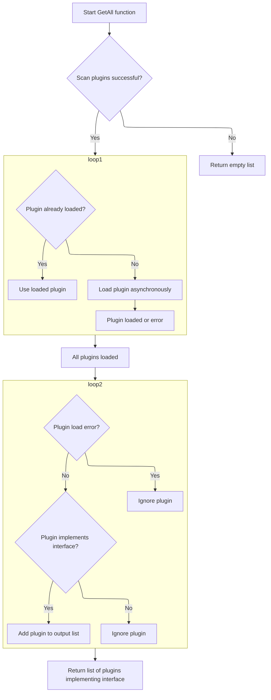

This document describes the flow of finding plugins that support a specific capability. The flow receives a capability string as input and returns a list of plugins that implement that capability. It achieves this by scanning all available plugins, loading them asynchronously if needed, and filtering out those that do not match the capability.

```mermaid
flowchart TD
  node1["Starting the plugin capability search"]:::HeadingStyle --> node2{"Plugins scanned successfully?" ]
  node2 -->|"No"| node3["Return empty list"]
  node2 -->|"Yes"| node4["Gathering all available plugins
(Gathering all available plugins)"]:::HeadingStyle
  node4 --> node5{"Plugin already loaded?
(Gathering all available plugins)
(Gathering all available plugins)"}:::HeadingStyle:::HeadingStyle
  node5 -->|"Yes"| node6["Use loaded plugin
(Gathering all available plugins)"]:::HeadingStyle
  node5 -->|"No"| node7["Load plugin asynchronously
(Gathering all available plugins)"]:::HeadingStyle
  node6 --> node8{"Plugin valid and implements capability?
(Gathering all available plugins)"}:::HeadingStyle
  node7 --> node8
  node8 -->|"Yes"| node9["Add plugin to output list
(Finalizing the plugin list for the caller)"]:::HeadingStyle
  node8 -->|"No"| node10["Skip plugin"]
  node9 --> node11["Finalizing the plugin list for the caller
(Finalizing the plugin list for the caller)"]:::HeadingStyle
  click node1 goToHeading "Starting the plugin capability search"
  click node2 goToHeading "Gathering all available plugins"
  click node4 goToHeading "Gathering all available plugins"
  click node5 goToHeading "Gathering all available plugins"
  click node6 goToHeading "Gathering all available plugins"
  click node7 goToHeading "Gathering all available plugins"
  click node8 goToHeading "Gathering all available plugins"
  click node9 goToHeading "Finalizing the plugin list for the caller"
  click node11 goToHeading "Finalizing the plugin list for the caller"
classDef HeadingStyle fill:#777777,stroke:#333,stroke-width:2px;
```

# Starting the plugin capability search

<SwmSnippet path="/plugin/legacy.go" line="8">

---

In `FindWithCapability`, we start by asking the plugins package to give us all plugins that match the capability string. This is the first step to narrow down plugins based on what they support. We handle errors immediately to avoid continuing with bad data.

```go
func FindWithCapability(capability string) ([]Plugin, error) {
	pl, err := plugins.GetAll(capability)
	if err != nil {
		return nil, err
	}
```

---

</SwmSnippet>

## Gathering all available plugins



<SwmSnippet path="/pkg/plugins/plugins.go" line="233">

---

In `GetAll`, we first scan for all plugin names available. Then, for each plugin, we either use the cached version or load it concurrently with goroutines. This speeds up loading multiple plugins and prepares us to filter them later.

```go
func GetAll(imp string) ([]*Plugin, error) {
	pluginNames, err := Scan()
	if err != nil {
		return nil, err
	}

	type plLoad struct {
		pl  *Plugin
		err error
	}

	chPl := make(chan *plLoad, len(pluginNames))
	var wg sync.WaitGroup
	for _, name := range pluginNames {
		if pl, ok := storage.plugins[name]; ok {
			chPl <- &plLoad{pl, nil}
			continue
		}

		wg.Add(1)
		go func(name string) {
			defer wg.Done()
			pl, err := loadWithRetry(name, false)
			chPl <- &plLoad{pl, err}
		}(name)
	}

```

---

</SwmSnippet>

<SwmSnippet path="/pkg/plugins/plugins.go" line="260">

---

Back in `GetAll`, after loading all plugins, we wait for all to finish, then filter out those that don't implement the requested capability. We log errors for plugins that failed to load but keep going with the rest.

```go
	wg.Wait()
	close(chPl)

	var out []*Plugin
	for pl := range chPl {
		if pl.err != nil {
			logrus.Error(pl.err)
			continue
		}
		if pl.pl.implements(imp) {
			out = append(out, pl.pl)
		}
	}
	return out, nil
}
```

---

</SwmSnippet>

## Finalizing the plugin list for the caller

<SwmSnippet path="/plugin/legacy.go" line="13">

---

In `FindWithCapability`, after getting the plugin pointers from `GetAll`, we convert them into a slice of Plugin values to match the function's return type. Then we return that slice.

```go
	result := make([]Plugin, len(pl))
	for i, p := range pl {
		result[i] = p
	}
	return result, nil
}
```

---

</SwmSnippet>

&nbsp;

*This is an auto-generated document by Swimm 🌊 and has not yet been verified by a human*

<SwmMeta version="3.0.0" repo-id="Z2l0aHViJTNBJTNBS3ViZXJuZXRlc01vYnklM0ElM0FHb3BpbmF0aHJlZGR5NjY=" repo-name="KubernetesMoby"><sup>Powered by [Swimm](https://app.swimm.io/)</sup></SwmMeta>
