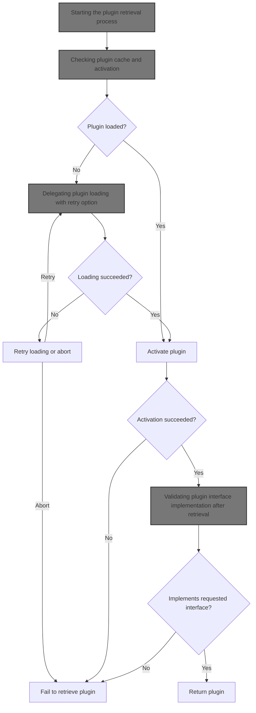
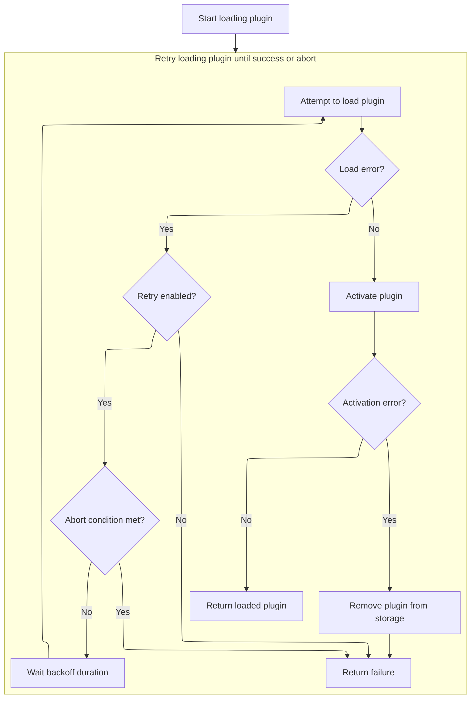

This document describes the flow of retrieving a plugin by name and ensuring it implements the requested interface. It checks if the plugin is loaded and activates it if found. Otherwise, it loads the plugin with retry logic until success or abort. After loading, the plugin is activated and validated before being returned.



# Starting the plugin retrieval process

<SwmSnippet path="/pkg/plugins/plugins.go" line="215">

---

In `Get`, we start by trying to fetch the plugin by name using `get`. Calling `get` helps us check if the plugin is already loaded or if we need to load it fresh.

```go
func Get(name, imp string) (*Plugin, error) {
	pl, err := get(name)
	if err != nil {
		return nil, err
	}
```

---

</SwmSnippet>

## Checking plugin cache and activation

<SwmSnippet path="/pkg/plugins/plugins.go" line="204">

---

`get` checks if the plugin is already in storage. If it is, it activates the plugin and returns it. If not, it calls `load` to fetch and load the plugin fresh.

```go
func get(name string) (*Plugin, error) {
	storage.Lock()
	pl, ok := storage.plugins[name]
	storage.Unlock()
	if ok {
		return pl, pl.activate()
	}
	return load(name)
}
```

---

</SwmSnippet>

## Delegating plugin loading with retry option



<SwmSnippet path="/pkg/plugins/plugins.go" line="162">

---

`load` just delegates to `loadWithRetry` with retry enabled, so the actual loading logic with retry happens there.

```go
func load(name string) (*Plugin, error) {
	return loadWithRetry(name, true)
}
```

---

</SwmSnippet>

<SwmSnippet path="/pkg/plugins/plugins.go" line="166">

---

`loadWithRetry` tries loading the plugin from the local registry in a loop. If loading fails and retry is enabled, it waits longer between attempts using backoff. It stops retrying if the abort condition is met. Once loaded, it stores the plugin safely with locking, activates it, and removes it if activation fails.

```go
func loadWithRetry(name string, retry bool) (*Plugin, error) {
	registry := newLocalRegistry()
	start := time.Now()

	var retries int
	for {
		pl, err := registry.Plugin(name)
		if err != nil {
			if !retry {
				return nil, err
			}

			timeOff := backoff(retries)
			if abort(start, timeOff) {
				return nil, err
			}
			retries++
			logrus.Warnf("Unable to locate plugin: %s, retrying in %v", name, timeOff)
			time.Sleep(timeOff)
			continue
		}

		storage.Lock()
		storage.plugins[name] = pl
		storage.Unlock()

		err = pl.activate()

		if err != nil {
			storage.Lock()
			delete(storage.plugins, name)
			storage.Unlock()
		}

		return pl, err
	}
```

---

</SwmSnippet>

## Validating plugin interface implementation after retrieval

<SwmSnippet path="/pkg/plugins/plugins.go" line="220">

---

After returning from `get`, `Get` checks if the plugin implements the requested interface. If yes, it returns the plugin; otherwise, it returns an error.

```go
	if pl.implements(imp) {
		logrus.Debugf("%s implements: %s", name, imp)
		return pl, nil
	}
	return nil, ErrNotImplements
}
```

---

</SwmSnippet>

&nbsp;

*This is an auto-generated document by Swimm 🌊 and has not yet been verified by a human*

<SwmMeta version="3.0.0" repo-id="Z2l0aHViJTNBJTNBS3ViZXJuZXRlc01vYnklM0ElM0FHb3BpbmF0aHJlZGR5NjY=" repo-name="KubernetesMoby"><sup>Powered by [Swimm](https://app.swimm.io/)</sup></SwmMeta>
