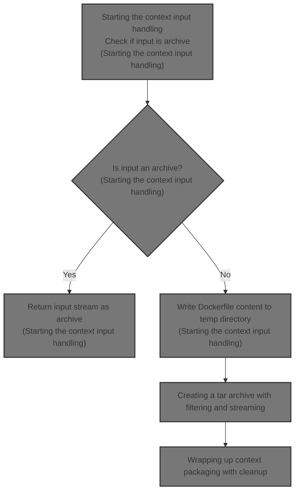
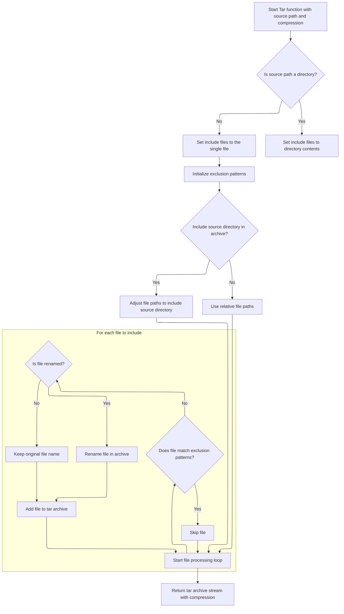

This document describes the flow of preparing a Docker build context from an input stream. The flow receives an input stream that may be a Docker build context archive or raw Dockerfile content. It outputs a tar archive stream representing the build context and the relative Dockerfile path. This packaging is necessary for Docker's image build process to consume the context correctly.

The main steps are:

- Detecting if the input is an archive
- Returning the archive directly if so
- Writing Dockerfile content to a temporary directory if not
- Creating a tar archive from the directory
- Wrapping the archive stream with cleanup logic



# Starting the context input handling

This section handles the input context for Docker builds by determining if the input is an archive or a Dockerfile, and then preparing the input accordingly for downstream processing.

| Category       | Rule Name                | Description                                                                                                                         |
| -------------- | ------------------------ | ----------------------------------------------------------------------------------------------------------------------------------- |
| Business logic | UseDefaultDockerfileName | The default Dockerfile name must be used when writing Dockerfile content to the temporary directory if the input is not an archive. |

<SwmSnippet path="/builder/context.go" line="74">

---

Here we start by peeking at the input stream to check if it's an archive. If it is, we just wrap and return it. If not, we write the input as a Dockerfile to a temp directory and then create a tar archive from that directory by calling archive.Tar. This call is needed to package the Dockerfile content into a tar stream, which is the expected format downstream.

```go
func GetContextFromReader(r io.ReadCloser, dockerfileName string) (out io.ReadCloser, relDockerfile string, err error) {
	buf := bufio.NewReader(r)

	magic, err := buf.Peek(archive.HeaderSize)
	if err != nil && err != io.EOF {
		return nil, "", fmt.Errorf("failed to peek context header from STDIN: %v", err)
	}

	if archive.IsArchive(magic) {
		return ioutils.NewReadCloserWrapper(buf, func() error { return r.Close() }), dockerfileName, nil
	}

	// Input should be read as a Dockerfile.
	tmpDir, err := ioutil.TempDir("", "docker-build-context-")
	if err != nil {
		return nil, "", fmt.Errorf("unbale to create temporary context directory: %v", err)
	}

	f, err := os.Create(filepath.Join(tmpDir, DefaultDockerfileName))
	if err != nil {
		return nil, "", err
	}
	_, err = io.Copy(f, buf)
	if err != nil {
		f.Close()
		return nil, "", err
	}

	if err := f.Close(); err != nil {
		return nil, "", err
	}
	if err := r.Close(); err != nil {
		return nil, "", err
	}

	tar, err := archive.Tar(tmpDir, archive.Uncompressed)
	if err != nil {
		return nil, "", err
	}

```

---

</SwmSnippet>

## Creating a tar archive with filtering and streaming



This section describes the process of creating a tar archive with filtering and streaming, including handling directories, files, exclusion patterns, and compression.

| Category       | Rule Name                   | Description                                                                                                                                   |
| -------------- | --------------------------- | --------------------------------------------------------------------------------------------------------------------------------------------- |
| Business logic | Single file inclusion       | If the source path is a single file, only that file is included in the archive.                                                               |
| Business logic | Directory content inclusion | If the source path is a directory, all contents of the directory are considered for inclusion based on include and exclude patterns.          |
| Business logic | Exclusion pattern filtering | Exclude patterns are applied to filter out files and directories from the archive, but explicit include files override exclusion.             |
| Business logic | Source directory inclusion  | If the option to include the source directory is enabled, file paths in the archive are adjusted to include the source directory as a prefix. |
| Business logic | Skip excluded files         | Files matching exclusion patterns are skipped unless they are explicitly included.                                                            |
| Business logic | File renaming in archive    | If a file is renamed in the options, the renamed path is used in the archive instead of the original file name.                               |
| Business logic | Compression streaming       | The tar archive is streamed with the specified compression method applied.                                                                    |

<SwmSnippet path="/pkg/archive/archive.go" line="532">

---

`Tar` is just a thin wrapper that calls `TarWithOptions` with compression options. It simplifies calling the more complex function by providing a straightforward interface.

```go
func Tar(path string, compression Compression) (io.ReadCloser, error) {
	return TarWithOptions(path, &TarOptions{Compression: compression})
}
```

---

</SwmSnippet>

<SwmSnippet path="/pkg/archive/archive.go" line="538">

---

`TarWithOptions` walks the source directory applying include and exclude patterns to decide which files to add. It streams the tar archive through an io.Pipe connected to a goroutine that writes the tar and compresses it. It also handles rebasing paths and remapping UID/GID for container-specific needs.

```go
func TarWithOptions(srcPath string, options *TarOptions) (io.ReadCloser, error) {

	// Fix the source path to work with long path names. This is a no-op
	// on platforms other than Windows.
	srcPath = fixVolumePathPrefix(srcPath)

	patterns, patDirs, exceptions, err := fileutils.CleanPatterns(options.ExcludePatterns)

	if err != nil {
		return nil, err
	}

	pipeReader, pipeWriter := io.Pipe()

	compressWriter, err := CompressStream(pipeWriter, options.Compression)
	if err != nil {
		return nil, err
	}

	go func() {
		ta := &tarAppender{
			TarWriter:         tar.NewWriter(compressWriter),
			Buffer:            pools.BufioWriter32KPool.Get(nil),
			SeenFiles:         make(map[uint64]string),
			UIDMaps:           options.UIDMaps,
			GIDMaps:           options.GIDMaps,
			WhiteoutConverter: getWhiteoutConverter(options.WhiteoutFormat),
		}

		defer func() {
			// Make sure to check the error on Close.
			if err := ta.TarWriter.Close(); err != nil {
				logrus.Errorf("Can't close tar writer: %s", err)
			}
			if err := compressWriter.Close(); err != nil {
				logrus.Errorf("Can't close compress writer: %s", err)
			}
			if err := pipeWriter.Close(); err != nil {
				logrus.Errorf("Can't close pipe writer: %s", err)
			}
		}()

		// this buffer is needed for the duration of this piped stream
		defer pools.BufioWriter32KPool.Put(ta.Buffer)

		// In general we log errors here but ignore them because
		// during e.g. a diff operation the container can continue
		// mutating the filesystem and we can see transient errors
		// from this

		stat, err := os.Lstat(srcPath)
		if err != nil {
			return
		}

		if !stat.IsDir() {
			// We can't later join a non-dir with any includes because the
			// 'walk' will error if "file/." is stat-ed and "file" is not a
			// directory. So, we must split the source path and use the
			// basename as the include.
			if len(options.IncludeFiles) > 0 {
				logrus.Warn("Tar: Can't archive a file with includes")
			}

			dir, base := SplitPathDirEntry(srcPath)
			srcPath = dir
			options.IncludeFiles = []string{base}
		}

		if len(options.IncludeFiles) == 0 {
			options.IncludeFiles = []string{"."}
		}

		seen := make(map[string]bool)

		for _, include := range options.IncludeFiles {
			rebaseName := options.RebaseNames[include]

			walkRoot := getWalkRoot(srcPath, include)
			filepath.Walk(walkRoot, func(filePath string, f os.FileInfo, err error) error {
				if err != nil {
					logrus.Errorf("Tar: Can't stat file %s to tar: %s", srcPath, err)
					return nil
				}

				relFilePath, err := filepath.Rel(srcPath, filePath)
				if err != nil || (!options.IncludeSourceDir && relFilePath == "." && f.IsDir()) {
					// Error getting relative path OR we are looking
					// at the source directory path. Skip in both situations.
					return nil
				}

				if options.IncludeSourceDir && include == "." && relFilePath != "." {
					relFilePath = strings.Join([]string{".", relFilePath}, string(filepath.Separator))
				}

				skip := false

				// If "include" is an exact match for the current file
				// then even if there's an "excludePatterns" pattern that
				// matches it, don't skip it. IOW, assume an explicit 'include'
				// is asking for that file no matter what - which is true
				// for some files, like .dockerignore and Dockerfile (sometimes)
				if include != relFilePath {
					skip, err = fileutils.OptimizedMatches(relFilePath, patterns, patDirs)
					if err != nil {
						logrus.Errorf("Error matching %s: %v", relFilePath, err)
						return err
					}
				}

				if skip {
					// If we want to skip this file and its a directory
					// then we should first check to see if there's an
					// excludes pattern (eg !dir/file) that starts with this
					// dir. If so then we can't skip this dir.

					// Its not a dir then so we can just return/skip.
					if !f.IsDir() {
						return nil
					}

					// No exceptions (!...) in patterns so just skip dir
					if !exceptions {
						return filepath.SkipDir
					}

					dirSlash := relFilePath + string(filepath.Separator)

					for _, pat := range patterns {
						if pat[0] != '!' {
							continue
						}
						pat = pat[1:] + string(filepath.Separator)
						if strings.HasPrefix(pat, dirSlash) {
							// found a match - so can't skip this dir
							return nil
						}
					}

					// No matching exclusion dir so just skip dir
					return filepath.SkipDir
				}

				if seen[relFilePath] {
					return nil
				}
				seen[relFilePath] = true

				// Rename the base resource.
				if rebaseName != "" {
					var replacement string
					if rebaseName != string(filepath.Separator) {
						// Special case the root directory to replace with an
						// empty string instead so that we don't end up with
						// double slashes in the paths.
						replacement = rebaseName
					}

					relFilePath = strings.Replace(relFilePath, include, replacement, 1)
				}

				if err := ta.addTarFile(filePath, relFilePath); err != nil {
					logrus.Errorf("Can't add file %s to tar: %s", filePath, err)
					// if pipe is broken, stop writing tar stream to it
					if err == io.ErrClosedPipe {
						return err
					}
				}
				return nil
			})
		}
```

---

</SwmSnippet>

## Wrapping up context packaging with cleanup

<SwmSnippet path="/builder/context.go" line="114">

---

We just got the tar archive from pkg/archive/archive.go. Now in GetContextFromReader, we wrap that tar stream with a cleanup function that closes the tar and deletes the temp directory when done. This finalizes the packaging and cleans up temporary files.

```go
	return ioutils.NewReadCloserWrapper(tar, func() error {
		err := tar.Close()
		os.RemoveAll(tmpDir)
		return err
	}), DefaultDockerfileName, nil

}
```

---

</SwmSnippet>

&nbsp;

*This is an auto-generated document by Swimm 🌊 and has not yet been verified by a human*

<SwmMeta version="3.0.0" repo-id="Z2l0aHViJTNBJTNBS3ViZXJuZXRlc01vYnklM0ElM0FHb3BpbmF0aHJlZGR5NjY=" repo-name="KubernetesMoby"><sup>Powered by [Swimm](https://app.swimm.io/)</sup></SwmMeta>
