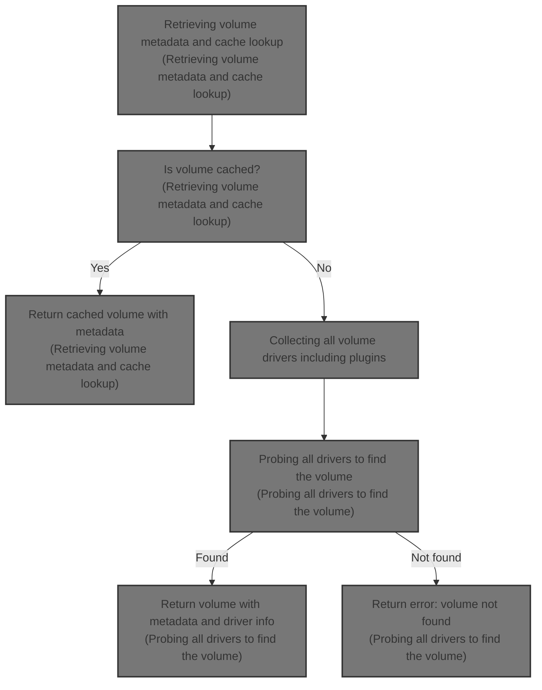

This document describes the flow of retrieving a volume by its name, including fetching metadata and checking cached volumes. It covers gathering all volume drivers, including plugins, and probing them to find the volume. The flow returns the volume with metadata and driver scope or an error if not found.



# Retrieving volume metadata and cache lookup

<SwmSnippet path="/volume/store/store.go" line="381">

---

In `getVolume` we start by trying to get volume metadata from BoltDB using a transaction. This lets us safely read the stored JSON metadata for the volume name, extracting labels. Then we check a cached map of volume names to see if we already have a reference. If we do, we get the driver and volume from that cache. This sets us up to either return the cached volume or continue probing drivers if not found.

```go
func (s *VolumeStore) getVolume(name string) (volume.Volume, error) {
	labels := map[string]string{}

	if s.db != nil {
		// get meta
		if err := s.db.Update(func(tx *bolt.Tx) error {
			b := tx.Bucket([]byte(volumeBucketName))
			data := b.Get([]byte(name))

			if string(data) == "" {
				return nil
			}

```

---

</SwmSnippet>

<SwmSnippet path="/volume/store/store.go" line="394">

---

After getting metadata, `getVolume` locks the names map for reading to safely check if the volume is cached. This prevents concurrent access issues. If the volume is cached, it fetches the driver and volume from the cache. If not, it moves on to probe all drivers.

```go
			var meta volumeMetadata
			buf := bytes.NewBuffer(data)

			if err := json.NewDecoder(buf).Decode(&meta); err != nil {
				return err
			}
			labels = meta.Labels

			return nil
		}); err != nil {
			return nil, err
		}
	}

	logrus.Debugf("Getting volume reference for name: %s", name)
	s.globalLock.RLock()
	v, exists := s.names[name]
	s.globalLock.RUnlock()
	if exists {
		vd, err := volumedrivers.GetDriver(v.DriverName())
		if err != nil {
			return nil, err
		}
```

---

</SwmSnippet>

<SwmSnippet path="/volume/store/store.go" line="417">

---

Here in `getVolume` after confirming the volume is cached, we get the driver by its name and ask it for the volume. If successful, we wrap the volume with labels and scope and return it.

```go
		vol, err := vd.Get(name)
		if err != nil {
			return nil, err
		}
		return volumeWrapper{vol, labels, vd.Scope()}, nil
	}

```

---

</SwmSnippet>

<SwmSnippet path="/volume/store/store.go" line="424">

---

Here in `getVolume` if the volume isn't cached, we get all volume drivers to probe each for the volume by name. This covers volumes managed by any driver.

```go
	logrus.Debugf("Probing all drivers for volume with name: %s", name)
	drivers, err := volumedrivers.GetAllDrivers()
	if err != nil {
		return nil, err
	}

```

---

</SwmSnippet>

## Collecting all volume drivers including plugins

<SwmSnippet path="/volume/drivers/extpoint.go" line="153">

---

In `GetAllDrivers` we start by locking the drivers map to collect all registered drivers. Then we find plugins with the needed capability and prepare to add new drivers for plugins not already registered, especially handling legacy plugins.

```go
func GetAllDrivers() ([]volume.Driver, error) {
	plugins, err := plugin.FindWithCapability(extName)
	if err != nil {
		return nil, fmt.Errorf("error listing plugins: %v", err)
	}
```

---

</SwmSnippet>

### Discovering plugins with required capabilities

See <SwmLink doc-title="Finding plugins by capability flow">[Finding plugins by capability flow](\.swm\finding-plugins-by-capability-flow.sg9ll40q.sw.md)</SwmLink>

### Integrating new plugins into driver registry

```mermaid
%%{init: {"flowchart": {"defaultRenderer": "elk"}} }%%
flowchart TD
    node1["Start GetAllDrivers"] --> subgraph loop1["For each registered driver extension"]
        node2["Add registered driver to list"]
        click node2 openCode "volume/drivers/extpoint.go:163:165"
    end
    loop1 --> subgraph loop2["For each plugin"]
        node3["Get plugin name"]
        click node3 openCode "volume/drivers/extpoint.go:168:169"
        node4{"Is driver already registered?"}
        click node4 openCode "volume/drivers/extpoint.go:169:171"
        node4 -- Yes (skip plugin) --> loop2
        node4 -- No --> node5["Create new driver from plugin"]
        click node5 openCode "volume/drivers/extpoint.go:174:175"
        node6{"Is plugin legacy?"}
        click node6 openCode "volume/drivers/extpoint.go:175:177"
        node5 --> node6
        node6 -- Yes --> node7["Register new driver"]
        node6 -- No --> node8["Do not register"]
        click node7 openCode "volume/drivers/extpoint.go:176:177"
        node7 --> node9["Add new driver to list"]
        node8 --> node9
        click node9 openCode "volume/drivers/extpoint.go:178:179"
        node9 --> loop2
    end
    loop2 --> node10["Return list of all drivers"]
    click node10 openCode "volume/drivers/extpoint.go:158:179"
classDef HeadingStyle fill:#777777,stroke:#333,stroke-width:2px;
```

<SwmSnippet path="/volume/drivers/extpoint.go" line="158">

---

Here in `GetAllDrivers` we lock the drivers map to safely append existing drivers and add new ones from plugins. Legacy plugins get added to the map for reuse. This keeps driver state consistent.

```go
	var ds []volume.Driver

	drivers.Lock()
	defer drivers.Unlock()

	for _, d := range drivers.extensions {
		ds = append(ds, d)
	}

	for _, p := range plugins {
		name := p.Name()
		ext, ok := drivers.extensions[name]
		if ok {
			continue
		}

		ext = NewVolumeDriver(name, p.Client())
		if p.IsLegacy() {
			drivers.extensions[name] = ext
		}
		ds = append(ds, ext)
	}
```

---

</SwmSnippet>

## Probing all drivers to find the volume

<SwmSnippet path="/volume/store/store.go" line="430">

---

Finally in `getVolume` we iterate all drivers to get the volume by name. We return the first successful result wrapped with metadata. If none succeed, we return an error.

```go
	for _, d := range drivers {
		v, err := d.Get(name)
		if err != nil {
			continue
		}

		return volumeWrapper{v, labels, d.Scope()}, nil
	}
	return nil, errNoSuchVolume
}
```

---

</SwmSnippet>

&nbsp;

*This is an auto-generated document by Swimm 🌊 and has not yet been verified by a human*

<SwmMeta version="3.0.0" repo-id="Z2l0aHViJTNBJTNBS3ViZXJuZXRlc01vYnklM0ElM0FHb3BpbmF0aHJlZGR5NjY=" repo-name="KubernetesMoby"><sup>Powered by [Swimm](https://app.swimm.io/)</sup></SwmMeta>
