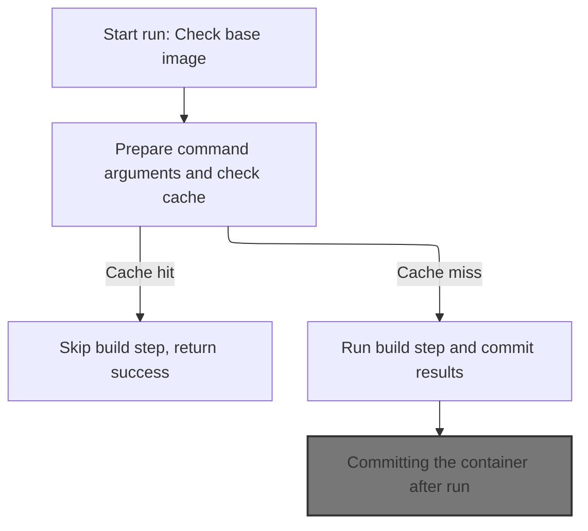
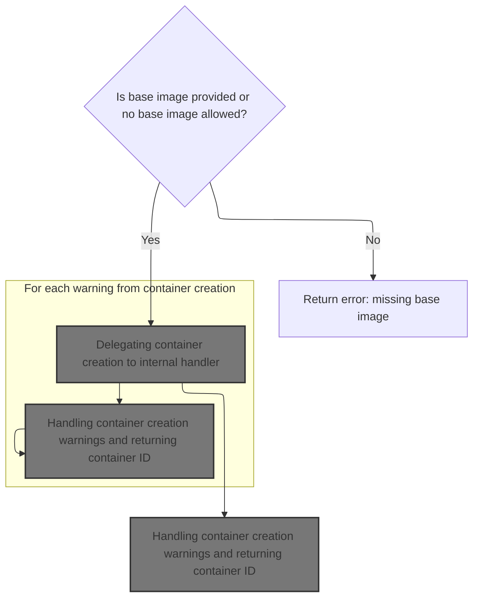
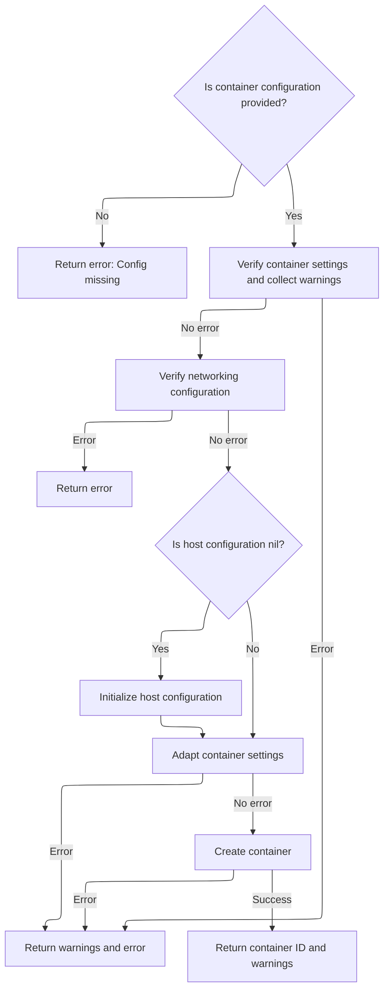
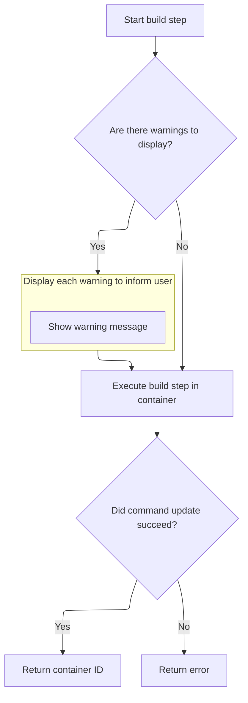
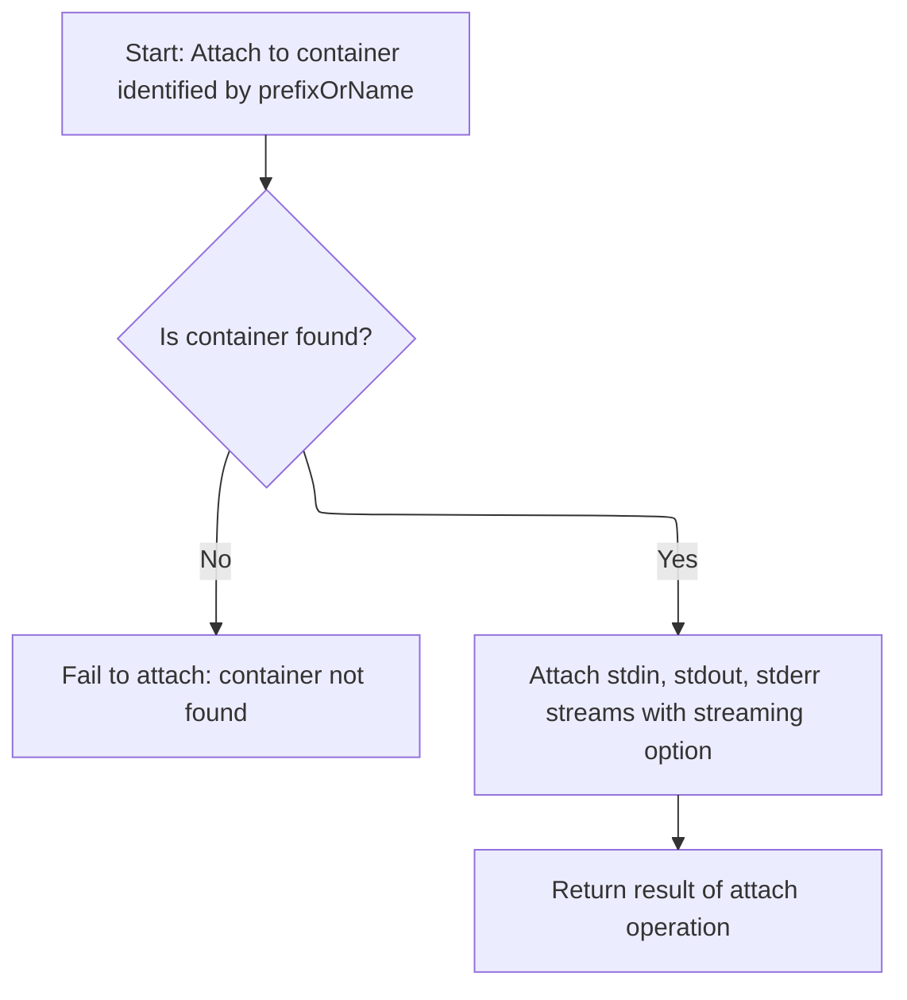
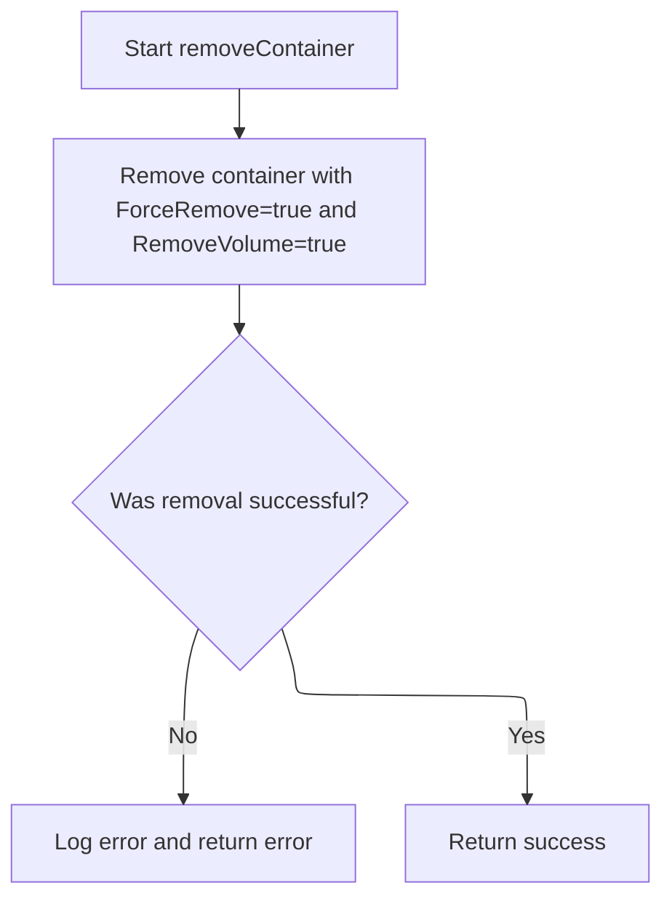
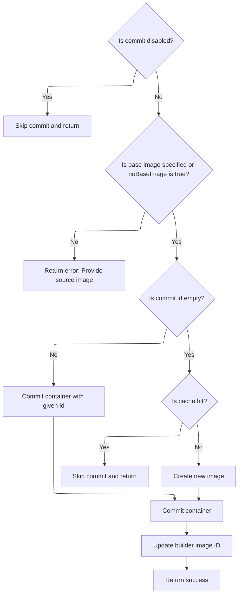

This document describes the process of running a build step inside a container during Docker image building. It covers preparing and validating command arguments, creating and configuring the container, managing container execution and output, handling cancellation, and committing the container state to create a new image layer.

The flow takes command arguments and build options as input and outputs a new image layer reflecting the run command execution.

```mermaid
flowchart TD
 node1["Preparing and validating run command arguments"]:::HeadingStyle
 click node1 goToHeading "Preparing and validating run command arguments"
 node1 --> node2["Preparing container config and invoking creation
(Preparing container config and invoking creation)"]:::HeadingStyle
 click node2 goToHeading "Preparing container config and invoking creation"
 node2 --> node3{"Is base image provided or no base image allowed?
(Preparing container config and invoking creation)"}:::HeadingStyle
 click node3 goToHeading "Preparing container config and invoking creation"
 node3 -->|"No"| node4["Error: missing base image
(Preparing container config and invoking creation)"]:::HeadingStyle
 click node4 goToHeading "Preparing container config and invoking creation"
 node3 -->|"Yes"| node5["Delegating container creation to internal handler"]:::HeadingStyle
 click node5 goToHeading "Delegating container creation to internal handler"
 node5 --> node6{"Is container configuration valid and networking verified?
(Validating and finalizing container creation)"}:::HeadingStyle
 click node6 goToHeading "Validating and finalizing container creation"
 node6 -->|"No"| node4
 node6 -->|"Yes"| node7["Creating the container in the daemon
(Creating the container in the daemon)"]:::HeadingStyle
 click node7 goToHeading "Creating the container in the daemon"
 node7 --> node8{"Is container creation successful?
(Creating the container in the daemon)"}:::HeadingStyle
 click node8 goToHeading "Creating the container in the daemon"
 node8 -->|"No"| node4
 node8 -->|"Yes"| node9["Executing the created container"]:::HeadingStyle
 click node9 goToHeading "Executing the created container"
 node9 --> node10["Attaching to container output and managing execution"]:::HeadingStyle
 click node10 goToHeading "Attaching to container output and managing execution"
 node10 --> node11["Handling cancellation and waiting for container completion
(Handling cancellation and waiting for container completion)"]:::HeadingStyle
 click node11 goToHeading "Handling cancellation and waiting for container completion"
 node11 --> node12{"Is build cancelled?
(Handling cancellation and waiting for container completion)"}:::HeadingStyle
 click node12 goToHeading "Handling cancellation and waiting for container completion"
 node12 -->|"Yes"| node13["Removing containers and handling cleanup"]:::HeadingStyle
 click node13 goToHeading "Removing containers and handling cleanup"
 node12 -->|"No"| node14{"Did container exit with non-zero code?
(Finalizing container run and error handling)"}:::HeadingStyle
 click node14 goToHeading "Finalizing container run and error handling"
 node14 -->|"Yes"| node13
 node14 -->|"No"| node15["Committing the container after run"]:::HeadingStyle
 click node15 goToHeading "Committing the container after run"
classDef HeadingStyle fill:#777777,stroke:#333,stroke-width:2px;

%% Swimm:
%% flowchart TD
%%  node1["Preparing and validating run command arguments"]:::HeadingStyle
%%  click node1 goToHeading "Preparing and validating run command arguments"
%%  node1 --> node2["Preparing container config and invoking creation
%% (Preparing container config and invoking creation)"]:::HeadingStyle
%%  click node2 goToHeading "Preparing container config and invoking creation"
%%  node2 --> node3{"Is base image provided or no base image allowed?
%% (Preparing container config and invoking creation)"}:::HeadingStyle
%%  click node3 goToHeading "Preparing container config and invoking creation"
%%  node3 -->|"No"| node4["Error: missing base image
%% (Preparing container config and invoking creation)"]:::HeadingStyle
%%  click node4 goToHeading "Preparing container config and invoking creation"
%%  node3 -->|"Yes"| node5["Delegating container creation to internal handler"]:::HeadingStyle
%%  click node5 goToHeading "Delegating container creation to internal handler"
%%  node5 --> node6{"Is container configuration valid and networking verified?
%% (Validating and finalizing container creation)"}:::HeadingStyle
%%  click node6 goToHeading "Validating and finalizing container creation"
%%  node6 -->|"No"| node4
%%  node6 -->|"Yes"| node7["Creating the container in the daemon
%% (Creating the container in the daemon)"]:::HeadingStyle
%%  click node7 goToHeading "Creating the container in the daemon"
%%  node7 --> node8{"Is container creation successful?
%% (Creating the container in the daemon)"}:::HeadingStyle
%%  click node8 goToHeading "Creating the container in the daemon"
%%  node8 -->|"No"| node4
%%  node8 -->|"Yes"| node9["Executing the created container"]:::HeadingStyle
%%  click node9 goToHeading "Executing the created container"
%%  node9 --> node10["Attaching to container output and managing execution"]:::HeadingStyle
%%  click node10 goToHeading "Attaching to container output and managing execution"
%%  node10 --> node11["Handling cancellation and waiting for container completion
%% (Handling cancellation and waiting for container completion)"]:::HeadingStyle
%%  click node11 goToHeading "Handling cancellation and waiting for container completion"
%%  node11 --> node12{"Is build cancelled?
%% (Handling cancellation and waiting for container completion)"}:::HeadingStyle
%%  click node12 goToHeading "Handling cancellation and waiting for container completion"
%%  node12 -->|"Yes"| node13["Removing containers and handling cleanup"]:::HeadingStyle
%%  click node13 goToHeading "Removing containers and handling cleanup"
%%  node12 -->|"No"| node14{"Did container exit with <SwmToken path="builder/dockerfile/internals.go" pos="567:22:24" line-data="			Message: fmt.Sprintf(&quot;The command &#39;%s&#39; returned a non-zero code: %d&quot;, strings.Join(b.runConfig.Cmd, &quot; &quot;), ret),">`non-zero`</SwmToken> code?
%% (Finalizing container run and error handling)"}:::HeadingStyle
%%  click node14 goToHeading "Finalizing container run and error handling"
%%  node14 -->|"Yes"| node13
%%  node14 -->|"No"| node15["Committing the container after run"]:::HeadingStyle
%%  click node15 goToHeading "Committing the container after run"
%% classDef HeadingStyle fill:#777777,stroke:#333,stroke-width:2px;
```



# Preparing and validating run command arguments



<SwmSnippet path="/builder/dockerfile/dispatchers.go" line="284">

---

In <SwmToken path="builder/dockerfile/dispatchers.go" pos="284:2:2" line-data="func run(b *Builder, args []string, attributes map[string]bool, original string) error {">`run`</SwmToken>, the function first checks if there's a base image set unless <SwmToken path="builder/dockerfile/dispatchers.go" pos="285:17:17" line-data="	if b.image == &quot;&quot; &amp;&amp; !b.noBaseImage {">`noBaseImage`</SwmToken> is true, returning an error if missing. Then it parses flags and processes the command arguments differently based on whether the 'json' attribute is set. This sets up the command properly for execution inside the container. We call <SwmToken path="builder/dockerfile/dispatchers.go" pos="293:5:5" line-data="	args = handleJSONArgs(args, attributes)">`handleJSONArgs`</SwmToken> next to convert or format the args correctly depending on JSON mode.

```go
func run(b *Builder, args []string, attributes map[string]bool, original string) error {
	if b.image == "" && !b.noBaseImage {
		return fmt.Errorf("Please provide a source image with `from` prior to run")
	}

	if err := b.flags.Parse(); err != nil {
		return err
	}

	args = handleJSONArgs(args, attributes)

	if !attributes["json"] {
		args = append(getShell(b.runConfig), args...)
	}
```

---

</SwmSnippet>

<SwmSnippet path="/builder/dockerfile/support.go" line="8">

---

<SwmToken path="builder/dockerfile/support.go" pos="8:2:2" line-data="func handleJSONArgs(args []string, attributes map[string]bool) []string {">`handleJSONArgs`</SwmToken> checks if the 'json' attribute is set. If yes, it returns the args slice unchanged, treating it as a JSON exec array. Otherwise, it joins the args into a single string command. This decides the command format for container execution.

```go
func handleJSONArgs(args []string, attributes map[string]bool) []string {
	if len(args) == 0 {
		return []string{}
	}

	if attributes != nil && attributes["json"] {
		return args
	}

	// literal string command, not an exec array
	return []string{strings.Join(args, " ")}
}
```

---

</SwmSnippet>

<SwmSnippet path="/builder/dockerfile/dispatchers.go" line="298">

---

Back in <SwmToken path="builder/dockerfile/dispatchers.go" pos="315:19:19" line-data="	// derive the net build-time environment for this run. We let config">`run`</SwmToken>, after formatting args, the function builds a list of <SwmToken path="builder/dockerfile/dispatchers.go" pos="315:9:11" line-data="	// derive the net build-time environment for this run. We let config">`build-time`</SwmToken> environment variables by removing those already in the container environment. This list is prepended to RUN commands to affect caching and traceability without leaking into the final image.

```go
	config := &container.Config{
		Cmd:   strslice.StrSlice(args),
		Image: b.image,
	}

	// stash the cmd
	cmd := b.runConfig.Cmd
	if len(b.runConfig.Entrypoint) == 0 && len(b.runConfig.Cmd) == 0 {
		b.runConfig.Cmd = config.Cmd
	}

	// stash the config environment
	env := b.runConfig.Env

	defer func(cmd strslice.StrSlice) { b.runConfig.Cmd = cmd }(cmd)
	defer func(env []string) { b.runConfig.Env = env }(env)

	// derive the net build-time environment for this run. We let config
	// environment override the build time environment.
	// This means that we take the b.buildArgs list of env vars and remove
	// any of those variables that are defined as part of the container. In other
	// words, anything in b.Config.Env. What's left is the list of build-time env
	// vars that we need to add to each RUN command - note the list could be empty.
	//
	// We don't persist the build time environment with container's config
	// environment, but just sort and prepend it to the command string at time
	// of commit.
	// This helps with tracing back the image's actual environment at the time
	// of RUN, without leaking it to the final image. It also aids cache
	// lookup for same image built with same build time environment.
	cmdBuildEnv := []string{}
	configEnv := runconfigopts.ConvertKVStringsToMap(b.runConfig.Env)
	for key, val := range b.options.BuildArgs {
		if !b.isBuildArgAllowed(key) {
			// skip build-args that are not in allowed list, meaning they have
			// not been defined by an "ARG" Dockerfile command yet.
			// This is an error condition but only if there is no "ARG" in the entire
			// Dockerfile, so we'll generate any necessary errors after we parsed
			// the entire file (see 'leftoverArgs' processing in evaluator.go )
			continue
		}
		if _, ok := configEnv[key]; !ok {
			cmdBuildEnv = append(cmdBuildEnv, fmt.Sprintf("%s=%s", key, val))
		}
	}
```

---

</SwmSnippet>

<SwmSnippet path="/builder/dockerfile/dispatchers.go" line="344">

---

This section in <SwmToken path="builder/dockerfile/dispatchers.go" pos="369:14:14" line-data="	// set build-time environment for &#39;run&#39;.">`run`</SwmToken> prepends a '|#' prefix with the count of <SwmToken path="builder/dockerfile/dispatchers.go" pos="345:23:25" line-data="	// Note that we only do this if there are any build-time env vars.  Also, we">`build-time`</SwmToken> env vars to the command to avoid cache conflicts. Then it probes the cache; if hit, it skips running. Otherwise, it creates, runs, and commits the container.

```go
	// derive the command to use for probeCache() and to commit in this container.
	// Note that we only do this if there are any build-time env vars.  Also, we
	// use the special argument "|#" at the start of the args array. This will
	// avoid conflicts with any RUN command since commands can not
	// start with | (vertical bar). The "#" (number of build envs) is there to
	// help ensure proper cache matches. We don't want a RUN command
	// that starts with "foo=abc" to be considered part of a build-time env var.
	saveCmd := config.Cmd
	if len(cmdBuildEnv) > 0 {
		sort.Strings(cmdBuildEnv)
		tmpEnv := append([]string{fmt.Sprintf("|%d", len(cmdBuildEnv))}, cmdBuildEnv...)
		saveCmd = strslice.StrSlice(append(tmpEnv, saveCmd...))
	}

	b.runConfig.Cmd = saveCmd
	hit, err := b.probeCache()
	if err != nil {
		return err
	}
	if hit {
		return nil
	}

	// set Cmd manually, this is special case only for Dockerfiles
	b.runConfig.Cmd = config.Cmd
	// set build-time environment for 'run'.
	b.runConfig.Env = append(b.runConfig.Env, cmdBuildEnv...)
	// set config as already being escaped, this prevents double escaping on windows
	b.runConfig.ArgsEscaped = true

	logrus.Debugf("[BUILDER] Command to be executed: %v", b.runConfig.Cmd)

	cID, err := b.create()
	if err != nil {
		return err
	}

```

---

</SwmSnippet>

## Preparing container config and invoking creation



<SwmSnippet path="/builder/dockerfile/internals.go" line="480">

---

In <SwmToken path="builder/dockerfile/internals.go" pos="480:9:9" line-data="func (b *Builder) create() (string, error) {">`create`</SwmToken>, the function rechecks the base image presence, sets resource limits and host config, then calls daemon.ContainerCreate to create the container with the prepared config.

```go
func (b *Builder) create() (string, error) {
	if b.image == "" && !b.noBaseImage {
		return "", fmt.Errorf("Please provide a source image with `from` prior to run")
	}
	b.runConfig.Image = b.image

	resources := container.Resources{
		CgroupParent: b.options.CgroupParent,
		CPUShares:    b.options.CPUShares,
		CPUPeriod:    b.options.CPUPeriod,
		CPUQuota:     b.options.CPUQuota,
		CpusetCpus:   b.options.CPUSetCPUs,
		CpusetMems:   b.options.CPUSetMems,
		Memory:       b.options.Memory,
		MemorySwap:   b.options.MemorySwap,
		Ulimits:      b.options.Ulimits,
	}

	// TODO: why not embed a hostconfig in builder?
	hostConfig := &container.HostConfig{
		Isolation: b.options.Isolation,
		ShmSize:   b.options.ShmSize,
		Resources: resources,
	}

	config := *b.runConfig

	// Create the container
	c, err := b.docker.ContainerCreate(types.ContainerCreateConfig{
		Config:     b.runConfig,
		HostConfig: hostConfig,
	})
	if err != nil {
		return "", err
	}
```

---

</SwmSnippet>

### Delegating container creation to internal handler

<SwmSnippet path="/daemon/create.go" line="28">

---

<SwmToken path="daemon/create.go" pos="28:9:9" line-data="func (daemon *Daemon) ContainerCreate(params types.ContainerCreateConfig) (types.ContainerCreateResponse, error) {">`ContainerCreate`</SwmToken> just calls <SwmToken path="daemon/create.go" pos="29:5:5" line-data="	return daemon.containerCreate(params, false)">`containerCreate`</SwmToken> with managed=false to continue container creation with validation and setup.

```go
func (daemon *Daemon) ContainerCreate(params types.ContainerCreateConfig) (types.ContainerCreateResponse, error) {
	return daemon.containerCreate(params, false)
}
```

---

</SwmSnippet>

### Validating and finalizing container creation



<SwmSnippet path="/daemon/create.go" line="32">

---

<SwmToken path="daemon/create.go" pos="32:9:9" line-data="func (daemon *Daemon) containerCreate(params types.ContainerCreateConfig, managed bool) (types.ContainerCreateResponse, error) {">`containerCreate`</SwmToken> validates config and networking, adapts settings, then calls <SwmToken path="daemon/create.go" pos="55:8:10" line-data="	container, err := daemon.create(params, managed)">`daemon.create`</SwmToken> to finalize container creation, returning warnings and errors.

```go
func (daemon *Daemon) containerCreate(params types.ContainerCreateConfig, managed bool) (types.ContainerCreateResponse, error) {
	if params.Config == nil {
		return types.ContainerCreateResponse{}, fmt.Errorf("Config cannot be empty in order to create a container")
	}

	warnings, err := daemon.verifyContainerSettings(params.HostConfig, params.Config, false)
	if err != nil {
		return types.ContainerCreateResponse{Warnings: warnings}, err
	}

	err = daemon.verifyNetworkingConfig(params.NetworkingConfig)
	if err != nil {
		return types.ContainerCreateResponse{}, err
	}

	if params.HostConfig == nil {
		params.HostConfig = &containertypes.HostConfig{}
	}
	err = daemon.adaptContainerSettings(params.HostConfig, params.AdjustCPUShares)
	if err != nil {
		return types.ContainerCreateResponse{Warnings: warnings}, err
	}

	container, err := daemon.create(params, managed)
	if err != nil {
		return types.ContainerCreateResponse{Warnings: warnings}, daemon.imageNotExistToErrcode(err)
	}

	return types.ContainerCreateResponse{ID: container.ID, Warnings: warnings}, nil
}
```

---

</SwmSnippet>

### Creating the container in the daemon

See <SwmLink doc-title="Container creation flow">[Container creation flow](.swm%5Ccontainer-creation-flow.3kebmtan.sw.md)</SwmLink>

### Handling container creation warnings and returning container ID



<SwmSnippet path="/builder/dockerfile/internals.go" line="515">

---

We just returned from `daemon.ContainerCreate`. Here, the function prints any warnings from container creation to the builder's stdout to inform the user.

```go
	for _, warning := range c.Warnings {
		fmt.Fprintf(b.Stdout, " ---> [Warning] %s\n", warning)
	}
```

---

</SwmSnippet>

<SwmSnippet path="/builder/dockerfile/internals.go" line="520">

---

After printing warnings, the function prints the container ID, overrides the entry point command, and returns the container ID for further use.

```go
	fmt.Fprintf(b.Stdout, " ---> Running in %s\n", stringid.TruncateID(c.ID))

	// override the entry point that may have been picked up from the base image
	if err := b.docker.ContainerUpdateCmdOnBuild(c.ID, config.Cmd); err != nil {
		return "", err
	}

	return c.ID, nil
}
```

---

</SwmSnippet>

## Executing the created container

<SwmSnippet path="/builder/dockerfile/dispatchers.go" line="381">

---

We just returned from `Builder.create`. Next, in <SwmToken path="builder/dockerfile/dispatchers.go" pos="381:9:9" line-data="	if err := b.run(cID); err != nil {">`run`</SwmToken>, the function calls `Builder.run` to execute the container with the created container ID.

```go
	if err := b.run(cID); err != nil {
		return err
	}

```

---

</SwmSnippet>

## Attaching to container output and managing execution

```mermaid
%%{init: {"flowchart": {"defaultRenderer": "elk"}} }%%
flowchart TD
    node1["Attach to container output"]
    click node1 openCode "builder/dockerfile/internals.go:532:537"
    node1 --> node4["Start container"]
    click node4 openCode "builder/dockerfile/internals.go:555:557"
    node4 --> node3["Monitor container output and cancellation"]
    click node3 openCode "builder/dockerfile/internals.go:538:562"
    node3 --> node5{"Was build cancelled?"}
    node5 -->|"Yes"| node6["Return failure due to cancellation"]
    node5 -->|"No"| node7{"Did container exit with non-zero code?"}
    node7 -->|"Yes"| node6
    node7 -->|"No"| node8["Return success"]
    click node5 openCode "builder/dockerfile/internals.go:544:552"
    click node7 openCode "builder/dockerfile/internals.go:564:570"
    click node6 openCode "builder/dockerfile/internals.go:555:557"
    click node8 openCode "builder/dockerfile/internals.go:572:573"
classDef HeadingStyle fill:#777777,stroke:#333,stroke-width:2px;

%% Swimm:
%% %%{init: {"flowchart": {"defaultRenderer": "elk"}} }%%
%% flowchart TD
%%     node1["Attach to container output"]
%%     click node1 openCode "<SwmPath>[builder/dockerfile/internals.go](builder/dockerfile/internals.go)</SwmPath>:532:537"
%%     node1 --> node4["Start container"]
%%     click node4 openCode "<SwmPath>[builder/dockerfile/internals.go](builder/dockerfile/internals.go)</SwmPath>:555:557"
%%     node4 --> node3["Monitor container output and cancellation"]
%%     click node3 openCode "<SwmPath>[builder/dockerfile/internals.go](builder/dockerfile/internals.go)</SwmPath>:538:562"
%%     node3 --> node5{"Was build cancelled?"}
%%     node5 -->|"Yes"| node6["Return failure due to cancellation"]
%%     node5 -->|"No"| node7{"Did container exit with <SwmToken path="builder/dockerfile/internals.go" pos="567:22:24" line-data="			Message: fmt.Sprintf(&quot;The command &#39;%s&#39; returned a non-zero code: %d&quot;, strings.Join(b.runConfig.Cmd, &quot; &quot;), ret),">`non-zero`</SwmToken> code?"}
%%     node7 -->|"Yes"| node6
%%     node7 -->|"No"| node8["Return success"]
%%     click node5 openCode "<SwmPath>[builder/dockerfile/internals.go](builder/dockerfile/internals.go)</SwmPath>:544:552"
%%     click node7 openCode "<SwmPath>[builder/dockerfile/internals.go](builder/dockerfile/internals.go)</SwmPath>:564:570"
%%     click node6 openCode "<SwmPath>[builder/dockerfile/internals.go](builder/dockerfile/internals.go)</SwmPath>:555:557"
%%     click node8 openCode "<SwmPath>[builder/dockerfile/internals.go](builder/dockerfile/internals.go)</SwmPath>:572:573"
%% classDef HeadingStyle fill:#777777,stroke:#333,stroke-width:2px;
```



<SwmSnippet path="/builder/dockerfile/internals.go" line="532">

---

<SwmToken path="builder/dockerfile/internals.go" pos="535:9:9" line-data="		errCh &lt;- b.docker.ContainerAttachRaw(cID, nil, b.Stdout, b.Stderr, true)">`ContainerAttachRaw`</SwmToken> gets the container by name and calls <SwmToken path="daemon/attach.go" pos="73:5:5" line-data="	return daemon.containerAttach(container, stdin, stdout, stderr, false, stream, nil)">`containerAttach`</SwmToken> to connect to its IO streams for output streaming.

```go
func (b *Builder) run(cID string) (err error) {
	errCh := make(chan error)
	go func() {
		errCh <- b.docker.ContainerAttachRaw(cID, nil, b.Stdout, b.Stderr, true)
	}()

```

---

</SwmSnippet>

### Retrieving container and delegating attachment



<SwmSnippet path="/daemon/attach.go" line="68">

---

After attaching, the function listens for cancellation in a goroutine, kills and removes the container if cancelled, then starts the container and waits for output reading and container exit, returning errors if any.

```go
func (daemon *Daemon) ContainerAttachRaw(prefixOrName string, stdin io.ReadCloser, stdout, stderr io.Writer, stream bool) error {
	container, err := daemon.GetContainer(prefixOrName)
	if err != nil {
		return err
	}
	return daemon.containerAttach(container, stdin, stdout, stderr, false, stream, nil)
}
```

---

</SwmSnippet>

### Connecting to container IO streams

See <SwmLink doc-title="Attaching to container streams and streaming logs">[Attaching to container streams and streaming logs](.swm%5Cattaching-to-container-streams-and-streaming-logs.tibq14vp.sw.md)</SwmLink>

### Handling cancellation and waiting for container completion

```mermaid
%%{init: {"flowchart": {"defaultRenderer": "elk"}} }%%
flowchart TD
    node1["Start container build process"] --> node2{"Container start successful?"}
    node2 -->|"No"| node3["Return start error"]
    node2 -->|"Yes"| subgraph parallelCancellation["Cancellation monitor running in parallel"]
        node4["Monitor cancellation"]
        node4 --> node5{"Build cancelled?"}
        node5 -->|"Yes"| node6["Kill and remove container"]
        node6 --> node7["Return cancellation error"]
        node5 -->|"No"| node8["Continue monitoring"]
    end
    node2 --> node9["Wait for container output"]
    node9 --> node10{"Output error?"}
    node10 -->|"Yes"| node11["Return output error"]
    node10 -->|"No"| node12["Build finished successfully"]
classDef HeadingStyle fill:#777777,stroke:#333,stroke-width:2px;
```

<SwmSnippet path="/builder/dockerfile/internals.go" line="538">

---

After attaching, the function listens for cancellation in a goroutine, kills and removes the container if cancelled, then starts the container and waits for output reading and container exit, returning errors if any.

```go
	finished := make(chan struct{})
	var once sync.Once
	finish := func() { close(finished) }
	cancelErrCh := make(chan error, 1)
	defer once.Do(finish)
	go func() {
		select {
		case <-b.clientCtx.Done():
			logrus.Debugln("Build cancelled, killing and removing container:", cID)
			b.docker.ContainerKill(cID, 0)
			b.removeContainer(cID)
			cancelErrCh <- errCancelled
		case <-finished:
			cancelErrCh <- nil
		}
	}()

	if err := b.docker.ContainerStart(cID, nil); err != nil {
		return err
	}

	// Block on reading output from container, stop on err or chan closed
	if err := <-errCh; err != nil {
		return err
	}

```

---

</SwmSnippet>

### Removing containers and handling cleanup



<SwmSnippet path="/builder/dockerfile/internals.go" line="575">

---

<SwmToken path="builder/dockerfile/internals.go" pos="575:9:9" line-data="func (b *Builder) removeContainer(c string) error {">`removeContainer`</SwmToken> calls <SwmToken path="builder/dockerfile/internals.go" pos="580:11:11" line-data="	if err := b.docker.ContainerRm(c, rmConfig); err != nil {">`ContainerRm`</SwmToken> with force and volume removal flags, logging errors if removal fails.

```go
func (b *Builder) removeContainer(c string) error {
	rmConfig := &types.ContainerRmConfig{
		ForceRemove:  true,
		RemoveVolume: true,
	}
	if err := b.docker.ContainerRm(c, rmConfig); err != nil {
		fmt.Fprintf(b.Stdout, "Error removing intermediate container %s: %v\n", stringid.TruncateID(c), err)
		return err
	}
	return nil
}
```

---

</SwmSnippet>

<SwmSnippet path="/daemon/delete.go" line="21">

---

<SwmToken path="daemon/delete.go" pos="21:9:9" line-data="func (daemon *Daemon) ContainerRm(name string, config *types.ContainerRmConfig) error {">`ContainerRm`</SwmToken> sets a removal-in-progress flag to avoid races, removes links if requested, otherwise cleans up the container and removes mount points if needed.

```go
func (daemon *Daemon) ContainerRm(name string, config *types.ContainerRmConfig) error {
	container, err := daemon.GetContainer(name)
	if err != nil {
		return err
	}

	// Container state RemovalInProgress should be used to avoid races.
	if inProgress := container.SetRemovalInProgress(); inProgress {
		return nil
	}
	defer container.ResetRemovalInProgress()

	// check if container wasn't deregistered by previous rm since Get
	if c := daemon.containers.Get(container.ID); c == nil {
		return nil
	}

	if config.RemoveLink {
		return daemon.rmLink(container, name)
	}

	err = daemon.cleanupContainer(container, config.ForceRemove)
	if err == nil || config.ForceRemove {
		if e := daemon.removeMountPoints(container, config.RemoveVolume); e != nil {
			logrus.Error(e)
		}
	}

	return err
}
```

---

</SwmSnippet>

### Finalizing container run and error handling

<SwmSnippet path="/builder/dockerfile/internals.go" line="564">

---

After waiting for output, the function waits for the container to exit and returns an error if the exit code is <SwmToken path="builder/dockerfile/internals.go" pos="567:22:24" line-data="			Message: fmt.Sprintf(&quot;The command &#39;%s&#39; returned a non-zero code: %d&quot;, strings.Join(b.runConfig.Cmd, &quot; &quot;), ret),">`non-zero`</SwmToken> or if the run was cancelled.

```go
	if ret, _ := b.docker.ContainerWait(cID, -1); ret != 0 {
		// TODO: change error type, because jsonmessage.JSONError assumes HTTP
		return &jsonmessage.JSONError{
			Message: fmt.Sprintf("The command '%s' returned a non-zero code: %d", strings.Join(b.runConfig.Cmd, " "), ret),
			Code:    ret,
		}
	}
	once.Do(finish)
	return <-cancelErrCh
}
```

---

</SwmSnippet>

## Committing the container after run

<SwmSnippet path="/builder/dockerfile/dispatchers.go" line="385">

---

After running the container, the function resets environment and command to include <SwmToken path="builder/dockerfile/dispatchers.go" pos="386:7:9" line-data="	// have the build-time env vars in it (if any) so that future cache look-ups">`build-time`</SwmToken> env vars, then commits the container to create a new image layer.

```go
	// revert to original config environment and set the command string to
	// have the build-time env vars in it (if any) so that future cache look-ups
	// properly match it.
	b.runConfig.Env = env
	b.runConfig.Cmd = saveCmd
	return b.commit(cID, cmd, "run")
}
```

---

</SwmSnippet>

# Committing container state to image



<SwmSnippet path="/builder/dockerfile/internals.go" line="42">

---

In <SwmToken path="builder/dockerfile/internals.go" pos="42:9:9" line-data="func (b *Builder) commit(id string, autoCmd strslice.StrSlice, comment string) error {">`commit`</SwmToken>, the function checks if commits are disabled or if base image is missing, then probes cache with a nop command. If no cache hit and no container ID, it creates a container to commit.

```go
func (b *Builder) commit(id string, autoCmd strslice.StrSlice, comment string) error {
	if b.disableCommit {
		return nil
	}
	if b.image == "" && !b.noBaseImage {
		return fmt.Errorf("Please provide a source image with `from` prior to commit")
	}
	b.runConfig.Image = b.image

	if id == "" {
		cmd := b.runConfig.Cmd
		b.runConfig.Cmd = strslice.StrSlice(append(getShell(b.runConfig), "#(nop) ", comment))
		defer func(cmd strslice.StrSlice) { b.runConfig.Cmd = cmd }(cmd)

		hit, err := b.probeCache()
		if err != nil {
			return err
		} else if hit {
			return nil
		}
		id, err = b.create()
		if err != nil {
			return err
		}
	}

```

---

</SwmSnippet>

<SwmSnippet path="/builder/dockerfile/internals.go" line="68">

---

After committing, the function updates the builder's image ID with the new image and returns any commit errors.

```go
	// Note: Actually copy the struct
	autoConfig := *b.runConfig
	autoConfig.Cmd = autoCmd

	commitCfg := &backend.ContainerCommitConfig{
		ContainerCommitConfig: types.ContainerCommitConfig{
			Author: b.maintainer,
			Pause:  true,
			Config: &autoConfig,
		},
	}

	// Commit the container
	imageID, err := b.docker.Commit(id, commitCfg)
	if err != nil {
		return err
	}

	b.image = imageID
	return nil
}
```

---

</SwmSnippet>

&nbsp;

*This is an auto-generated document by Swimm 🌊 and has not yet been verified by a human*

<SwmMeta version="3.0.0" repo-id="Z2l0aHViJTNBJTNBS3ViZXJuZXRlc01vYnklM0ElM0FHb3BpbmF0aHJlZGR5NjY=" repo-name="KubernetesMoby"><sup>Powered by [Swimm](https://app.swimm.io/)</sup></SwmMeta>
