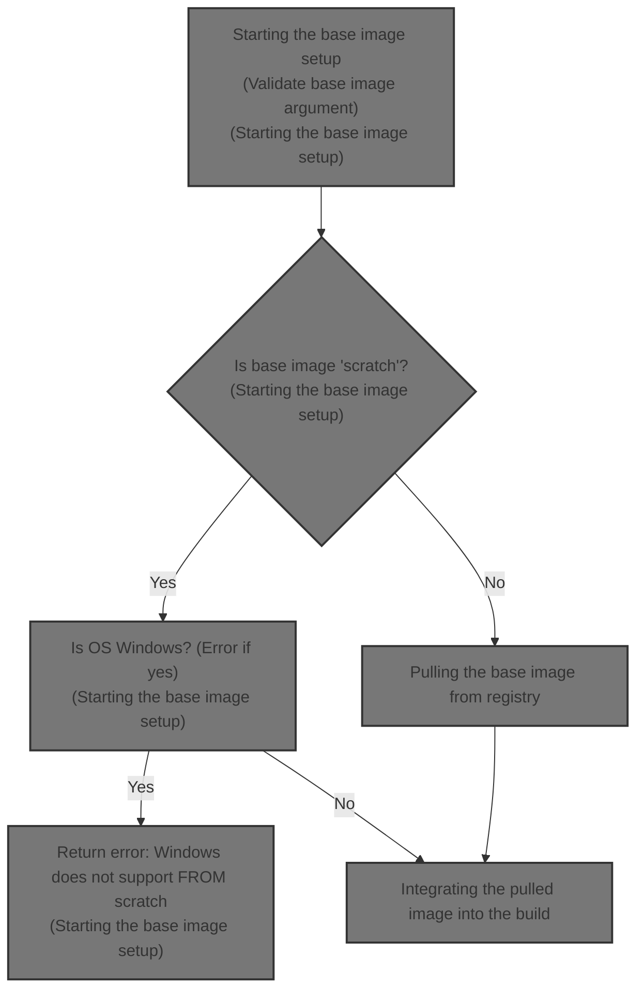
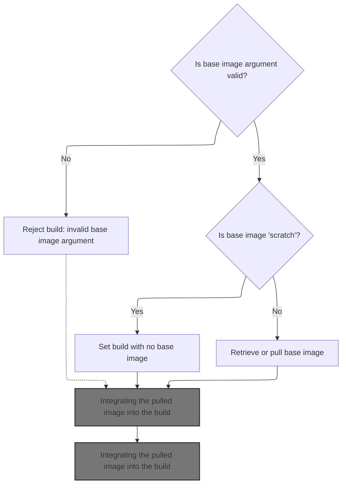
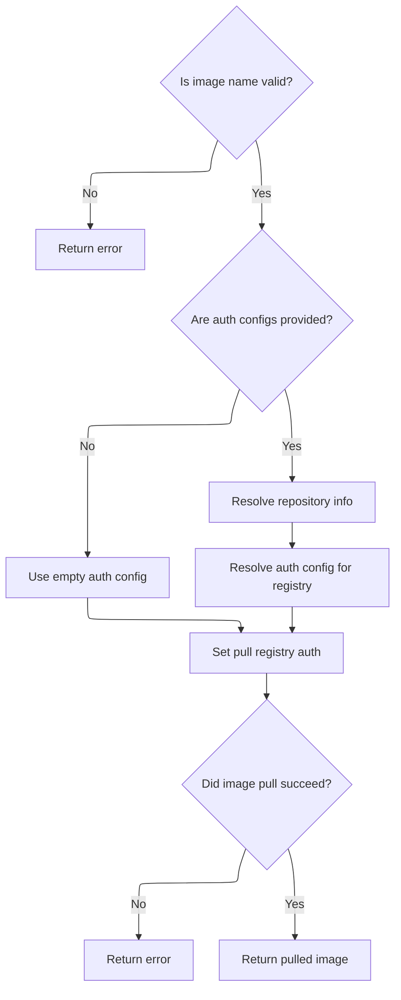
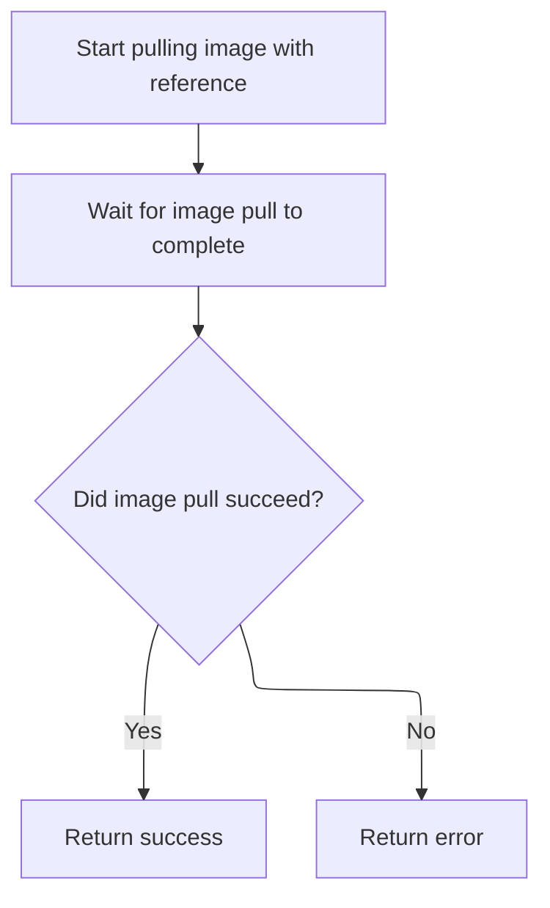

This document explains the flow of setting up the base image during a Docker build. The flow receives the base image specifier as input and ensures the image is available locally or pulls it from a registry if needed. It then integrates the image into the build environment, setting configuration and processing any build triggers defined by the base image.



# Starting the base image setup



<SwmSnippet path="/builder/dockerfile/dispatchers.go" line="178">

---

In the from function, we start by checking if the base image specifier is 'scratch'. If it is, and we're on Windows, we error out because Windows doesn't support no base image. Otherwise, we mark that there's no base image. If it's not 'scratch', we try to get the image locally if <SwmToken path="builder/dockerfile/dispatchers.go" pos="203:8:8" line-data="		if !b.options.PullParent {">`PullParent`</SwmToken> is false; if that fails, we pull the image. We call <SwmPath>[daemon/image_pull.go](daemon/image_pull.go)</SwmPath> next to handle the actual image pulling process, which is necessary when the image isn't found locally or needs to be updated.

```go
func from(b *Builder, args []string, attributes map[string]bool, original string) error {
	if len(args) != 1 {
		return errExactlyOneArgument("FROM")
	}

	if err := b.flags.Parse(); err != nil {
		return err
	}

	name := args[0]

	var (
		image builder.Image
		err   error
	)

	// Windows cannot support a container with no base image.
	if name == api.NoBaseImageSpecifier {
		if runtime.GOOS == "windows" {
			return fmt.Errorf("Windows does not support FROM scratch")
		}
		b.image = ""
		b.noBaseImage = true
	} else {
		// TODO: don't use `name`, instead resolve it to a digest
		if !b.options.PullParent {
			image, err = b.docker.GetImageOnBuild(name)
			// TODO: shouldn't we error out if error is different from "not found" ?
		}
		if image == nil {
			image, err = b.docker.PullOnBuild(b.clientCtx, name, b.options.AuthConfigs, b.Output)
			if err != nil {
				return err
			}
		}
	}

```

---

</SwmSnippet>

## Pulling the base image from registry



<SwmSnippet path="/daemon/image_pull.go" line="48">

---

<SwmToken path="daemon/image_pull.go" pos="48:9:9" line-data="func (daemon *Daemon) PullOnBuild(ctx context.Context, name string, authConfigs map[string]types.AuthConfig, output io.Writer) (builder.Image, error) {">`PullOnBuild`</SwmToken> parses the image name, resolves auth, calls <SwmToken path="daemon/image_pull.go" pos="70:9:9" line-data="	if err := daemon.pullImageWithReference(ctx, ref, nil, pullRegistryAuth, output); err != nil {">`pullImageWithReference`</SwmToken> to pull the image, then returns the pulled image.

```go
func (daemon *Daemon) PullOnBuild(ctx context.Context, name string, authConfigs map[string]types.AuthConfig, output io.Writer) (builder.Image, error) {
	ref, err := reference.ParseNamed(name)
	if err != nil {
		return nil, err
	}
	ref = reference.WithDefaultTag(ref)

	pullRegistryAuth := &types.AuthConfig{}
	if len(authConfigs) > 0 {
		// The request came with a full auth config file, we prefer to use that
		repoInfo, err := daemon.RegistryService.ResolveRepository(ref)
		if err != nil {
			return nil, err
		}

		resolvedConfig := registry.ResolveAuthConfig(
			authConfigs,
			repoInfo.Index,
		)
		pullRegistryAuth = &resolvedConfig
	}

	if err := daemon.pullImageWithReference(ctx, ref, nil, pullRegistryAuth, output); err != nil {
		return nil, err
	}
	return daemon.GetImage(name)
}
```

---

</SwmSnippet>

## Preparing and executing the image pull

<SwmSnippet path="/daemon/image_pull.go" line="76">

---

PullImageWithReference sets up a buffered channel for progress updates and a goroutine to write those updates to the output stream. It also creates a cancellable context to handle interruptions. Then it prepares the <SwmToken path="daemon/image_pull.go" pos="90:8:8" line-data="	imagePullConfig := &amp;distribution.ImagePullConfig{">`ImagePullConfig`</SwmToken> with all necessary services and calls <SwmToken path="daemon/image_pull.go" pos="102:5:7" line-data="	err := distribution.Pull(ctx, ref, imagePullConfig)">`distribution.Pull`</SwmToken> to actually pull the image. This sets the stage for the real image download.

```go
func (daemon *Daemon) pullImageWithReference(ctx context.Context, ref reference.Named, metaHeaders map[string][]string, authConfig *types.AuthConfig, outStream io.Writer) error {
	// Include a buffer so that slow client connections don't affect
	// transfer performance.
	progressChan := make(chan progress.Progress, 100)

	writesDone := make(chan struct{})

	ctx, cancelFunc := context.WithCancel(ctx)

	go func() {
		writeDistributionProgress(cancelFunc, outStream, progressChan)
		close(writesDone)
	}()

	imagePullConfig := &distribution.ImagePullConfig{
		MetaHeaders:      metaHeaders,
		AuthConfig:       authConfig,
		ProgressOutput:   progress.ChanOutput(progressChan),
		RegistryService:  daemon.RegistryService,
		ImageEventLogger: daemon.LogImageEvent,
		MetadataStore:    daemon.distributionMetadataStore,
		ImageStore:       daemon.imageStore,
		ReferenceStore:   daemon.referenceStore,
		DownloadManager:  daemon.downloadManager,
	}

	err := distribution.Pull(ctx, ref, imagePullConfig)
```

---

</SwmSnippet>

### Downloading the image from registry

See document about <SwmToken path="daemon/image_pull.go" pos="102:7:7" line-data="	err := distribution.Pull(ctx, ref, imagePullConfig)">`Pull`</SwmToken>

### Completing the pull and cleaning up



<SwmSnippet path="/daemon/image_pull.go" line="103">

---

After the pull finishes, we close the progress channel to signal no more progress updates. Then we wait for the goroutine writing progress to finish before returning any error from the pull. This cleans up the progress reporting properly.

```go
	close(progressChan)
	<-writesDone
	return err
}
```

---

</SwmSnippet>

## Integrating the pulled image into the build

```mermaid
%%{init: {"flowchart": {"defaultRenderer": "elk"}} }%%
flowchart TD
    node1{"Is image nil? (e.g., FROM scratch)"}
    click node1 openCode "builder/dockerfile/internals.go:388:410"
    node1 -->|"Yes"| node2["Return success"]
    click node2 openCode "builder/dockerfile/internals.go:411:413"
    node1 -->|"No"| node3["Set builder image and runConfig"]
    click node3 openCode "builder/dockerfile/internals.go:389:395"
    node3 --> node4{"Is default PATH missing in runConfig?"}
    click node4 openCode "builder/dockerfile/internals.go:399:408"
    node4 -->|"Yes"| node5["Add default PATH to runConfig"]
    click node5 openCode "builder/dockerfile/internals.go:405:407"
    node4 -->|"No"| node6["Check ONBUILD triggers"]
    node5 --> node6
    click node6 openCode "builder/dockerfile/internals.go:416:417"
    node6 --> node7{"Are there ONBUILD triggers?"}
    click node7 openCode "builder/dockerfile/internals.go:416:420"
    node7 -->|"No"| node8["Return success"]
    click node8 openCode "builder/dockerfile/internals.go:449:450"
    node7 -->|"Yes"| subgraph loop1["For each ONBUILD trigger"]
        node9["Parse ONBUILD trigger"]
        click node9 openCode "builder/dockerfile/internals.go:429:431"
        node9 --> node10{"Is ONBUILD chaining or forbidden command (MAINTAINER, FROM)?"}
        click node10 openCode "builder/dockerfile/internals.go:436:441"
        node10 -->|"Yes"| node11["Return error"]
        click node11 openCode "builder/dockerfile/internals.go:438:440"
        node10 -->|"No"| node12["Dispatch ONBUILD trigger"]
        click node12 openCode "builder/dockerfile/internals.go:443:445"
        node12 -->|"Next trigger"| node9
    end
    node8 --> end["End"]
    node11 --> end

classDef HeadingStyle fill:#777777,stroke:#333,stroke-width:2px;

%% Swimm:
%% %%{init: {"flowchart": {"defaultRenderer": "elk"}} }%%
%% flowchart TD
%%     node1{"Is image nil? (<SwmToken path="builder/dockerfile/internals.go" pos="112:10:12" line-data="	// do the copy (e.g. hash value if cached).  Don&#39;t actually do">`e.g`</SwmToken>., FROM scratch)"}
%%     click node1 openCode "<SwmPath>[builder/dockerfile/internals.go](builder/dockerfile/internals.go)</SwmPath>:388:410"
%%     node1 -->|"Yes"| node2["Return success"]
%%     click node2 openCode "<SwmPath>[builder/dockerfile/internals.go](builder/dockerfile/internals.go)</SwmPath>:411:413"
%%     node1 -->|"No"| node3["Set builder image and <SwmToken path="builder/dockerfile/internals.go" pos="393:3:3" line-data="			b.runConfig = img.RunConfig()">`runConfig`</SwmToken>"]
%%     click node3 openCode "<SwmPath>[builder/dockerfile/internals.go](builder/dockerfile/internals.go)</SwmPath>:389:395"
%%     node3 --> node4{"Is default PATH missing in <SwmToken path="builder/dockerfile/internals.go" pos="393:3:3" line-data="			b.runConfig = img.RunConfig()">`runConfig`</SwmToken>?"}
%%     click node4 openCode "<SwmPath>[builder/dockerfile/internals.go](builder/dockerfile/internals.go)</SwmPath>:399:408"
%%     node4 -->|"Yes"| node5["Add default PATH to <SwmToken path="builder/dockerfile/internals.go" pos="393:3:3" line-data="			b.runConfig = img.RunConfig()">`runConfig`</SwmToken>"]
%%     click node5 openCode "<SwmPath>[builder/dockerfile/internals.go](builder/dockerfile/internals.go)</SwmPath>:405:407"
%%     node4 -->|"No"| node6["Check ONBUILD triggers"]
%%     node5 --> node6
%%     click node6 openCode "<SwmPath>[builder/dockerfile/internals.go](builder/dockerfile/internals.go)</SwmPath>:416:417"
%%     node6 --> node7{"Are there ONBUILD triggers?"}
%%     click node7 openCode "<SwmPath>[builder/dockerfile/internals.go](builder/dockerfile/internals.go)</SwmPath>:416:420"
%%     node7 -->|"No"| node8["Return success"]
%%     click node8 openCode "<SwmPath>[builder/dockerfile/internals.go](builder/dockerfile/internals.go)</SwmPath>:449:450"
%%     node7 -->|"Yes"| subgraph loop1["For each ONBUILD trigger"]
%%         node9["Parse ONBUILD trigger"]
%%         click node9 openCode "<SwmPath>[builder/dockerfile/internals.go](builder/dockerfile/internals.go)</SwmPath>:429:431"
%%         node9 --> node10{"Is ONBUILD chaining or forbidden command (MAINTAINER, FROM)?"}
%%         click node10 openCode "<SwmPath>[builder/dockerfile/internals.go](builder/dockerfile/internals.go)</SwmPath>:436:441"
%%         node10 -->|"Yes"| node11["Return error"]
%%         click node11 openCode "<SwmPath>[builder/dockerfile/internals.go](builder/dockerfile/internals.go)</SwmPath>:438:440"
%%         node10 -->|"No"| node12["Dispatch ONBUILD trigger"]
%%         click node12 openCode "<SwmPath>[builder/dockerfile/internals.go](builder/dockerfile/internals.go)</SwmPath>:443:445"
%%         node12 -->|"Next trigger"| node9
%%     end
%%     node8 --> end["End"]
%%     node11 --> end
%% 
%% classDef HeadingStyle fill:#777777,stroke:#333,stroke-width:2px;
```

<SwmSnippet path="/builder/dockerfile/dispatchers.go" line="215">

---

After pulling the image, from calls <SwmToken path="builder/dockerfile/dispatchers.go" pos="215:5:5" line-data="	return b.processImageFrom(image)">`processImageFrom`</SwmToken> to update the builder with the image ID and config. This also handles ONBUILD triggers. This step integrates the pulled image into the build process.

```go
	return b.processImageFrom(image)
}
```

---

</SwmSnippet>

<SwmSnippet path="/builder/dockerfile/internals.go" line="388">

---

ProcessImageFrom sets the builder's image ID and run config from the image. It adds a default PATH if missing. If the image is nil, it returns early for FROM scratch. Then it processes ONBUILD triggers by parsing and dispatching them, while blocking disallowed instructions.

```go
func (b *Builder) processImageFrom(img builder.Image) error {
	if img != nil {
		b.image = img.ImageID()

		if img.RunConfig() != nil {
			b.runConfig = img.RunConfig()
		}
	}

	// Check to see if we have a default PATH, note that windows won't
	// have one as its set by HCS
	if system.DefaultPathEnv != "" {
		// Convert the slice of strings that represent the current list
		// of env vars into a map so we can see if PATH is already set.
		// If its not set then go ahead and give it our default value
		configEnv := opts.ConvertKVStringsToMap(b.runConfig.Env)
		if _, ok := configEnv["PATH"]; !ok {
			b.runConfig.Env = append(b.runConfig.Env,
				"PATH="+system.DefaultPathEnv)
		}
	}

	if img == nil {
		// Typically this means they used "FROM scratch"
		return nil
	}

	// Process ONBUILD triggers if they exist
	if nTriggers := len(b.runConfig.OnBuild); nTriggers != 0 {
		word := "trigger"
		if nTriggers > 1 {
			word = "triggers"
		}
		fmt.Fprintf(b.Stderr, "# Executing %d build %s...\n", nTriggers, word)
	}

	// Copy the ONBUILD triggers, and remove them from the config, since the config will be comitted.
	onBuildTriggers := b.runConfig.OnBuild
	b.runConfig.OnBuild = []string{}

	// parse the ONBUILD triggers by invoking the parser
	for _, step := range onBuildTriggers {
		ast, err := parser.Parse(strings.NewReader(step), &b.directive)
		if err != nil {
			return err
		}

		for i, n := range ast.Children {
			switch strings.ToUpper(n.Value) {
			case "ONBUILD":
				return fmt.Errorf("Chaining ONBUILD via `ONBUILD ONBUILD` isn't allowed")
			case "MAINTAINER", "FROM":
				return fmt.Errorf("%s isn't allowed as an ONBUILD trigger", n.Value)
			}

			if err := b.dispatch(i, n); err != nil {
				return err
			}
		}
	}

	return nil
}
```

---

</SwmSnippet>

&nbsp;

*This is an auto-generated document by Swimm 🌊 and has not yet been verified by a human*

<SwmMeta version="3.0.0" repo-id="Z2l0aHViJTNBJTNBS3ViZXJuZXRlc01vYnklM0ElM0FHb3BpbmF0aHJlZGR5NjY=" repo-name="KubernetesMoby"><sup>Powered by [Swimm](https://app.swimm.io/)</sup></SwmMeta>
