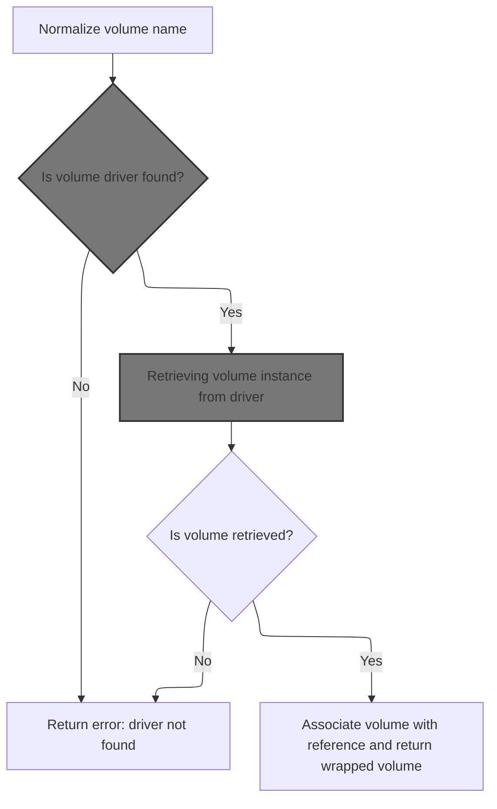
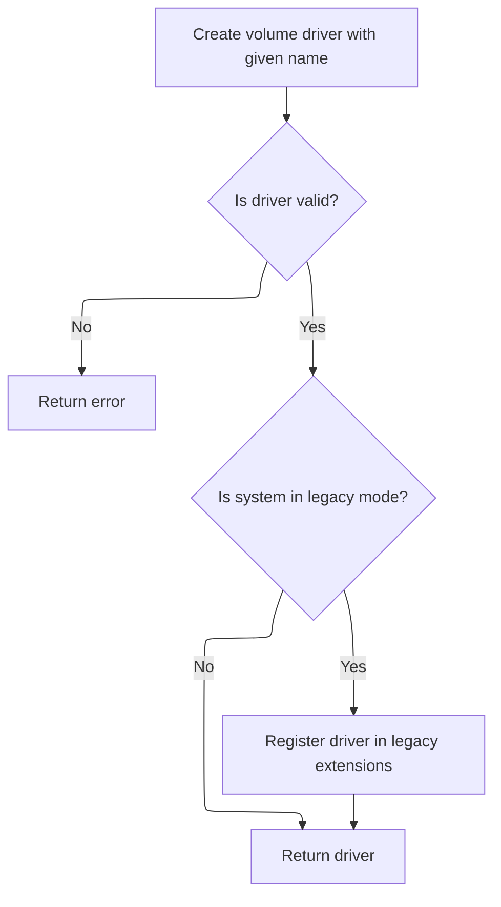

This document explains how a volume is retrieved by its name and driver, associated with a reference, and returned with metadata. The process ensures the volume is safely accessed and enriched with labels and scope information for further use.

```mermaid
flowchart TD
 node1["Starting volume retrieval with locking and driver acquisition
(Starting volume retrieval with locking and driver acquisition)"]:::HeadingStyle
 node1 --> node2["Driver retrieval with concurrency control and plugin loading
(Driver retrieval with concurrency control and plugin loading)"]:::HeadingStyle
 node2 --> node3{"Is driver valid?
(Validating and caching legacy drivers after plugin retrieval)"}:::HeadingStyle
 node3 -->|"No"| node9["Return error
(Starting volume retrieval with locking and driver acquisition)"]:::HeadingStyle
 node3 -->|"Yes"| node4{"Is system in legacy mode?
(Validating and caching legacy drivers after plugin retrieval)"}:::HeadingStyle
 node4 -->|"Yes"| node5["Validating and caching legacy drivers after plugin retrieval
(Validating and caching legacy drivers after plugin retrieval)"]:::HeadingStyle
 node4 -->|"No"| node6["Return driver
(Driver retrieval with concurrency control and plugin loading)"]:::HeadingStyle
 node5 --> node6
 node6 --> node7["Retrieving volume instance from driver
(Retrieving volume instance from driver)"]:::HeadingStyle
 node7 --> node8{"Is volume retrieved?
(Retrieving volume instance from driver)"}:::HeadingStyle
 node8 -->|"No"| node9
 node8 -->|"Yes"| node10["Getting volume with locking and internal retrieval"]:::HeadingStyle
 node10 --> node11["Finalizing volume retrieval with naming and return"]:::HeadingStyle
 node11 --> node12["Associating references and wrapping volume with metadata"]:::HeadingStyle

 click node1 goToHeading "Starting volume retrieval with locking and driver acquisition"
 click node2 goToHeading "Driver retrieval with concurrency control and plugin loading"
 click node3 goToHeading "Validating and caching legacy drivers after plugin retrieval"
 click node4 goToHeading "Validating and caching legacy drivers after plugin retrieval"
 click node5 goToHeading "Validating and caching legacy drivers after plugin retrieval"
 click node6 goToHeading "Driver retrieval with concurrency control and plugin loading"
 click node7 goToHeading "Retrieving volume instance from driver"
 click node8 goToHeading "Retrieving volume instance from driver"
 click node9 goToHeading "Starting volume retrieval with locking and driver acquisition"
 click node10 goToHeading "Getting volume with locking and internal retrieval"
 click node11 goToHeading "Finalizing volume retrieval with naming and return"
 click node12 goToHeading "Associating references and wrapping volume with metadata"
classDef HeadingStyle fill:#777777,stroke:#333,stroke-width:2px;
```



# Starting volume retrieval with locking and driver acquisition



<SwmSnippet path="/volume/store/store.go" line="342">

---

In `GetWithRef`, we start by normalizing the volume name to keep it consistent. Then we lock the volume name to avoid concurrent access issues. After that, we get the volume driver by its name, which lets us interact with the volume through a standard interface. Next, we call the driver retrieval function to continue the process.

```go
func (s *VolumeStore) GetWithRef(name, driverName, ref string) (volume.Volume, error) {
	name = normaliseVolumeName(name)
	s.locks.Lock(name)
	defer s.locks.Unlock(name)

	vd, err := volumedrivers.GetDriver(driverName)
	if err != nil {
		return nil, &OpErr{Err: err, Name: name, Op: "get"}
	}

```

---

</SwmSnippet>

## Resolving driver name with default fallback

<SwmSnippet path="/volume/drivers/extpoint.go" line="133">

---

`GetDriver` checks if the driver name is empty and replaces it with a default if needed. Then it calls `lookup` to find the actual driver instance by name.

```go
func GetDriver(name string) (volume.Driver, error) {
	if name == "" {
		name = volume.DefaultDriverName
	}
	return lookup(name)
}
```

---

</SwmSnippet>

## Driver retrieval with concurrency control and plugin loading

<SwmSnippet path="/volume/drivers/extpoint.go" line="94">

---

In `lookup`, we first lock the driver name to avoid concurrent creation. Then we check the extensions map with a global lock to see if the driver is cached. If cached, we return it. Otherwise, we proceed to look up the plugin and create the driver. Next, we call plugin lookup to get the plugin client.

```go
func lookup(name string) (volume.Driver, error) {
	drivers.driverLock.Lock(name)
	defer drivers.driverLock.Unlock(name)

	drivers.Lock()
	ext, ok := drivers.extensions[name]
	drivers.Unlock()
	if ok {
		return ext, nil
	}

	p, err := plugin.LookupWithCapability(name, extName)
	if err != nil {
		return nil, fmt.Errorf("Error looking up volume plugin %s: %v", name, err)
	}

```

---

</SwmSnippet>

### Delegating plugin retrieval with capability filtering

<SwmSnippet path="/plugin/legacy.go" line="21">

---

`LookupWithCapability` just calls `plugins.Get` with the name and capability to get the right plugin. It filters plugins by capability.

```go
func LookupWithCapability(name, capability string) (Plugin, error) {
	return plugins.Get(name, capability)
}
```

---

</SwmSnippet>

### Fetching plugin by name and capability

See <SwmLink doc-title="Plugin retrieval and validation flow">[Plugin retrieval and validation flow](\.swm\plugin-retrieval-and-validation-flow.e53jq9xm.sw.md)</SwmLink>

### Validating and caching legacy drivers after plugin retrieval



<SwmSnippet path="/volume/drivers/extpoint.go" line="110">

---

After returning from `LookupWithCapability`, `lookup` creates a new volume driver with the plugin client, validates it, and caches it only if the plugin is legacy. Then it returns the driver.

```go
	d := NewVolumeDriver(name, p.Client())
	if err := validateDriver(d); err != nil {
		return nil, err
	}

	if p.IsLegacy() {
		drivers.Lock()
		drivers.extensions[name] = d
		drivers.Unlock()
	}
	return d, nil
}
```

---

</SwmSnippet>

## Retrieving volume instance from driver

<SwmSnippet path="/volume/store/store.go" line="352">

---

After getting the driver, `GetWithRef` calls `vd.Get(name)` to get the volume instance. If that fails, it returns an error. Next, it calls `VolumeStore.Get` to continue.

```go
	v, err := vd.Get(name)
	if err != nil {
		return nil, &OpErr{Err: err, Name: name, Op: "get"}
	}

```

---

</SwmSnippet>

## Getting volume with locking and internal retrieval

<SwmSnippet path="/volume/store/store.go" line="365">

---

In `Get`, we normalize and lock the volume name again, then call `getVolume` to fetch the volume internally.

```go
func (s *VolumeStore) Get(name string) (volume.Volume, error) {
	name = normaliseVolumeName(name)
	s.locks.Lock(name)
	defer s.locks.Unlock(name)

	v, err := s.getVolume(name)
	if err != nil {
		return nil, &OpErr{Err: err, Name: name, Op: "get"}
	}
```

---

</SwmSnippet>

### See <SwmLink doc-title="Retrieving a volume by name flow">[Retrieving a volume by name flow](\.swm\retrieving-a-volume-by-name-flow.33zx8kz1.sw.md)</SwmLink>

See <SwmLink doc-title="Retrieving a volume by name flow">[Retrieving a volume by name flow](\.swm\retrieving-a-volume-by-name-flow.33zx8kz1.sw.md)</SwmLink>

### Finalizing volume retrieval with naming and return

<SwmSnippet path="/volume/store/store.go" line="374">

---

After `getVolume` returns, `Get` sets the volume's name reference and returns the volume.

```go
	s.setNamed(v, "")
	return v, nil
}
```

---

</SwmSnippet>

## Associating references and wrapping volume with metadata

<SwmSnippet path="/volume/store/store.go" line="357">

---

After `Get` returns, `GetWithRef` sets a named reference to the volume and wraps it with labels and scope metadata before returning.

```go
	s.setNamed(v, ref)

	s.globalLock.RLock()
	defer s.globalLock.RUnlock()
	return volumeWrapper{v, s.labels[name], vd.Scope()}, nil
}
```

---

</SwmSnippet>

&nbsp;

*This is an auto-generated document by Swimm 🌊 and has not yet been verified by a human*

<SwmMeta version="3.0.0" repo-id="Z2l0aHViJTNBJTNBS3ViZXJuZXRlc01vYnklM0ElM0FHb3BpbmF0aHJlZGR5NjY=" repo-name="KubernetesMoby"><sup>Powered by [Swimm](https://app.swimm.io/)</sup></SwmMeta>
